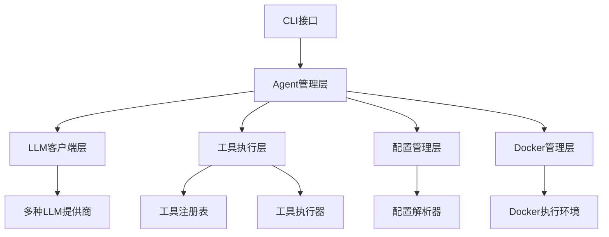
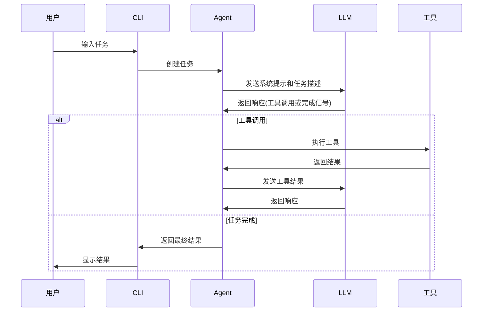

# Trae Agent 项目实现原理分析

## 1. 概述

Trae Agent 是一个基于大型语言模型（LLM）的通用软件工程任务代理。它提供了一个强大的命令行界面（CLI），能够理解自然语言指令并执行复杂的软件工程工作流。该项目采用模块化架构设计，支持多种LLM提供商和丰富的工具生态系统。

### 1.1 核心特性

- **Lakeview**: 提供简洁的代理步骤摘要
- **多LLM支持**: 支持OpenAI、Anthropic、Doubao、Azure、OpenRouter、Ollama和Google Gemini API
- **丰富工具生态**: 文件编辑、bash执行、顺序思考等工具
- **交互模式**: 支持对话式界面进行迭代开发
- **轨迹记录**: 详细记录所有代理操作用于调试和分析
- **灵活配置**: 基于YAML的配置文件，支持环境变量
- **Docker模式**: 支持在容器环境中执行任务

## 2. 需求分析

### 2.1 项目背景与目标

在软件开发过程中，开发者经常需要执行重复性的任务，如代码修复、测试编写、文档生成等。这些任务虽然有一定规律，但需要深入理解代码库和上下文。Trae Agent 的设计目标是通过LLM的能力来自动化这些软件工程任务，提高开发效率。

### 2.2 功能需求

1. **任务执行**: 能够理解自然语言描述的任务并自动执行
2. **工具集成**: 集成多种开发工具，如文件编辑、命令执行等
3. **多LLM支持**: 支持不同的LLM提供商，提供灵活性
4. **环境隔离**: 通过Docker提供安全的执行环境
5. **过程记录**: 记录执行过程用于调试和分析
6. **交互式开发**: 支持与用户的交互式对话

### 2.3 非功能需求

1. **可扩展性**: 系统应支持新工具和LLM提供商的轻松集成
2. **安全性**: 确保执行环境的安全隔离
3. **可靠性**: 提供错误处理和恢复机制
4. **可配置性**: 支持灵活的配置管理
5. **可观察性**: 提供详细的执行轨迹记录

### 2.4 用户场景

1. **代码修复**: 自动修复GitHub issue中报告的bug
2. **测试生成**: 根据代码逻辑自动生成测试用例
3. **文档更新**: 根据代码变更自动更新文档
4. **重构建议**: 提供代码重构建议并自动实施
5. **性能优化**: 分析代码性能瓶颈并提供优化方案

## 2. 架构设计

### 2.1 整体架构

Trae Agent 采用分层架构设计，主要包括以下组件：



### 2.2 核心模块

#### 2.2.1 Agent模块
- `BaseAgent`: 抽象基类，定义了代理的基本行为和执行流程
- `TraeAgent`: 具体实现类，专门用于软件工程任务
- `Agent`: 工厂类，负责创建和管理不同类型的代理

#### 2.2.2 工具模块
- `Tool`: 工具基类，定义工具的基本接口
- `ToolExecutor`: 工具执行器，负责执行工具调用
- `DockerToolExecutor`: Docker环境下的工具执行器
- 工具注册表: 管理所有可用工具的注册和发现

#### 2.2.3 LLM客户端模块
- `LLMClient`: 主客户端，支持多种LLM提供商
- 各提供商客户端: OpenAI、Anthropic、Azure、Ollama、OpenRouter、Doubao、Google等
- `LLMMessage`和`LLMResponse`: 定义LLM交互的数据结构

#### 2.2.4 配置模块
- `Config`: 主配置类，管理所有配置信息
- `AgentConfig`: 代理配置
- `ModelConfig`: 模型配置
- `ModelProvider`: 模型提供商配置

#### 2.2.5 Docker管理模块
- `DockerManager`: 管理Docker容器的生命周期
- 支持多种Docker模式: 镜像、容器ID、Dockerfile、镜像文件

## 3. 核心实现原理

### 3.1 代理执行流程



### 3.2 工具系统实现

Trae Agent 采用插件化工具架构，支持动态注册和扩展:

1. **工具基类**: 所有工具都继承自`Tool`基类，实现统一接口
2. **工具注册**: 通过`tools_registry`字典进行工具注册
3. **工具执行**: 通过`ToolExecutor`执行工具调用
4. **参数验证**: 使用`ToolParameter`定义工具参数规范

核心工具包括:
- `BashTool`: 执行bash命令
- `TextEditorTool`: 文件编辑工具
- `SequentialThinkingTool`: 顺序思考工具
- `TaskDoneTool`: 任务完成标记工具

#### 3.2.1 编辑工具的最佳实现

编辑工具(`TextEditorTool`)是Trae Agent中最核心的工具之一，它允许代理查看、创建和修改文件。其实现具有以下特点:

1. **命令模式**: 支持多种子命令，包括`view`(查看)、`create`(创建)、`str_replace`(字符串替换)和`insert`(插入)

2. **路径验证**: 所有路径操作都要求使用绝对路径，确保操作的安全性

3. **精确替换**: `str_replace`命令要求精确匹配要替换的字符串，避免意外修改

以下是一个具体的例子，展示编辑工具如何工作:

```python
# 当LLM需要修改文件时，会生成类似这样的工具调用
{
  "name": "str_replace_based_edit_tool",
  "arguments": {
    "command": "str_replace",
    "path": "/workspace/src/main.py",
    "old_str": "def hello():\n    print('Hello World')",
    "new_str": "def hello(name='World'):\n    print(f'Hello {name}')"
  }
}
```

在这个例子中，编辑工具会:
1. 验证路径是否为绝对路径
2. 检查文件是否存在
3. 查找`old_str`在文件中的精确匹配
4. 如果找到唯一匹配，则替换为`new_str`
5. 返回修改结果和修改片段

4. **安全机制**: 通过多种验证机制确保文件操作的安全性:
   - 路径必须是绝对路径
   - 文件必须存在(除了create命令)
   - 字符串替换必须精确匹配
   - 对大文件输出进行截断处理

### 3.3 LLM交互机制

Trae Agent 支持多种LLM提供商，通过统一接口进行交互:

1. **多提供商支持**: 通过`LLMProvider`枚举支持不同提供商
2. **适配器模式**: 每个提供商有对应的客户端实现
3. **工具调用**: 支持LLM工具调用功能
4. **轨迹记录**: 记录LLM交互过程用于分析

#### 3.3.1 统一接口设计

Trae Agent通过`LLMClient`类提供统一的LLM交互接口，屏蔽了不同提供商的具体实现细节。这种设计具有以下优势:

1. **可扩展性**: 添加新的LLM提供商只需要实现对应的客户端类
2. **一致性**: 所有LLM交互都遵循相同的接口规范
3. **可替换性**: 可以在不修改上层代码的情况下切换LLM提供商

#### 3.3.2 工具调用实现

LLM工具调用是Trae Agent的核心功能之一。当LLM决定调用工具时，会返回包含工具名称和参数的结构化响应。系统会解析这个响应并执行相应的工具。

以下是一个工具调用的示例流程:

```python
# LLM返回的工具调用响应
llm_response = LLMResponse(
    content="",
    tool_calls=[
        ToolCall(
            name="bash",
            arguments={
                "command": "ls -la"
            }
        )
    ]
)

# 系统解析并执行工具调用
for tool_call in llm_response.tool_calls:
    tool_result = await tool_executor.execute_tool_call(tool_call)
    # 将工具执行结果返回给LLM
```

#### 3.3.3 消息结构

LLM交互使用`LLMMessage`结构来表示对话历史，支持多种消息类型:

1. **系统消息**: 提供系统提示和规则
2. **用户消息**: 包含任务描述和工具执行结果
3. **助手消息**: LLM生成的响应

这种结构化的消息设计使得对话历史能够被准确地传递给LLM，确保上下文的连续性。

### 3.4 Docker模式实现

Docker模式允许在隔离环境中执行任务，提供安全的执行环境:

1. **容器管理**: 通过`DockerManager`管理容器生命周期
2. **工具复制**: 将本地工具复制到容器中
3. **路径映射**: 实现主机路径与容器路径的映射
4. **命令执行**: 在容器中执行工具命令

#### 3.4.1 容器生命周期管理

`DockerManager`负责管理容器的完整生命周期，包括创建、启动、执行命令和清理:

1. **容器创建**: 根据指定的镜像创建新容器
2. **工作目录挂载**: 将主机工作目录挂载到容器中
3. **工具复制**: 将必要的工具复制到容器内部
4. **持久化Shell**: 在容器中启动持久化的bash shell
5. **命令执行**: 通过持久化shell执行命令
6. **资源清理**: 任务完成后清理容器资源

#### 3.4.2 工具执行机制

在Docker模式下，工具执行通过`DockerToolExecutor`实现，它将特定工具的调用转发到容器中执行:

```python
# DockerToolExecutor中的工具执行逻辑
if tool_call.name == "bash":
    command_to_run = processed_args.get("command")
elif tool_call.name == "str_replace_based_edit_tool":
    # 构建容器内工具的执行命令
    executable_path = f"{self._docker_manager.CONTAINER_TOOLS_PATH}/edit_tool"
    cmd_parts = [executable_path, sub_command]
    # 添加参数...
    command_to_run = " ".join(cmd_parts)
```

#### 3.4.3 路径转换机制

为了确保主机和容器之间的文件操作一致性，系统实现了路径转换机制:

```python
def _translate_path(self, host_path: str) -> str:
    """将主机路径转换为容器路径"""
    abs_host_path = os.path.abspath(host_path)
    if os.path.commonpath([abs_host_path, self._host_workspace_dir]) == self._host_workspace_dir:
        relative_path = os.path.relpath(abs_host_path, self._host_workspace_dir)
        container_path = os.path.join(self._container_workspace_dir, relative_path)
        return os.path.normpath(container_path)
    return host_path
```

这种机制确保了无论在主机还是容器环境中，文件操作都能正确执行。

### 3.5 配置管理系统

Trae Agent 采用灵活的配置管理系统，支持多种配置方式和优先级规则:

1. **YAML配置**: 主要配置格式
2. **环境变量**: 支持通过环境变量配置
3. **优先级**: 命令行参数 > 配置文件 > 环境变量 > 默认值
4. **动态解析**: 支持运行时配置值解析

#### 3.5.1 配置结构

配置系统采用分层结构设计，包含以下几个主要部分:

1. **模型提供商配置**(`model_providers`): 定义不同LLM提供商的API密钥、基础URL等
2. **模型配置**(`models`): 定义具体模型的参数，如温度、最大令牌数等
3. **代理配置**(`agents`): 定义代理的行为参数，如最大步骤数、使用的工具等

以下是一个典型的配置文件示例:

```yaml
model_providers:
  anthropic:
    api_key: your_anthropic_api_key
    provider: anthropic

models:
  trae_agent_model:
    model_provider: anthropic
    model: claude-sonnet-4-20250514
    max_tokens: 4096
    temperature: 0.5

agents:
  trae_agent:
    model: trae_agent_model
    max_steps: 200
    tools:
      - bash
      - str_replace_based_edit_tool
      - sequentialthinking
      - task_done
```

#### 3.5.2 配置解析机制

配置系统通过`Config`类进行解析和管理，具有以下特点:

1. **多格式支持**: 支持YAML和JSON格式的配置文件
2. **动态解析**: 支持运行时解析CLI参数、环境变量和配置文件
3. **验证机制**: 对配置值进行验证，确保配置的正确性
4. **引用解析**: 支持模型配置引用模型提供商配置

配置解析的核心逻辑如下:

```python
class Config:
    @classmethod
    def create(cls, config_file: str | None = None):
        # 解析YAML配置文件
        yaml_config = yaml.safe_load(f)
        
        # 解析模型提供商配置
        for model_provider_name, model_provider_config in model_providers.items():
            config_model_providers[model_provider_name] = ModelProvider(**model_provider_config)
        
        # 解析模型配置
        for model_name, model_config in models.items():
            config_models[model_name] = ModelConfig(**model_config)
            # 关联模型提供商
            config_models[model_name].model_provider = config_model_providers[model_config["model_provider"]]
```

#### 3.5.3 配置优先级

Trae Agent采用多层配置优先级机制，确保配置的灵活性:

1. **命令行参数**: 最高优先级，用于临时覆盖配置
2. **配置文件**: 持久化配置，定义默认行为
3. **环境变量**: 用于敏感信息的配置，如API密钥
4. **默认值**: 当其他配置源未提供时使用

优先级解析通过`resolve_config_value`函数实现:

```python
def resolve_config_value(
    *,
    cli_value: int | str | float | None,
    config_value: int | str | float | None,
    env_var: str | None = None,
) -> int | str | float | None:
    """解析配置值，优先级: CLI > ENV > Config > Default"""
    if cli_value is not None:
        return cli_value

    if env_var and os.getenv(env_var):
        return os.getenv(env_var)

    if config_value is not None:
        return config_value

    return None
```

这种机制使得用户可以在不同场景下灵活地覆盖配置，例如在开发环境中使用一套配置，在生产环境中使用另一套配置。

## 4. 关键技术点

### 4.1 异步执行模型

Trae Agent 大量使用异步编程模型，以提高系统的并发处理能力和响应性:

```python
async def execute_task(self) -> AgentExecution:
    # 异步执行LLM调用
    llm_response = self._llm_client.chat(messages, self._model_config, self._tools)
    
    # 异步执行工具调用
    tool_results = await self._tool_caller.parallel_tool_call(tool_calls)
```

#### 4.1.1 异步任务执行

代理的任务执行过程是一个典型的异步工作流，包含多个可能耗时的操作:

1. **LLM调用**: 与LLM的网络交互可能需要几百毫秒到几秒
2. **工具执行**: 工具执行时间取决于具体操作，可能需要几秒到几分钟
3. **文件I/O**: 文件读写操作虽然相对较快，但仍可能阻塞

通过异步编程模型，这些操作可以并行执行，提高整体效率。

#### 4.1.2 并行工具调用

Trae Agent支持并行执行多个工具调用，这对于可以并行处理的任务非常有用:

```python
async def parallel_tool_call(self, tool_calls: list[ToolCall]) -> list[ToolResult]:
    """并行执行工具调用"""
    return await asyncio.gather(*[self.execute_tool_call(call) for call in tool_calls])
```

例如，当需要同时执行多个不相关的文件操作时，可以并行执行以节省时间:

```python
# LLM可能同时请求查看多个文件
[
    {"name": "str_replace_based_edit_tool", "arguments": {"command": "view", "path": "/file1.py"}},
    {"name": "str_replace_based_edit_tool", "arguments": {"command": "view", "path": "/file2.py"}},
    {"name": "bash", "arguments": {"command": "ls -la"}}
]
```

#### 4.1.3 异步资源管理

系统还实现了异步资源管理机制，确保资源的正确释放:

```python
async def _close_tools(self):
    """释放工具资源"""
    if self._tool_caller:
        res = await self._tool_caller.close_tools()
        return res

# 在任务执行完成后确保资源释放
finally:
    await self._close_tools()
```

这种机制确保即使在任务执行过程中出现异常，相关资源也能得到正确释放。

### 4.2 工具调用机制

工具调用采用标准化接口，确保所有工具具有一致的行为规范:

```python
class Tool(ABC):
    @abstractmethod
    async def execute(self, arguments: ToolCallArguments) -> ToolExecResult:
        pass
```

#### 4.2.1 工具接口设计

所有工具都必须实现以下核心方法:

1. **get_name()**: 返回工具的唯一标识符
2. **get_description()**: 返回工具的详细描述
3. **get_parameters()**: 返回工具参数定义
4. **execute()**: 执行工具逻辑

这种设计确保了工具的一致性和可发现性。

#### 4.2.2 工具参数验证

工具参数通过`ToolParameter`类进行定义和验证:

```python
class ToolParameter:
    name: str          # 参数名称
    type: str          # 参数类型 (string, integer, boolean等)
    description: str   # 参数描述
    required: bool     # 是否必需
    enum: list[str]    # 枚举值(可选)
```

例如，编辑工具的参数定义:

```python
def get_parameters(self) -> list[ToolParameter]:
    return [
        ToolParameter(
            name="command",
            type="string",
            description="要执行的命令",
            required=True,
            enum=["view", "create", "str_replace", "insert"]
        ),
        ToolParameter(
            name="path",
            type="string",
            description="文件或目录的绝对路径",
            required=True
        )
    ]
```

#### 4.2.3 工具执行器

`ToolExecutor`负责工具的执行和管理:

1. **工具发现**: 通过工具注册表发现可用工具
2. **参数验证**: 验证工具调用参数
3. **执行调度**: 调度工具执行
4. **结果处理**: 处理工具执行结果

```python
async def execute_tool_call(self, tool_call: ToolCall) -> ToolResult:
    # 查找工具
    tool = self.tools[tool_call.name]
    
    # 执行工具
    try:
        tool_exec_result = await tool.execute(tool_call.arguments)
        return ToolResult(
            success=tool_exec_result.error_code == 0,
            result=tool_exec_result.output,
            error=tool_exec_result.error
        )
    except Exception as e:
        return ToolResult(success=False, error=str(e))
```

#### 4.2.4 工具注册机制

工具通过`tools_registry`字典进行注册:

```python
tools_registry: dict[str, type[Tool]] = {
    "bash": BashTool,
    "str_replace_based_edit_tool": TextEditorTool,
    "sequentialthinking": SequentialThinkingTool,
    "task_done": TaskDoneTool
}
```

这种机制使得添加新工具变得非常简单，只需要实现工具类并将其注册到字典中即可。

### 4.3 轨迹记录系统

详细记录代理执行过程，用于调试、分析和审计:

```python
def _record_handler(self, step: AgentStep, messages: list[LLMMessage]) -> None:
    if self.trajectory_recorder:
        self.trajectory_recorder.record_agent_step(
            step_number=step.step_number,
            state=step.state.value,
            llm_messages=messages,
            llm_response=step.llm_response,
            tool_calls=step.tool_calls,
            tool_results=step.tool_results,
            reflection=step.reflection,
            error=step.error,
        )
```

#### 4.3.1 轨迹数据结构

轨迹记录系统捕获代理执行过程中的关键信息:

1. **步骤信息**: 每个执行步骤的编号和状态
2. **LLM交互**: 发送给LLM的消息和LLM的响应
3. **工具调用**: 工具调用详情和执行结果
4. **反思信息**: 代理对工具执行结果的反思
5. **错误信息**: 执行过程中出现的错误

#### 4.3.2 轨迹记录实现

轨迹记录通过`TrajectoryRecorder`类实现:

```python
class TrajectoryRecorder:
    def record_agent_step(self, **kwargs):
        # 记录步骤信息
        step_data = {
            "timestamp": time.time(),
            "step_number": kwargs.get("step_number"),
            "state": kwargs.get("state"),
            "llm_messages": kwargs.get("llm_messages"),
            "llm_response": kwargs.get("llm_response"),
            # ... 其他信息
        }
        self.trajectory["steps"].append(step_data)
    
    def save_trajectory(self, file_path: str):
        # 保存轨迹到文件
        with open(file_path, "w") as f:
            json.dump(self.trajectory, f, indent=2)
```

#### 4.3.3 轨迹使用场景

轨迹记录在多个场景中发挥重要作用:

1. **调试**: 当任务执行失败时，可以通过轨迹分析失败原因
2. **审计**: 记录代理的所有操作，确保操作的可追溯性
3. **优化**: 通过分析轨迹优化代理的行为
4. **教学**: 用于训练新的代理模型

例如，一个典型的轨迹文件可能包含以下信息:

```json
{
  "task": "修复登录功能的bug",
  "steps": [
    {
      "step_number": 1,
      "state": "THINKING",
      "llm_response": {
        "content": "我需要先查看登录相关的文件",
        "tool_calls": [
          {
            "name": "str_replace_based_edit_tool",
            "arguments": {
              "command": "view",
              "path": "/src/auth/login.py"
            }
          }
        ]
      }
    }
  ]
}
```

## 5. 扩展性设计

### 5.1 工具扩展

通过继承`Tool`基类可以轻松添加新工具:

```python
class NewTool(Tool):
    def get_name(self) -> str:
        return "new_tool"
    
    def get_description(self) -> str:
        return "Description of new tool"
    
    def get_parameters(self) -> list[ToolParameter]:
        return [
            ToolParameter(name="param1", type="string", description="Parameter 1")
        ]
    
    async def execute(self, arguments: ToolCallArguments) -> ToolExecResult:
        # 实现工具逻辑
        pass
```

#### 5.1.1 工具扩展实例

假设我们需要添加一个Git操作工具，可以按以下方式实现:

```python
class GitTool(Tool):
    def get_name(self) -> str:
        return "git"
    
    def get_description(self) -> str:
        return "执行Git操作，如提交、推送、拉取等"
    
    def get_parameters(self) -> list[ToolParameter]:
        return [
            ToolParameter(
                name="command",
                type="string",
                description="Git命令，如commit, push, pull",
                required=True,
                enum=["commit", "push", "pull", "status"]
            ),
            ToolParameter(
                name="message",
                type="string",
                description="提交信息(仅commit命令需要)"
            )
        ]
    
    async def execute(self, arguments: ToolCallArguments) -> ToolExecResult:
        command = arguments.get("command")
        if command == "commit":
            message = arguments.get("message", "Auto commit by Trae Agent")
            # 执行 git commit -m "message"
            result = subprocess.run([
                "git", "commit", "-m", str(message)
            ], capture_output=True, text=True)
            
            return ToolExecResult(
                output=result.stdout,
                error=result.stderr,
                error_code=result.returncode
            )
        # 实现其他命令...
```

然后将工具注册到工具注册表中:

```python
tools_registry["git"] = GitTool
```

### 5.2 LLM提供商扩展

通过实现`BaseLLMClient`可以添加新的LLM提供商:

```python
class NewLLMClient(BaseLLMClient):
    def chat(self, messages: list[LLMMessage], model_config: ModelConfig, tools: list[Tool] | None = None) -> LLMResponse:
        # 实现与新LLM提供商的交互逻辑
        pass
```

#### 5.2.1 LLM提供商扩展实例

假设我们要添加对百度文心一言的支持，可以按以下方式实现:

```python
class ERNIEBotClient(BaseLLMClient):
    def __init__(self, model_config: ModelConfig):
        super().__init__(model_config)
        self.api_key = model_config.model_provider.api_key
        self.base_url = model_config.model_provider.base_url or "https://aip.baidubce.com"
    
    def chat(self, messages: list[LLMMessage], model_config: ModelConfig, tools: list[Tool] | None = None) -> LLMResponse:
        # 构建请求
        headers = {"Content-Type": "application/json"}
        payload = {
            "messages": self._convert_messages(messages),
            "temperature": model_config.temperature,
            "top_p": model_config.top_p
        }
        
        # 添加工具信息(如果有的话)
        if tools:
            payload["functions"] = [tool.json_definition() for tool in tools]
        
        # 发送请求
        response = requests.post(
            f"{self.base_url}/rpc/2.0/ai_custom/v1/wenxinworkshop/chat/{model_config.model}",
            headers=headers,
            json=payload,
            params={"access_token": self._get_access_token()}
        )
        
        # 解析响应
        result = response.json()
        return LLMResponse(
            content=result["result"],
            tool_calls=self._parse_tool_calls(result.get("function_call"))
        )
    
    def _convert_messages(self, messages: list[LLMMessage]) -> list[dict]:
        # 将内部消息格式转换为文心一言所需的格式
        return [{"role": msg.role, "content": msg.content} for msg in messages]
```

然后在`LLMClient`中添加对新提供商的支持:

```python
match self.provider:
    case LLMProvider.OPENAI:
        from .openai_client import OpenAIClient
        self.client = OpenAIClient(model_config)
    case LLMProvider.ERNIE:  # 添加新提供商
        from .ernie_client import ERNIEBotClient
        self.client = ERNIEBotClient(model_config)
```

## 6. 安全性考虑

### 6.1 Docker隔离

通过Docker容器提供执行环境隔离，防止恶意代码影响主机系统。

Docker隔离是Trae Agent最重要的安全机制之一。通过在容器中执行所有潜在危险的操作，可以有效防止以下安全风险:

1. **文件系统访问控制**: 容器只能访问挂载的工作目录，无法访问主机系统的其他文件
2. **进程隔离**: 容器中的进程与主机系统隔离，无法直接影响主机进程
3. **网络限制**: 可以通过Docker网络配置限制容器的网络访问
4. **资源限制**: 可以限制容器使用的CPU、内存等资源

在实现上，`DockerManager`确保了以下安全措施:

```python
def start(self):
    # 挂载工作目录时使用只读或读写限制
    volumes = {
        os.path.abspath(self.workspace_dir): {
            "bind": self.container_workspace,
            "mode": "rw",  # 限制读写权限
        }
    }
    
    # 使用非特权用户运行容器
    self.container = self.client.containers.run(
        self.image,
        command="sleep infinity",
        detach=True,
        volumes=volumes,
        working_dir=self.container_workspace,
        user="1000:1000"  # 非root用户
    )
```

### 6.2 路径验证

对文件操作工具进行路径验证，确保只能访问指定工作目录内的文件。

路径验证机制防止了路径遍历攻击，确保代理只能访问授权的文件:

```python
def validate_path(self, command: str, path: Path):
    # 检查是否为绝对路径
    if not path.is_absolute():
        raise ToolError(f"路径 {path} 不是绝对路径")
    
    # 检查路径是否在工作目录内
    if self.workspace_dir:
        try:
            path.relative_to(self.workspace_dir)
        except ValueError:
            raise ToolError(f"路径 {path} 超出工作目录范围")
```

例如，以下操作会被阻止:

```bash
# 尝试访问系统文件
str_replace_based_edit_tool --command view --path /etc/passwd

# 尝试使用相对路径
str_replace_based_edit_tool --command view --path ../secret/file.txt
```

### 6.3 命令执行限制

对bash命令执行进行时间限制和输出截断，防止长时间运行或大量输出。

Bash工具实现了多重安全限制:

1. **时间限制**: 每个命令执行有最大时间限制(默认120秒)
2. **输出截断**: 大量输出会被截断并标记
3. **命令过滤**: 可以实现命令黑名单机制

```python
class _BashSession:
    _timeout: float = 120.0  # 执行超时时间
    
    async def run(self, command: str) -> ToolExecResult:
        try:
            async with asyncio.timeout(self._timeout):
                # 执行命令
                pass
        except asyncio.TimeoutError:
            raise ToolError(f"命令执行超时: {command}")
```

### 6.4 敏感信息保护

配置系统通过多种机制保护敏感信息:

1. **环境变量**: API密钥等敏感信息通过环境变量配置
2. **文件忽略**: 配置文件被添加到.gitignore，防止意外提交
3. **权限控制**: 配置文件设置适当权限，防止未授权访问

```yaml
# trae_config.yaml (示例，实际文件应被.gitignore忽略)
model_providers:
  openai:
    api_key: ${OPENAI_API_KEY}  # 从环境变量读取
    provider: openai
```

### 6.5 输入验证

所有工具输入都经过严格验证，防止注入攻击:

```python
def _validate_thought_data(self, arguments: ToolCallArguments) -> ThoughtData:
    # 验证必需参数
    if "thought" not in arguments or not isinstance(arguments["thought"], str):
        raise ValueError("无效的thought参数: 必须是字符串")
    
    # 验证数值参数范围
    if arguments["thought_number"] < 1:
        raise ValueError("thought_number必须至少为1")
    
    # 验证布尔参数
    if "next_thought_needed" not in arguments or not isinstance(
        arguments["next_thought_needed"], bool
    ):
        raise ValueError("next_thought_needed必须是布尔值")
```

这些安全机制共同构成了Trae Agent的多层安全防护体系，确保系统在执行各种任务时的安全性。

## 7. 性能优化

### 7.1 工具缓存

使用`cached_property`装饰器缓存工具属性，避免重复计算。

工具缓存机制通过Python的`cached_property`装饰器实现，确保只在第一次访问时计算属性值，后续访问直接返回缓存值:

```python
class Tool(ABC):
    @cached_property
    def name(self) -> str:
        return self.get_name()
    
    @cached_property
    def description(self) -> str:
        return self.get_description()
    
    @cached_property
    def parameters(self) -> list[ToolParameter]:
        return self.get_parameters()
```

这种机制在以下场景中特别有效:

1. **工具描述**: 工具的名称、描述和参数定义通常不会改变，缓存避免了重复调用
2. **模型提供商**: 模型提供商信息在运行时是固定的
3. **配置信息**: 配置解析结果可以安全缓存

### 7.2 异步并行执行

支持工具的并行执行，提高执行效率。

并行执行通过`asyncio.gather`实现，可以同时执行多个不相关的工具调用:

```python
async def parallel_tool_call(self, tool_calls: list[ToolCall]) -> list[ToolResult]:
    """并行执行工具调用"""
    return await asyncio.gather(*[self.execute_tool_call(call) for call in tool_calls])
```

例如，当代理需要同时查看多个文件时，可以并行执行:

```python
# 串行执行可能需要3秒(每个文件1秒)
view_file("/file1.py")  # 1秒
view_file("/file2.py")  # 1秒
view_file("/file3.py")  # 1秒
# 总计: 3秒

# 并行执行只需要1秒
parallel_execute([
    view_file("/file1.py"),
    view_file("/file2.py"),
    view_file("/file3.py")
])
# 总计: 1秒
```

### 7.3 资源管理

proper资源释放机制，确保工具执行完毕后正确释放资源。

资源管理通过异步上下文管理器和显式清理方法实现:

```python
async def _close_tools(self):
    """释放工具资源"""
    tasks = [tool.close() for tool in self._tools if hasattr(tool, "close")]
    res = await asyncio.gather(*tasks)
    return res

# 在任务执行完成后确保资源释放
finally:
    await self._close_tools()
```

### 7.4 输出截断

对大量输出进行截断处理，防止内存溢出和传输延迟:

```python
def maybe_truncate(content: str, max_length: int = 2000) -> str:
    """如果内容过长则截断"""
    if len(content) > max_length:
        return content[:max_length] + f"\n... (内容已截断，原始长度: {len(content)} 字符)"
    return content
```

### 7.5 连接复用

LLM客户端复用连接，减少连接建立开销:

```python
class OpenAIClient(BaseLLMClient):
    def __init__(self, model_config: ModelConfig):
        super().__init__(model_config)
        # 复用HTTP连接
        self.client = httpx.AsyncClient(
            timeout=httpx.Timeout(
                connect=10.0,  # 连接超时
                read=60.0,     # 读取超时
                write=60.0,    # 写入超时
            ),
            limits=httpx.Limits(
                max_keepalive_connections=5,  # 最大保持连接数
                max_connections=20            # 最大连接数
            )
        )
```

### 7.6 消息历史管理

智能管理消息历史，避免上下文过长:

```python
class BaseAgent:
    def _run_llm_step(self, step: "AgentStep", messages: list["LLMMessage"], execution: "AgentExecution") -> list["LLMMessage"]:
        # 可以实现消息历史压缩或截断
        if len(messages) > MAX_HISTORY_LENGTH:
            # 保留系统消息和最近的几条消息
            messages = [messages[0]] + messages[-(MAX_HISTORY_LENGTH-1):]
        
        # 执行LLM调用
        llm_response = self._llm_client.chat(messages, self._model_config, self._tools)
```

这些性能优化措施共同确保了Trae Agent在处理复杂任务时的高效性和响应性。

## 8. 总结

Trae Agent 通过精心设计的架构和实现，成功构建了一个功能强大、安全可靠、易于扩展的软件工程任务代理系统。其核心优势包括:

1. **模块化设计**: 清晰的架构分层和接口定义，便于维护和扩展
2. **多LLM支持**: 灵活的适配器模式支持多种LLM提供商
3. **安全机制**: 多层次的安全防护确保系统运行安全
4. **性能优化**: 异步执行、缓存机制和资源管理提升系统性能
5. **可扩展性**: 简单的扩展机制支持新工具和LLM提供商的快速集成
6. **可观察性**: 详细的轨迹记录便于调试和分析

通过深入分析其实现原理，我们可以看到Trae Agent在软件工程自动化领域的创新和实用价值，为开发者提供了一个强大的AI助手工具。