# Trae Agent 系统 Mermaid 流程图详解

## 文档概述

本文档提供了Trae Agent系统各个核心模块的详细Mermaid流程图，包括系统架构、执行流程、组件交互等多个层面的可视化展示。每个流程图都配有详细的说明和代码执行逻辑解释。

## 目录

1. [系统整体架构流程图](#1-系统整体架构流程图)
2. [任务执行生命周期流程图](#2-任务执行生命周期流程图)
3. [LLM客户端调用流程图](#3-llm客户端调用流程图)
4. [工具系统执行流程图](#4-工具系统执行流程图)
5. [配置系统加载流程图](#5-配置系统加载流程图)
6. [异步执行引擎流程图](#6-异步执行引擎流程图)
7. [错误处理和重试机制流程图](#7-错误处理和重试机制流程图)
8. [事件驱动架构流程图](#8-事件驱动架构流程图)

---

## 1. 系统整体架构流程图

### 1.1 核心组件关系图

#### 🎯 **架构设计背景与理念**

Trae Agent系统采用**模块化微服务架构**，这种设计理念源于对现代AI系统复杂性和可扩展性需求的深度思考。在AI Agent领域，我们面临着几个关键挑战：

**业务挑战分析：**
- **多样化的LLM提供商**：不同的LLM服务商具有不同的API格式、能力特性和成本结构
- **复杂的工具生态**：需要集成各种外部工具和服务，每种工具都有独特的调用方式和错误处理需求
- **动态的配置管理**：在不同环境和场景下需要灵活的配置策略
- **高可靠性要求**：作为自动化系统，需要具备强大的错误恢复和监控能力

**技术架构创新点：**

1. **统一抽象层设计**：通过BaseAgent抽象类，我们创建了一个统一的执行框架，使得不同类型的AI Agent都能复用相同的执行逻辑、错误处理和监控机制。

2. **策略模式的深度应用**：LLMClient采用策略模式，支持7种主流LLM提供商的无缝切换，这不仅降低了供应商锁定风险，还为成本优化和性能调优提供了灵活性。

3. **插件化工具架构**：工具系统采用注册表模式，支持运行时动态加载和MCP协议的工具发现，这使得系统具备了强大的扩展能力。

4. **配置驱动的设计哲学**：通过YAML配置文件和环境变量的优先级系统，实现了从开发到生产环境的无缝部署。

**系统价值与优势：**
- **研究友好性**：模块化设计使研究人员可以独立研究和改进各个组件
- **生产就绪性**：完整的监控、错误处理和资源管理确保系统可以在生产环境稳定运行
- **开发效率**：统一的接口和丰富的工具生态大大提升了AI应用的开发效率
- **成本控制**：多提供商支持和智能调度帮助优化LLM使用成本

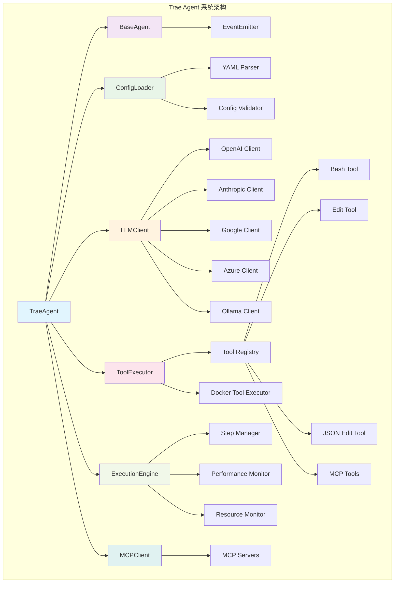
```mermaid
graph TB
    subgraph "Trae Agent 系统架构"
        A[TraeAgent] --> B[BaseAgent]
        A --> C[ConfigLoader]
        A --> D[LLMClient]
        A --> E[ToolExecutor]
        A --> F[ExecutionEngine]
        A --> G[MCPClient]
        
        B --> H[EventEmitter]
        
        C --> I[YAML Parser]
        C --> J[Config Validator]
        
        D --> K[OpenAI Client]
        D --> L[Anthropic Client]
        D --> M[Google Client]
        D --> N[Azure Client]
        D --> O[Ollama Client]
        
        E --> P[Tool Registry]
        E --> Q[Docker Tool Executor]
        
        P --> R[Bash Tool]
        P --> S[Edit Tool]
        P --> T[JSON Edit Tool]
        P --> U[MCP Tools]
        
        F --> V[Step Manager]
        F --> W[Performance Monitor]
        F --> X[Resource Monitor]
        
        G --> Y[MCP Servers]
    end
    
    style A fill:#e1f5fe
    style B fill:#f3e5f5
    style C fill:#e8f5e8
    style D fill:#fff3e0
    style E fill:#fce4ec
    style F fill:#f1f8e9
    style G fill:#e0f2f1
```

**架构说明：**
- **TraeAgent**: 系统的主入口，专门处理软件工程任务
- **BaseAgent**: 抽象基类，提供通用的代理执行逻辑
- **ConfigLoader**: 配置系统，支持YAML/JSON配置文件
- **LLMClient**: 统一的LLM客户端接口，支持多个提供商
- **ToolExecutor**: 工具执行系统，支持本地和Docker执行
- **ExecutionEngine**: 异步执行引擎，管理任务生命周期
- **MCPClient**: Model Context Protocol客户端，支持动态工具发现

### 1.2 数据流向图

#### 🌊 **数据流设计的核心思想**

数据流向图展现了Trae Agent系统中信息的完整生命周期，从用户输入到最终输出的每一个环节都经过精心设计。这种设计体现了**数据驱动架构**的核心理念：

**数据流设计原则：**

1. **单向数据流**：采用类似Redux的单向数据流模式，确保数据流向的可预测性和调试的便利性。每个数据变换都有明确的输入和输出，避免了双向绑定带来的复杂性。

2. **分层处理模式**：将数据处理分为输入层、处理层、执行层和输出层，每一层都有明确的职责边界。这种分层设计使得系统具备了良好的可测试性和可维护性。

3. **配置优先级机制**：实现了CLI参数 > 环境变量 > 配置文件 > 默认值的四级优先级系统，这种设计借鉴了12-Factor App的最佳实践，确保了在不同环境下的配置灵活性。

**技术创新与优势：**

- **智能配置合并**：系统能够智能地合并来自不同源的配置信息，避免配置冲突和遗漏
- **实时配置验证**：在数据流的每个关键节点都进行配置验证，确保错误能够被及早发现
- **可追溯的数据变换**：每个数据变换都会被记录，便于问题排查和系统优化
- **异步处理优化**：在执行层采用异步处理模式，大大提升了系统的并发处理能力

```mermaid
flowchart LR
    subgraph "输入层"
        A[用户任务] --> B[配置文件]
        B --> C[环境变量]
        C --> D[CLI参数]
    end
    
    subgraph "处理层"
        D --> E[TraeAgent.newTask]
        E --> F[配置解析]
        F --> G[工具初始化]
        G --> H[LLM客户端创建]
        H --> I[MCP工具发现]
    end
    
    subgraph "执行层"
        I --> J[ExecutionEngine.executeTask]
        J --> K[步骤循环]
        K --> L[LLM调用]
        L --> M[工具调用]
        M --> N[结果处理]
        N --> O{任务完成?}
        O -->|否| K
        O -->|是| P[生成结果]
    end
    
    subgraph "输出层"
        P --> Q[执行报告]
        Q --> R[代码补丁]
        R --> S[轨迹记录]
    end
    
    style A fill:#ffcdd2
    style E fill:#c8e6c9
    style J fill:#bbdefb
    style P fill:#d1c4e9
```

## 2. 任务执行生命周期流程图

### 2.1 完整执行流程

#### 🔄 **异步执行模式的深度设计**

任务执行生命周期是Trae Agent系统的核心，它体现了现代AI Agent系统的**异步执行哲学**。这种设计不仅仅是技术实现，更是对AI Agent工作模式的深刻理解：

**执行模式的核心理念：**

1. **人类认知模拟**：AI Agent的执行过程模拟了人类解决复杂问题的思维模式 - 思考、行动、反思、再思考。这种循环式的执行模式使得AI能够处理复杂的多步骤任务。

2. **可观测的执行过程**：通过详细的步骤追踪和状态管理，系统提供了完全透明的执行过程。这对于调试、优化和理解AI决策过程至关重要。

3. **弹性执行架构**：系统设计了完善的错误恢复机制，包括步骤级重试、依赖检查和智能回退，确保即使在复杂环境下也能稳定运行。

**技术实现的创新点：**

- **状态机驱动**：每个执行步骤都是一个明确定义的状态机，状态转换清晰可控
- **事件驱动通知**：实时的事件发射机制确保外部系统能够及时响应执行状态变化
- **资源生命周期管理**：从资源分配到释放的完整生命周期管理，防止内存泄漏和资源浪费
- **智能超时控制**：多层次的超时机制，从单步骤到整体任务的全方位时间控制

**实际应用价值：**
- **生产环境适应性**：完善的监控和错误处理使系统能够在生产环境长期稳定运行
- **调试友好性**：详细的执行日志和状态追踪大大简化了问题诊断过程
- **性能可优化性**：精确的性能指标收集为系统优化提供了数据基础

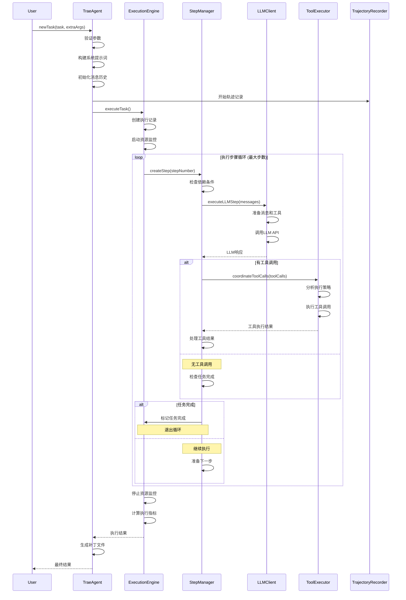
```mermaid
sequenceDiagram
    participant U as User
    participant TA as TraeAgent
    participant EE as ExecutionEngine
    participant SM as StepManager
    participant LC as LLMClient
    participant TE as ToolExecutor
    participant TR as TrajectoryRecorder
    
    U->>TA: newTask(task, extraArgs)
    TA->>TA: 验证参数
    TA->>TA: 构建系统提示词
    TA->>TA: 初始化消息历史
    TA->>TR: 开始轨迹记录
    
    TA->>EE: executeTask()
    EE->>EE: 创建执行记录
    EE->>EE: 启动资源监控
    
    loop 执行步骤循环 (最大步数)
        EE->>SM: createStep(stepNumber)
        SM->>SM: 检查依赖条件
        SM->>LC: executeLLMStep(messages)
        
        LC->>LC: 准备消息和工具
        LC->>LC: 调用LLM API
        LC-->>SM: LLM响应
        
        alt 有工具调用
            SM->>TE: coordinateToolCalls(toolCalls)
            TE->>TE: 分析执行策略
            TE->>TE: 执行工具调用
            TE-->>SM: 工具执行结果
            SM->>SM: 处理工具结果
        else
            Note over SM: 无工具调用
            SM->>SM: 检查任务完成
        end
        
        alt 任务完成
            SM->>EE: 标记任务完成
            Note over SM,EE: 退出循环
        else
            Note over SM: 继续执行
            SM->>SM: 准备下一步
        end
    end
    
    EE->>EE: 停止资源监控
    EE->>EE: 计算执行指标
    EE-->>TA: 执行结果
    TA->>TA: 生成补丁文件
    TA-->>U: 最终结果
```

### 2.2 步骤状态转换图

#### 🎯 **状态机设计的精妙之处**

步骤状态转换图展现了AI Agent执行过程中每个步骤的状态变化逻辑。这种状态机设计借鉴了**有限状态机理论**和**工作流管理系统**的最佳实践：

**状态机设计哲学：**

1. **确定性状态转换**：每个状态转换都有明确的触发条件和结果，避免了不确定性带来的系统不稳定
2. **可逆性设计**：支持从错误状态恢复到可重试状态，体现了系统的自愈能力
3. **状态持久化**：所有状态变化都会被持久化记录，确保系统重启后能够恢复执行状态

**关键状态解析：**
- **THINKING状态**：AI模型的推理阶段，是整个系统的智能核心
- **CALLING_TOOL状态**：工具调用阶段，体现了AI与外部世界的交互能力
- **REFLECTING状态**：反思阶段，AI对执行结果进行分析和总结，这是自我改进的关键环节

这种状态机设计不仅保证了执行的可靠性，更为AI Agent的智能行为提供了结构化的框架。

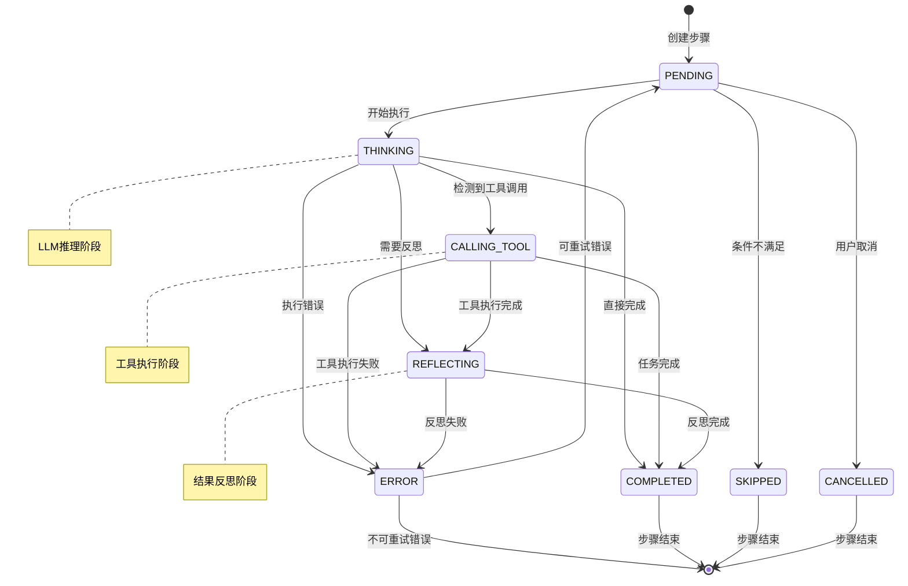
```mermaid
stateDiagram-v2
    [*] --> PENDING: 创建步骤
    
    PENDING --> THINKING: 开始执行
    PENDING --> SKIPPED: 条件不满足
    PENDING --> CANCELLED: 用户取消
    
    THINKING --> CALLING_TOOL: 检测到工具调用
    THINKING --> REFLECTING: 需要反思
    THINKING --> COMPLETED: 直接完成
    THINKING --> ERROR: 执行错误
    
    CALLING_TOOL --> REFLECTING: 工具执行完成
    CALLING_TOOL --> ERROR: 工具执行失败
    CALLING_TOOL --> COMPLETED: 任务完成
    
    REFLECTING --> COMPLETED: 反思完成
    REFLECTING --> ERROR: 反思失败
    
    ERROR --> PENDING: 可重试错误
    ERROR --> [*]: 不可重试错误
    
    COMPLETED --> [*]: 步骤结束
    SKIPPED --> [*]: 步骤结束
    CANCELLED --> [*]: 步骤结束
    
    note right of THINKING: LLM推理阶段
    note right of CALLING_TOOL: 工具执行阶段
    note right of REFLECTING: 结果反思阶段
```

## 3. LLM客户端调用流程图

### 3.1 多提供商客户端架构

#### 🤖 **多提供商策略的战略价值**

LLM客户端系统是Trae Agent的智能核心，其多提供商架构设计体现了对**AI基础设施多样性**和**供应商风险管理**的深刻理解：

**战略设计考量：**

1. **供应商风险分散**：在AI快速发展的时代，单一依赖某个LLM提供商存在巨大风险。多提供商架构确保了系统的持续可用性和技术路线的灵活性。

2. **成本优化策略**：不同提供商在定价、性能和能力上各有优势。系统可以根据任务类型、成本预算和性能要求智能选择最适合的提供商。

3. **能力互补性**：OpenAI擅长代码生成、Anthropic在安全性上表现出色、Google在多模态方面领先。多提供商支持使系统能够发挥各家的优势。

**技术架构亮点：**

- **统一抽象接口**：通过BaseLLMClient抽象类，屏蔽了不同提供商API的差异，为上层应用提供一致的调用体验
- **智能适配机制**：每个具体客户端都实现了提供商特有的优化，如OpenAI的严格模式、Anthropic的系统消息分离等
- **故障转移支持**：当某个提供商服务不可用时，系统可以自动切换到备用提供商
- **性能监控集成**：统一的性能监控和Token使用跟踪，便于成本分析和性能优化

**实际应用场景：**
- **开发环境**：使用成本较低的模型进行开发和测试
- **生产环境**：根据任务重要性选择不同性能等级的模型
- **特殊场景**：针对特定任务类型选择最擅长的模型提供商

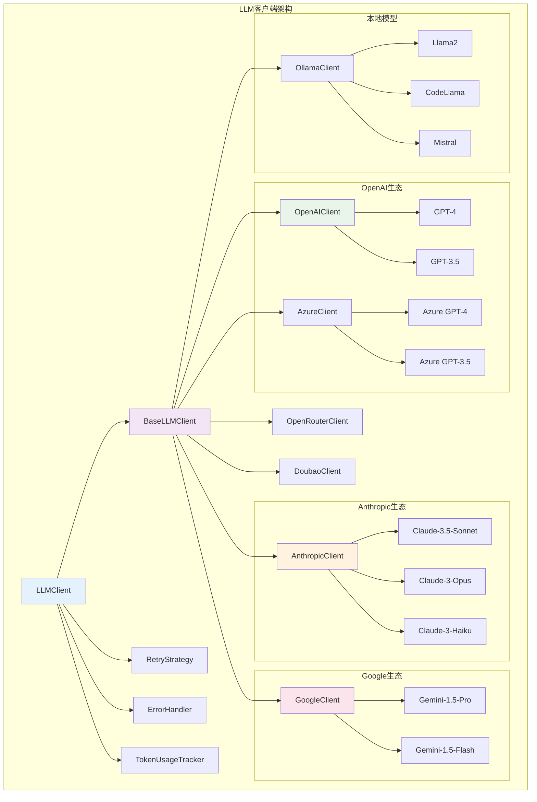
```mermaid
graph TB
    subgraph "LLM客户端架构"
        A[LLMClient] --> B[BaseLLMClient]
        
        B --> C[OpenAIClient]
        B --> D[AnthropicClient]
        B --> E[GoogleClient]
        B --> F[AzureClient]
        B --> G[OllamaClient]
        B --> H[OpenRouterClient]
        B --> I[DoubaoClient]
        
        A --> J[RetryStrategy]
        A --> K[ErrorHandler]
        A --> L[TokenUsageTracker]
        
        subgraph "OpenAI生态"
            C --> C1[GPT-4]
            C --> C2[GPT-3.5]
            F --> F1[Azure GPT-4]
            F --> F2[Azure GPT-3.5]
        end
        
        subgraph "Anthropic生态"
            D --> D1[Claude-3.5-Sonnet]
            D --> D2[Claude-3-Opus]
            D --> D3[Claude-3-Haiku]
        end
        
        subgraph "Google生态"
            E --> E1[Gemini-1.5-Pro]
            E --> E2[Gemini-1.5-Flash]
        end
        
        subgraph "本地模型"
            G --> G1[Llama2]
            G --> G2[CodeLlama]
            G --> G3[Mistral]
        end
    end
    
    style A fill:#e3f2fd
    style B fill:#f3e5f5
    style C fill:#e8f5e8
    style D fill:#fff3e0
    style E fill:#fce4ec
```

### 3.2 LLM调用执行流程

#### ⚡ **智能调用策略的技术深度**

LLM调用执行流程体现了系统对**AI服务调用优化**的深度思考。这不仅仅是简单的API调用，而是一个包含智能路由、错误处理、性能优化的复杂系统：

**调用策略的核心设计：**

1. **流式与批量的智能选择**：系统根据应用场景自动选择流式调用（实时响应）或批量调用（高吞吐量），这种自适应机制大大提升了用户体验。

2. **多层次的错误处理**：从网络层错误到业务逻辑错误，系统实现了分层的错误处理策略，每种错误都有对应的恢复机制。

3. **智能重试算法**：采用指数退避算法，结合抖动机制，避免了"雷群效应"，确保在高并发场景下的系统稳定性。

**性能优化的关键技术：**
- **连接池管理**：复用HTTP连接，减少连接建立开销
- **请求去重**：避免重复的API调用，节省成本和时间
- **缓存策略**：对于相同的请求，智能使用缓存结果
- **并发控制**：合理控制并发请求数量，避免触发提供商的限流机制

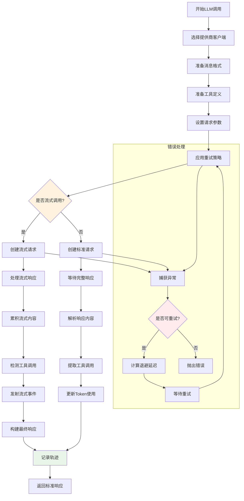
```mermaid
flowchart TD
    A[开始LLM调用] --> B[选择提供商客户端]
    B --> C[准备消息格式]
    C --> D[准备工具定义]
    D --> E[设置请求参数]
    E --> F[应用重试策略]
    
    F --> G{是否流式调用?}
    G -->|是| H[创建流式请求]
    G -->|否| I[创建标准请求]
    
    H --> J[处理流式响应]
    I --> K[等待完整响应]
    
    J --> L[累积流式内容]
    L --> M[检测工具调用]
    M --> N[发射流式事件]
    N --> O[构建最终响应]
    
    K --> P[解析响应内容]
    P --> Q[提取工具调用]
    Q --> R[更新Token使用]
    
    O --> S[记录轨迹]
    R --> S
    S --> T[返回标准响应]
    
    subgraph "错误处理"
        U[捕获异常] --> V{是否可重试?}
        V -->|是| W[计算退避延迟]
        W --> X[等待重试]
        X --> F
        V -->|否| Y[抛出错误]
    end
    
    F --> U
    H --> U
    I --> U
    
    style G fill:#fff3e0
    style V fill:#ffebee
    style S fill:#e8f5e8
```

### 3.3 工具调用处理流程

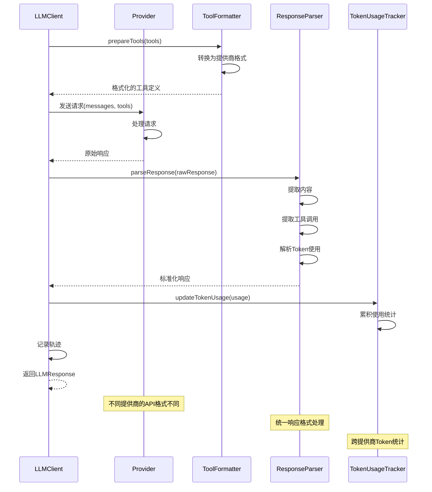
```mermaid
sequenceDiagram
    participant LC as LLMClient
    participant P as Provider
    participant TF as ToolFormatter
    participant RP as ResponseParser
    participant TU as TokenUsageTracker
    
    LC->>TF: prepareTools(tools)
    TF->>TF: 转换为提供商格式
    TF-->>LC: 格式化的工具定义
    
    LC->>P: 发送请求(messages, tools)
    P->>P: 处理请求
    P-->>LC: 原始响应
    
    LC->>RP: parseResponse(rawResponse)
    RP->>RP: 提取内容
    RP->>RP: 提取工具调用
    RP->>RP: 解析Token使用
    RP-->>LC: 标准化响应
    
    LC->>TU: updateTokenUsage(usage)
    TU->>TU: 累积使用统计
    
    LC->>LC: 记录轨迹
    LC-->>LC: 返回LLMResponse
    
    note over P: 不同提供商的API格式不同
    note over RP: 统一响应格式处理
    note over TU: 跨提供商Token统计
```

## 4. 工具系统执行流程图

### 4.1 工具执行架构图

#### 🛠️ **工具生态系统的架构哲学**

工具系统是AI Agent与外部世界交互的桥梁，其架构设计体现了**可扩展性**和**智能调度**的核心理念。这种设计使得AI Agent不再局限于纯文本交互，而是具备了操作真实世界的能力：

**架构设计的核心思想：**

1. **插件化生态系统**：采用注册表模式，支持运行时动态加载工具。这种设计使得系统具备了无限扩展的可能性，第三方开发者可以轻松集成自定义工具。

2. **智能执行策略**：系统实现了四种执行策略（顺序、并行、智能、批量），能够根据工具间的依赖关系和执行特性自动选择最优的执行方案。

3. **容器化隔离执行**：通过Docker集成，实现了工具执行的完全隔离，既保证了安全性，又提供了一致的执行环境。

**技术创新亮点：**

- **依赖分析引擎**：自动分析工具调用间的依赖关系，构建执行图，实现最优的并行执行
- **故障隔离机制**：单个工具的失败不会影响整个系统的运行，体现了微服务架构的优势
- **MCP协议支持**：支持Model Context Protocol，实现了工具的动态发现和热插拔
- **执行上下文管理**：维护工具执行的上下文信息，支持复杂的多步骤工具调用场景

**实际应用价值：**
- **开发效率提升**：丰富的内置工具和简单的扩展机制大大降低了AI应用的开发门槛
- **安全性保障**：容器化执行确保了工具调用的安全性，避免了恶意代码的风险
- **性能优化**：智能调度算法最大化了工具执行的并行性，提升了整体性能

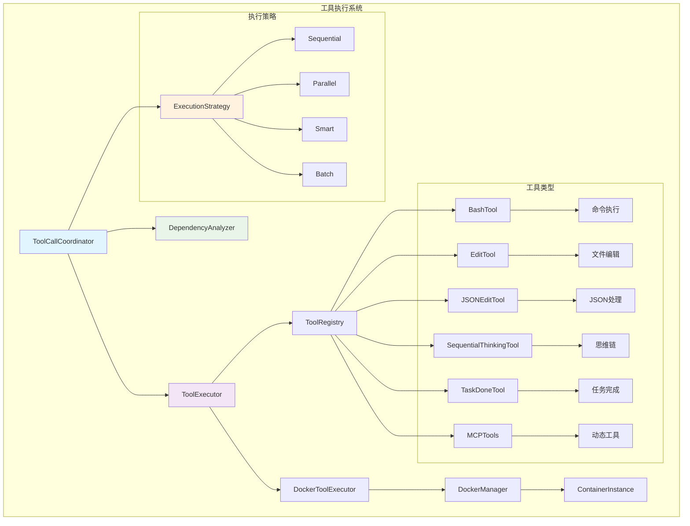
```mermaid
graph TB
    subgraph "工具执行系统"
        A[ToolCallCoordinator] --> B[ToolExecutor]
        A --> C[DependencyAnalyzer]
        A --> D[ExecutionStrategy]
        
        B --> E[ToolRegistry]
        B --> F[DockerToolExecutor]
        
        E --> G[BashTool]
        E --> H[EditTool]
        E --> I[JSONEditTool]
        E --> J[SequentialThinkingTool]
        E --> K[TaskDoneTool]
        E --> L[MCPTools]
        
        F --> M[DockerManager]
        M --> N[ContainerInstance]
        
        subgraph "执行策略"
            D --> O[Sequential]
            D --> P[Parallel]
            D --> Q[Smart]
            D --> R[Batch]
        end
        
        subgraph "工具类型"
            G --> G1[命令执行]
            H --> H1[文件编辑]
            I --> I1[JSON处理]
            J --> J1[思维链]
            K --> K1[任务完成]
            L --> L1[动态工具]
        end
    end
    
    style A fill:#e1f5fe
    style B fill:#f3e5f5
    style C fill:#e8f5e8
    style D fill:#fff3e0
```

### 4.2 智能工具调用策略流程

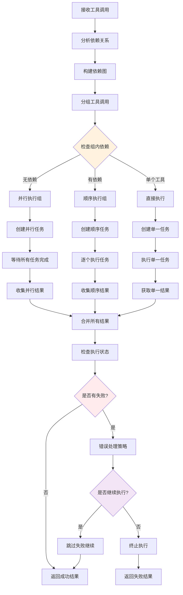
```mermaid
flowchart TD
    A[接收工具调用] --> B[分析依赖关系]
    B --> C[构建依赖图]
    C --> D[分组工具调用]
    
    D --> E{检查组内依赖}
    E -->|无依赖| F[并行执行组]
    E -->|有依赖| G[顺序执行组]
    E -->|单个工具| H[直接执行]
    
    F --> I[创建并行任务]
    G --> J[创建顺序任务]
    H --> K[创建单一任务]
    
    I --> L[等待所有任务完成]
    J --> M[逐个执行任务]
    K --> N[执行单一任务]
    
    L --> O[收集并行结果]
    M --> P[收集顺序结果]
    N --> Q[获取单一结果]
    
    O --> R[合并所有结果]
    P --> R
    Q --> R
    
    R --> S[检查执行状态]
    S --> T{是否有失败?}
    T -->|是| U[错误处理策略]
    T -->|否| V[返回成功结果]
    
    U --> W{是否继续执行?}
    W -->|是| X[跳过失败继续]
    W -->|否| Y[终止执行]
    
    X --> V
    Y --> Z[返回失败结果]
    
    style E fill:#fff3e0
    style T fill:#ffebee
    style W fill:#f3e5f5
```

### 4.3 Docker工具执行流程

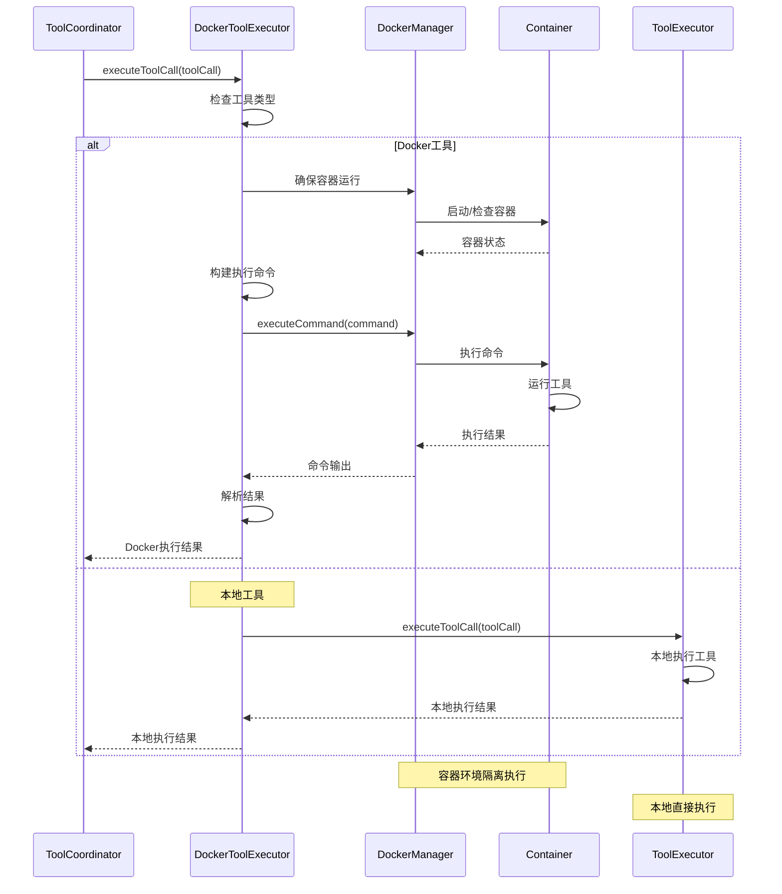
```mermaid
sequenceDiagram
    participant TC as ToolCoordinator
    participant DTE as DockerToolExecutor
    participant DM as DockerManager
    participant C as Container
    participant TE as ToolExecutor
    
    TC->>DTE: executeToolCall(toolCall)
    DTE->>DTE: 检查工具类型
    
    alt Docker工具
        DTE->>DM: 确保容器运行
        DM->>C: 启动/检查容器
        C-->>DM: 容器状态
        
        DTE->>DTE: 构建执行命令
        DTE->>DM: executeCommand(command)
        DM->>C: 执行命令
        C->>C: 运行工具
        C-->>DM: 执行结果
        DM-->>DTE: 命令输出
        
        DTE->>DTE: 解析结果
        DTE-->>TC: Docker执行结果
    else
        Note over DTE: 本地工具
        DTE->>TE: executeToolCall(toolCall)
        TE->>TE: 本地执行工具
        TE-->>DTE: 本地执行结果
        DTE-->>TC: 本地执行结果
    end
    
    note over DM,C: 容器环境隔离执行
    note over TE: 本地直接执行
```

## 5. 配置系统加载流程图

### 5.1 配置优先级解析流程

#### ⚙️ **配置管理的企业级设计**

配置系统是现代应用架构的基础设施，Trae Agent的配置系统设计体现了**12-Factor App方法论**和**云原生应用**的最佳实践：

**配置管理的设计原则：**

1. **环境分离**：严格分离不同环境的配置，确保开发、测试、生产环境的独立性和安全性。

2. **优先级清晰**：实现了CLI > 环境变量 > 配置文件 > 默认值的四级优先级系统，这种设计确保了配置的灵活性和可控性。

3. **类型安全**：通过TypeScript的类型系统，在编译时就能发现配置错误，大大提升了系统的可靠性。

**技术实现的创新点：**

- **智能类型转换**：系统能够自动将字符串配置转换为相应的数据类型（布尔值、数字、数组等）
- **配置验证引擎**：多层次的配置验证，从语法检查到业务逻辑验证，确保配置的正确性
- **热更新支持**：支持配置文件的热更新，无需重启应用即可应用新配置
- **配置审计追踪**：详细记录配置的来源和变更历史，便于问题排查和合规审计

**实际应用场景：**
- **CI/CD流水线**：通过环境变量动态配置不同环境的参数
- **容器化部署**：通过ConfigMap和Secret管理敏感配置
- **多租户系统**：支持租户级别的配置定制

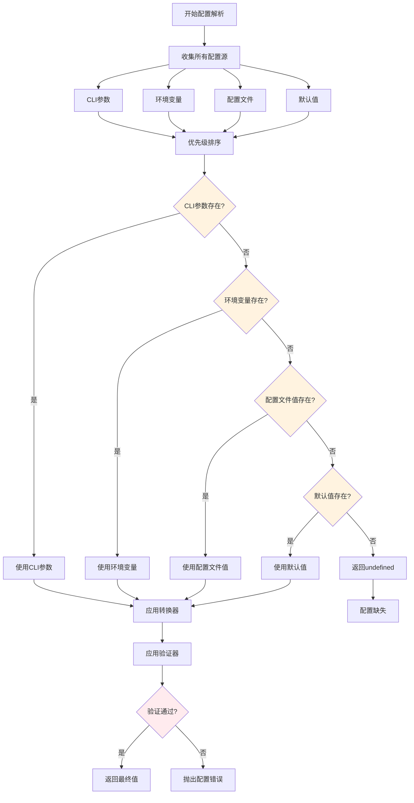
```mermaid
flowchart TD
    A[开始配置解析] --> B[收集所有配置源]
    
    B --> C[CLI参数]
    B --> D[环境变量]
    B --> E[配置文件]
    B --> F[默认值]
    
    C --> G[优先级排序]
    D --> G
    E --> G
    F --> G
    
    G --> H{CLI参数存在?}
    H -->|是| I[使用CLI参数]
    H -->|否| J{环境变量存在?}
    
    J -->|是| K[使用环境变量]
    J -->|否| L{配置文件值存在?}
    
    L -->|是| M[使用配置文件值]
    L -->|否| N{默认值存在?}
    
    N -->|是| O[使用默认值]
    N -->|否| P[返回undefined]
    
    I --> Q[应用转换器]
    K --> Q
    M --> Q
    O --> Q
    
    Q --> R[应用验证器]
    R --> S{验证通过?}
    S -->|是| T[返回最终值]
    S -->|否| U[抛出配置错误]
    
    P --> V[配置缺失]
    
    style H fill:#fff3e0
    style J fill:#fff3e0
    style L fill:#fff3e0
    style N fill:#fff3e0
    style S fill:#ffebee
```

### 5.2 YAML配置文件处理流程

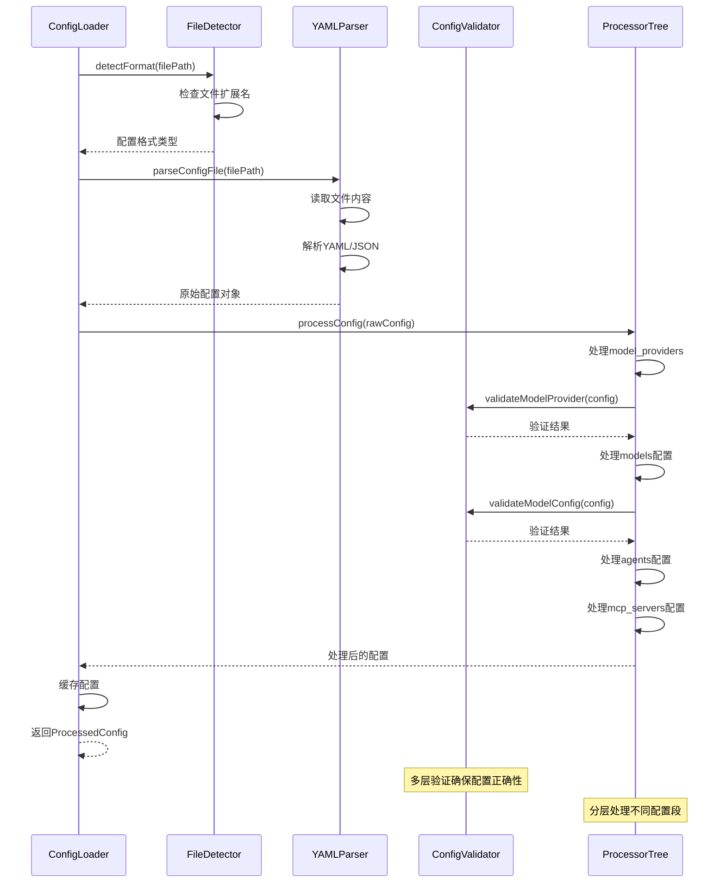
```mermaid
sequenceDiagram
    participant CL as ConfigLoader
    participant FD as FileDetector
    participant YP as YAMLParser
    participant CV as ConfigValidator
    participant PT as ProcessorTree
    
    CL->>FD: detectFormat(filePath)
    FD->>FD: 检查文件扩展名
    FD-->>CL: 配置格式类型
    
    CL->>YP: parseConfigFile(filePath)
    YP->>YP: 读取文件内容
    YP->>YP: 解析YAML/JSON
    YP-->>CL: 原始配置对象
    
    CL->>PT: processConfig(rawConfig)
    PT->>PT: 处理model_providers
    PT->>CV: validateModelProvider(config)
    CV-->>PT: 验证结果
    
    PT->>PT: 处理models配置
    PT->>CV: validateModelConfig(config)
    CV-->>PT: 验证结果
    
    PT->>PT: 处理agents配置
    PT->>PT: 处理mcp_servers配置
    PT-->>CL: 处理后的配置
    
    CL->>CL: 缓存配置
    CL-->>CL: 返回ProcessedConfig
    
    note over CV: 多层验证确保配置正确性
    note over PT: 分层处理不同配置段
```

### 5.3 配置监听和热更新流程

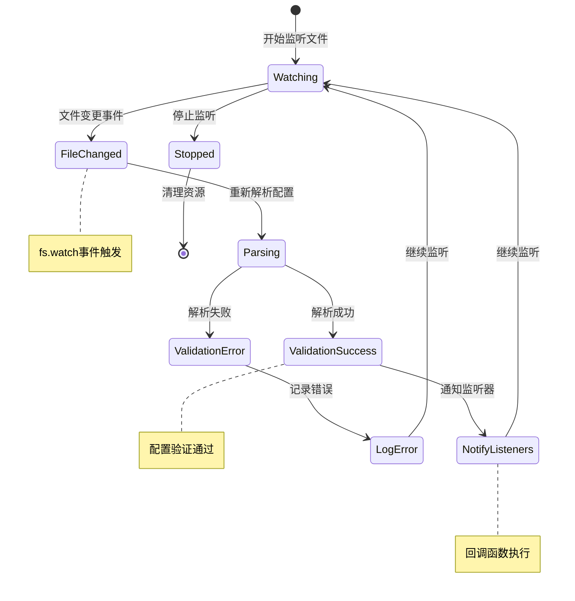
```mermaid
stateDiagram-v2
    [*] --> Watching: 开始监听文件
    
    Watching --> FileChanged: 文件变更事件
    FileChanged --> Parsing: 重新解析配置
    
    Parsing --> ValidationSuccess: 解析成功
    Parsing --> ValidationError: 解析失败
    
    ValidationSuccess --> NotifyListeners: 通知监听器
    ValidationError --> LogError: 记录错误
    
    NotifyListeners --> Watching: 继续监听
    LogError --> Watching: 继续监听
    
    Watching --> Stopped: 停止监听
    Stopped --> [*]: 清理资源
    
    note right of FileChanged: fs.watch事件触发
    note right of ValidationSuccess: 配置验证通过
    note right of NotifyListeners: 回调函数执行
```

## 6. 异步执行引擎流程图

### 6.1 执行引擎状态管理

#### 🚀 **高性能异步架构的核心设计**

异步执行引擎是Trae Agent系统的性能核心，其设计体现了**现代异步编程**和**响应式系统**的最佳实践：

**异步架构的核心价值：**

1. **非阻塞执行**：通过异步I/O和事件循环，系统能够在等待外部服务响应时继续处理其他任务，大大提升了资源利用率。

2. **弹性伸缩**：支持动态调整并发数量，根据系统负载和资源状况自动优化性能。

3. **故障隔离**：异步架构天然支持故障隔离，单个任务的失败不会阻塞整个系统。

**状态管理的精妙设计：**

- **状态持久化**：所有执行状态都会被持久化，确保系统重启后能够恢复执行
- **状态同步机制**：多个组件间的状态同步通过事件机制实现，保证了数据一致性
- **暂停恢复支持**：支持任务的暂停和恢复，这对于长时间运行的任务特别有价值
- **优雅关闭**：系统关闭时能够优雅地完成正在执行的任务，避免数据丢失

这种状态管理设计不仅保证了系统的可靠性，更为复杂的AI工作流提供了强大的控制能力。

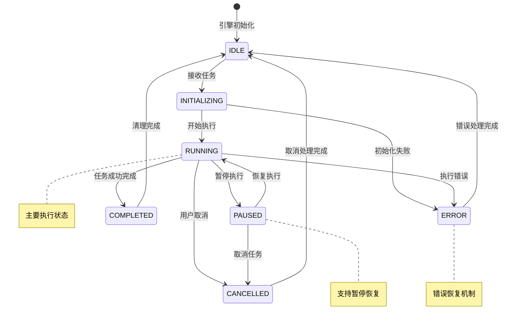
```mermaid
stateDiagram-v2
    [*] --> IDLE: 引擎初始化
    
    IDLE --> INITIALIZING: 接收任务
    INITIALIZING --> RUNNING: 开始执行
    INITIALIZING --> ERROR: 初始化失败
    
    RUNNING --> COMPLETED: 任务成功完成
    RUNNING --> ERROR: 执行错误
    RUNNING --> CANCELLED: 用户取消
    RUNNING --> PAUSED: 暂停执行
    
    PAUSED --> RUNNING: 恢复执行
    PAUSED --> CANCELLED: 取消任务
    
    ERROR --> IDLE: 错误处理完成
    COMPLETED --> IDLE: 清理完成
    CANCELLED --> IDLE: 取消处理完成
    
    note right of RUNNING: 主要执行状态
    note right of PAUSED: 支持暂停恢复
    note right of ERROR: 错误恢复机制
```

### 6.2 性能监控流程

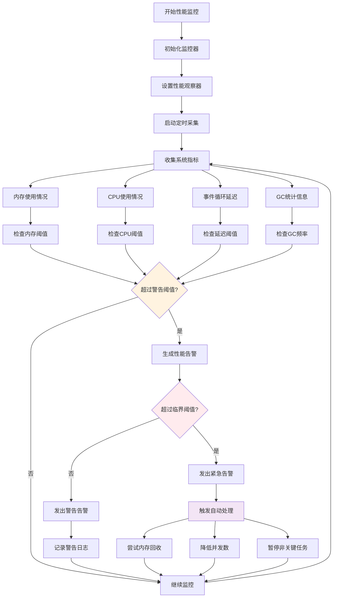
```mermaid
flowchart TD
    A[开始性能监控] --> B[初始化监控器]
    B --> C[设置性能观察器]
    C --> D[启动定时采集]
    
    D --> E[收集系统指标]
    E --> F[内存使用情况]
    E --> G[CPU使用情况]
    E --> H[事件循环延迟]
    E --> I[GC统计信息]
    
    F --> J[检查内存阈值]
    G --> K[检查CPU阈值]
    H --> L[检查延迟阈值]
    I --> M[检查GC频率]
    
    J --> N{超过警告阈值?}
    K --> N
    L --> N
    M --> N
    
    N -->|是| O[生成性能告警]
    N -->|否| P[继续监控]
    
    O --> Q{超过临界阈值?}
    Q -->|是| R[发出紧急告警]
    Q -->|否| S[发出警告告警]
    
    R --> T[触发自动处理]
    S --> U[记录警告日志]
    
    T --> V[尝试内存回收]
    T --> W[降低并发数]
    T --> X[暂停非关键任务]
    
    U --> P
    V --> P
    W --> P
    X --> P
    P --> E
    
    style N fill:#fff3e0
    style Q fill:#ffebee
    style T fill:#f3e5f5
```

### 6.3 资源管理和清理流程

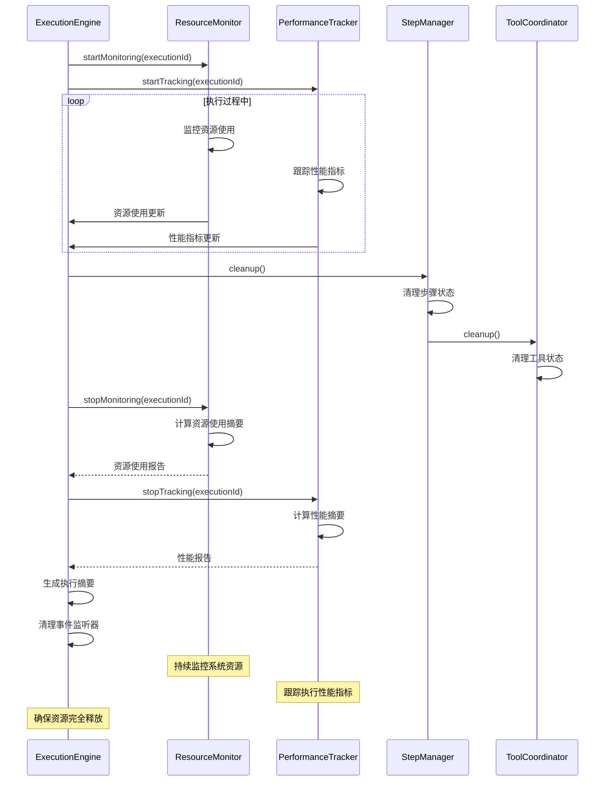
```mermaid
sequenceDiagram
    participant EE as ExecutionEngine
    participant RM as ResourceMonitor
    participant PM as PerformanceTracker
    participant SM as StepManager
    participant TC as ToolCoordinator
    
    EE->>RM: startMonitoring(executionId)
    EE->>PM: startTracking(executionId)
    
    loop 执行过程中
        RM->>RM: 监控资源使用
        PM->>PM: 跟踪性能指标
        RM->>EE: 资源使用更新
        PM->>EE: 性能指标更新
    end
    
    EE->>SM: cleanup()
    SM->>SM: 清理步骤状态
    SM->>TC: cleanup()
    TC->>TC: 清理工具状态
    
    EE->>RM: stopMonitoring(executionId)
    RM->>RM: 计算资源使用摘要
    RM-->>EE: 资源使用报告
    
    EE->>PM: stopTracking(executionId)
    PM->>PM: 计算性能摘要
    PM-->>EE: 性能报告
    
    EE->>EE: 生成执行摘要
    EE->>EE: 清理事件监听器
    
    note over RM: 持续监控系统资源
    note over PM: 跟踪执行性能指标
    note over EE: 确保资源完全释放
```

## 7. 错误处理和重试机制流程图

### 7.1 错误分类和处理策略

#### 🛡️ **企业级容错设计的哲学**

错误处理和重试机制是系统可靠性的基石，Trae Agent的错误处理设计体现了**混沌工程**和**弹性系统设计**的核心理念：

**容错设计的核心哲学：**

1. **故障即常态**：在分布式系统中，故障不是异常而是常态。系统设计必须假设故障会发生，并提前准备应对策略。

2. **快速失败与优雅降级**：对于无法恢复的错误快速失败，对于临时性错误提供优雅降级方案。

3. **可观测性优先**：详细的错误分类和日志记录，使得问题能够被快速定位和解决。

**错误处理的技术创新：**

- **智能错误分类**：基于错误特征自动分类，不同类型的错误采用不同的处理策略
- **上下文感知重试**：重试策略会考虑错误发生的上下文，避免无意义的重试
- **熔断器模式**：当错误率超过阈值时，自动熔断以保护系统
- **降级策略库**：预定义的降级策略，确保在各种故障场景下系统仍能提供基本服务

**实际应用价值：**
- **系统稳定性**：完善的错误处理机制大大提升了系统的可用性
- **运维效率**：智能的错误分类和处理减少了人工干预的需求
- **用户体验**：优雅的降级策略确保用户在故障情况下仍能获得良好体验

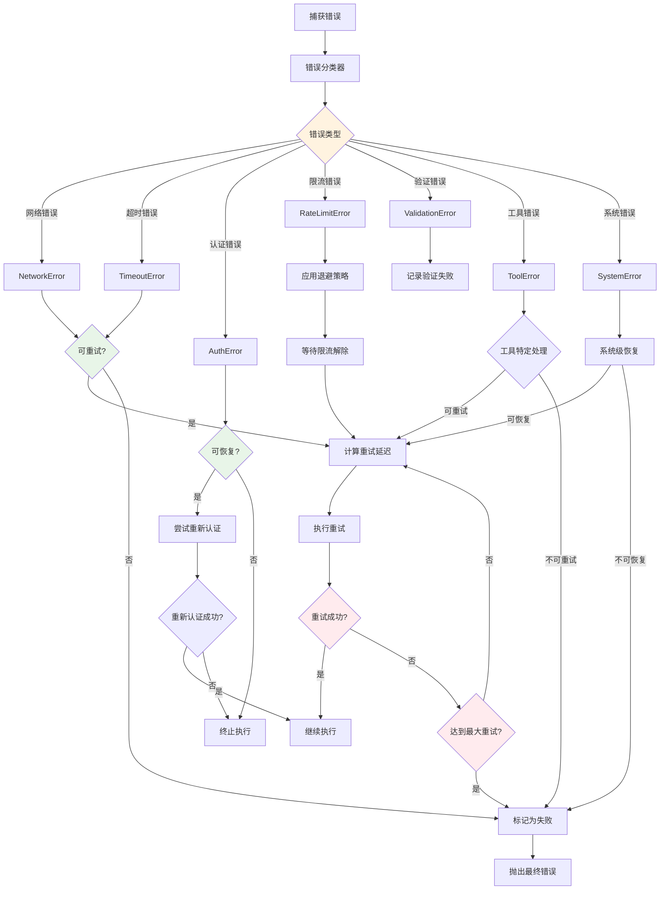
```mermaid
flowchart TD
    A[捕获错误] --> B[错误分类器]
    
    B --> C{错误类型}
    C -->|网络错误| D[NetworkError]
    C -->|超时错误| E[TimeoutError]
    C -->|认证错误| F[AuthError]
    C -->|限流错误| G[RateLimitError]
    C -->|验证错误| H[ValidationError]
    C -->|工具错误| I[ToolError]
    C -->|系统错误| J[SystemError]
    
    D --> K{可重试?}
    E --> K
    F --> L{可恢复?}
    G --> M[应用退避策略]
    H --> N[记录验证失败]
    I --> O{工具特定处理}
    J --> P[系统级恢复]
    
    K -->|是| Q[计算重试延迟]
    K -->|否| R[标记为失败]
    
    L -->|是| S[尝试重新认证]
    L -->|否| T[终止执行]
    
    M --> U[等待限流解除]
    U --> Q
    
    O -->|可重试| Q
    O -->|不可重试| R
    
    P -->|可恢复| Q
    P -->|不可恢复| R
    
    Q --> V[执行重试]
    V --> W{重试成功?}
    W -->|是| X[继续执行]
    W -->|否| Y{达到最大重试?}
    
    Y -->|是| R
    Y -->|否| Q
    
    R --> Z[抛出最终错误]
    S --> AA{重新认证成功?}
    AA -->|是| X
    AA -->|否| T
    
    style C fill:#fff3e0
    style K fill:#e8f5e8
    style L fill:#e8f5e8
    style W fill:#ffebee
    style Y fill:#ffebee
```

### 7.2 重试策略决策树

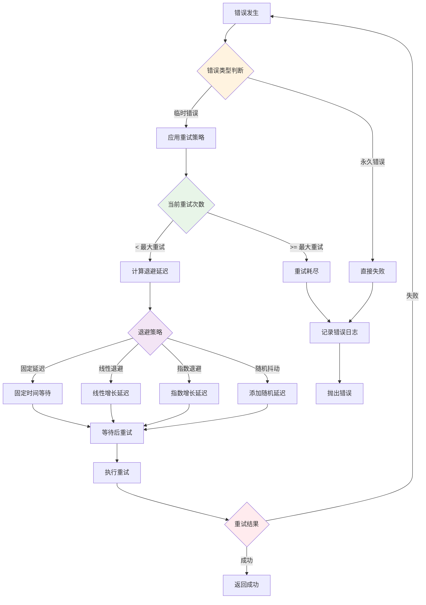
```mermaid
graph TD
    A[错误发生] --> B{错误类型判断}
    
    B -->|临时错误| C[应用重试策略]
    B -->|永久错误| D[直接失败]
    
    C --> E{当前重试次数}
    E -->|< 最大重试| F[计算退避延迟]
    E -->|>= 最大重试| G[重试耗尽]
    
    F --> H{退避策略}
    H -->|固定延迟| I[固定时间等待]
    H -->|线性退避| J[线性增长延迟]
    H -->|指数退避| K[指数增长延迟]
    H -->|随机抖动| L[添加随机延迟]
    
    I --> M[等待后重试]
    J --> M
    K --> M
    L --> M
    
    M --> N[执行重试]
    N --> O{重试结果}
    O -->|成功| P[返回成功]
    O -->|失败| A
    
    D --> Q[记录错误日志]
    G --> Q
    Q --> R[抛出错误]
    
    style B fill:#fff3e0
    style E fill:#e8f5e8
    style H fill:#f3e5f5
    style O fill:#ffebee
```

### 7.3 错误恢复和降级策略

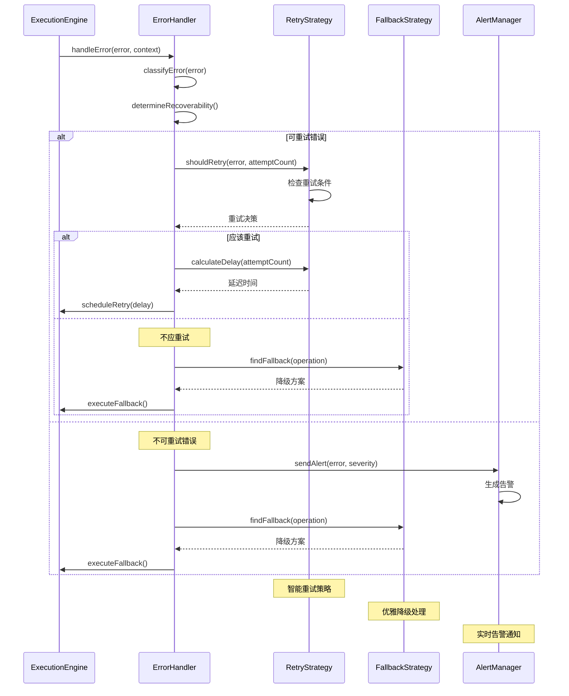
```mermaid
sequenceDiagram
    participant EE as ExecutionEngine
    participant EH as ErrorHandler
    participant RS as RetryStrategy
    participant FS as FallbackStrategy
    participant AL as AlertManager
    
    EE->>EH: handleError(error, context)
    EH->>EH: classifyError(error)
    EH->>EH: determineRecoverability()
    
    alt 可重试错误
        EH->>RS: shouldRetry(error, attemptCount)
        RS->>RS: 检查重试条件
        RS-->>EH: 重试决策
        
        alt 应该重试
            EH->>RS: calculateDelay(attemptCount)
            RS-->>EH: 延迟时间
            EH->>EE: scheduleRetry(delay)
        else
            Note over EH: 不应重试
            EH->>FS: findFallback(operation)
            FS-->>EH: 降级方案
            EH->>EE: executeFallback()
        end
    else
        Note over EH: 不可重试错误
        EH->>AL: sendAlert(error, severity)
        AL->>AL: 生成告警
        EH->>FS: findFallback(operation)
        FS-->>EH: 降级方案
        EH->>EE: executeFallback()
    end
    
    note over RS: 智能重试策略
    note over FS: 优雅降级处理
    note over AL: 实时告警通知
```

## 8. 事件驱动架构流程图

### 8.1 事件系统架构

#### 📡 **响应式系统的核心设计**

事件驱动架构是现代分布式系统的重要范式，Trae Agent的事件系统设计体现了**响应式宣言**和**微服务架构**的核心原则：

**事件驱动的设计价值：**

1. **松耦合架构**：通过事件机制，各组件间实现了松耦合，提升了系统的可维护性和可扩展性。

2. **实时响应能力**：事件驱动使系统具备了实时响应能力，用户可以实时了解系统状态和执行进度。

3. **可观测性增强**：丰富的事件流为系统监控、调试和分析提供了详细的数据基础。

**事件系统的技术特色：**

- **类型安全的事件**：基于TypeScript的事件类型定义，确保事件的类型安全
- **事件过滤和路由**：支持基于条件的事件过滤和智能路由
- **事件持久化**：关键事件会被持久化，支持事件重放和审计
- **背压处理**：当事件处理速度跟不上产生速度时，系统会自动应用背压机制

**实际应用场景：**
- **实时监控**：通过事件流实现系统状态的实时监控
- **用户界面更新**：UI组件通过监听事件实现实时更新
- **系统集成**：不同系统通过事件进行异步通信
- **审计日志**：事件流天然形成了完整的操作审计日志

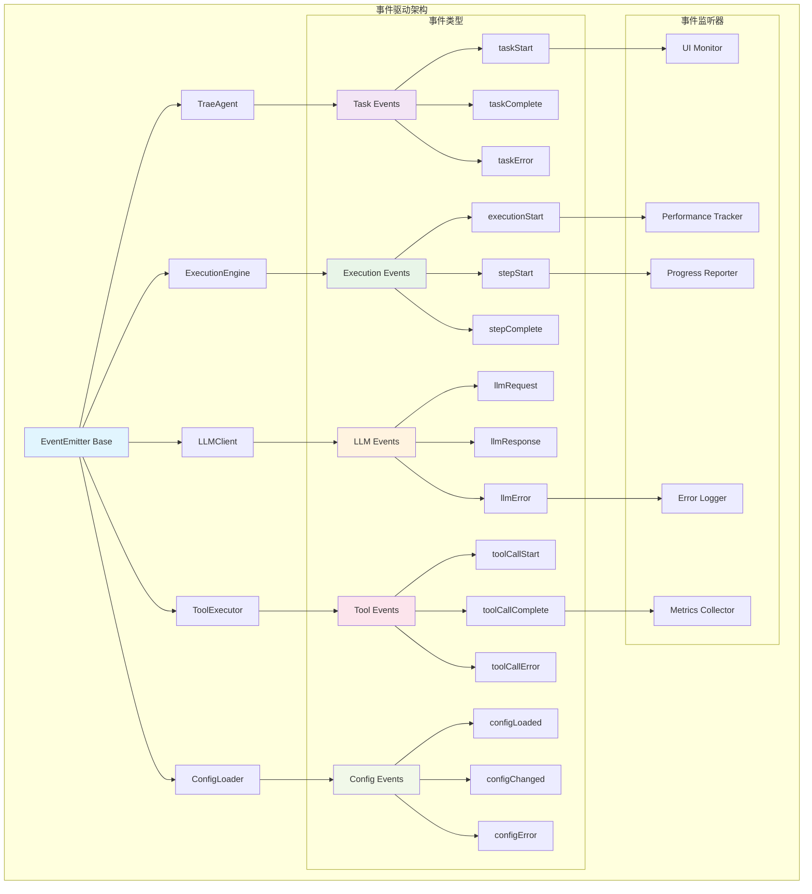
```mermaid
graph TB
    subgraph "事件驱动架构"
        A[EventEmitter Base] --> B[TraeAgent]
        A --> C[ExecutionEngine]
        A --> D[LLMClient]
        A --> E[ToolExecutor]
        A --> F[ConfigLoader]
        
        B --> G[Task Events]
        C --> H[Execution Events]
        D --> I[LLM Events]
        E --> J[Tool Events]
        F --> K[Config Events]
        
        subgraph "事件类型"
            G --> G1[taskStart]
            G --> G2[taskComplete]
            G --> G3[taskError]
            
            H --> H1[executionStart]
            H --> H2[stepStart]
            H --> H3[stepComplete]
            
            I --> I1[llmRequest]
            I --> I2[llmResponse]
            I --> I3[llmError]
            
            J --> J1[toolCallStart]
            J --> J2[toolCallComplete]
            J --> J3[toolCallError]
            
            K --> K1[configLoaded]
            K --> K2[configChanged]
            K --> K3[configError]
        end
        
        subgraph "事件监听器"
            L[UI Monitor]
            M[Performance Tracker]
            N[Error Logger]
            O[Progress Reporter]
            P[Metrics Collector]
        end
        
        G1 --> L
        H1 --> M
        I3 --> N
        H2 --> O
        J2 --> P
    end
    
    style A fill:#e1f5fe
    style G fill:#f3e5f5
    style H fill:#e8f5e8
    style I fill:#fff3e0
    style J fill:#fce4ec
    style K fill:#f1f8e9
```

### 8.2 事件传播和处理流程

```mermaid
sequenceDiagram
    participant TA as TraeAgent
    participant EE as ExecutionEngine
    participant SM as StepManager
    participant LC as LLMClient
    participant UI as UIMonitor
    participant PT as PerformanceTracker
    participant EL as ErrorLogger
    
    TA->>UI: emit('taskStart', {task})
    UI->>UI: 更新任务状态显示
    
    TA->>EE: executeTask()
    EE->>PT: emit('executionStart', {execution})
    PT->>PT: 开始性能跟踪
    
    EE->>SM: executeStep()
    SM->>UI: emit('stepStart', {step})
    UI->>UI: 更新步骤进度
    
    SM->>LC: executeLLMStep()
    LC->>PT: emit('llmRequest', {request})
    PT->>PT: 记录请求开始时间
    
    LC->>LC: 调用LLM API
    
    alt 成功响应
        LC->>PT: emit('llmResponse', {response})
        PT->>PT: 记录响应时间
        LC->>SM: 返回LLM响应
        SM->>UI: emit('stepComplete', {step})
        UI->>UI: 更新步骤完成状态
    else
        Note over LC: 错误响应
        LC->>EL: emit('llmError', {error})
        EL->>EL: 记录错误日志
        LC->>SM: 抛出错误
        SM->>EL: emit('stepError', {step, error})
        EL->>EL: 记录步骤错误
    end
    
    EE->>PT: emit('executionComplete', {execution})
    PT->>PT: 计算执行统计
    TA->>UI: emit('taskComplete', {result})
    UI->>UI: 显示最终结果
    
    note over UI: 实时UI更新
    note over PT: 性能数据收集
    note over EL: 错误日志记录
```

### 8.3 事件监听器管理

```mermaid
flowchart TD
    A[事件监听器管理器] --> B[注册监听器]
    A --> C[移除监听器]
    A --> D[事件过滤]
    A --> E[批量处理]
    
    B --> F[验证监听器]
    F --> G[添加到监听列表]
    G --> H[返回取消函数]
    
    C --> I[查找监听器]
    I --> J[从列表移除]
    J --> K[清理资源]
    
    D --> L[检查事件类型]
    L --> M[应用过滤规则]
    M --> N[转发匹配事件]
    
    E --> O[收集事件批次]
    O --> P[批量发送通知]
    P --> Q[优化性能]
    
    subgraph "监听器类型"
        R[一次性监听器]
        S[持久监听器]
        T[条件监听器]
        U[优先级监听器]
    end
    
    B --> R
    B --> S
    B --> T
    B --> U
    
    style A fill:#e1f5fe
    style F fill:#e8f5e8
    style L fill:#fff3e0
    style O fill:#f3e5f5
```

## 总结

### 🎯 **Trae Agent系统的技术价值与创新**

通过以上详细的Mermaid流程图和深度技术分析，我们可以看到Trae Agent系统在AI Agent领域的重要技术贡献：

#### **核心技术创新点：**

1. **模块化微服务架构** - 通过清晰的组件分离和统一接口，实现了高度可维护和可扩展的系统设计

2. **多提供商LLM策略** - 降低供应商锁定风险，提供成本优化和性能调优的灵活性

3. **智能工具调度系统** - 自动分析依赖关系，实现最优的并行执行策略

4. **企业级配置管理** - 四级优先级系统确保了从开发到生产的无缝部署

5. **弹性异步执行引擎** - 支持暂停恢复、故障隔离和性能监控的高可靠性执行

6. **智能错误处理机制** - 基于错误特征的自动分类和上下文感知重试策略

7. **响应式事件驱动架构** - 实现松耦合、实时响应和完整可观测性

#### **实际应用价值：**

- **🔬 研究友好性**: 模块化设计使研究人员可以独立研究和改进各个组件
- **🏭 生产就绪性**: 完整的监控、错误处理和资源管理确保生产环境稳定运行  
- **⚡ 开发效率**: 统一接口和丰富工具生态大大提升AI应用开发效率
- **💰 成本控制**: 多提供商支持和智能调度帮助优化LLM使用成本
- **🛡️ 安全可靠**: 容器化执行和完善错误处理确保系统安全稳定
- **📊 可观测性**: 详细的事件流和性能监控提供全方位的系统洞察

#### **技术领先性：**

Trae Agent系统不仅实现了当前AI Agent的核心功能，更重要的是它为AI Agent系统的工程化实践提供了一个完整的参考架构。这种设计理念和技术实现为AI应用的产业化发展提供了重要的技术基础。

每个流程图都可以作为独立的技术参考，也可以结合起来形成完整的系统设计指南。这些深度的技术分析和可视化设计，将为AI Agent领域的研究者和工程师提供宝贵的技术参考。
