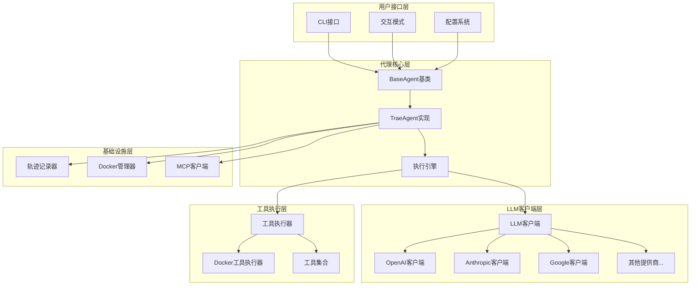
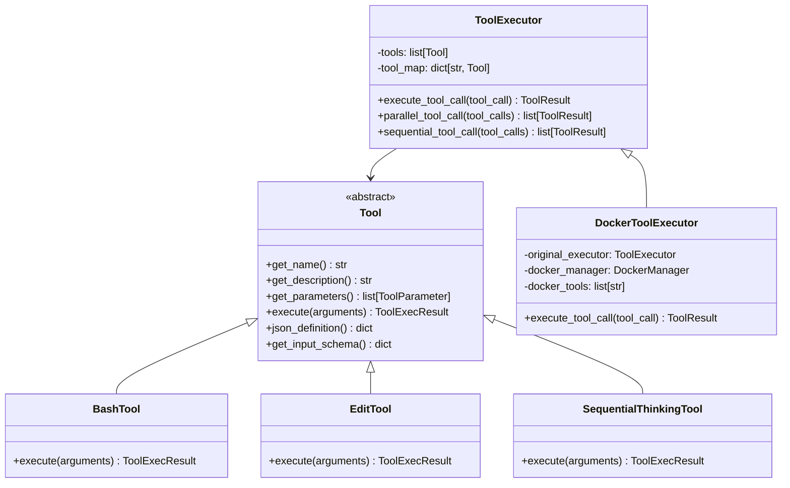
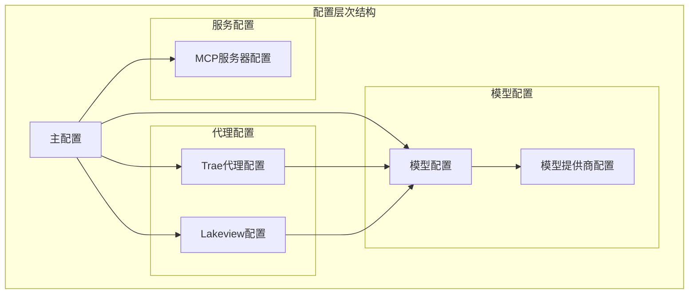
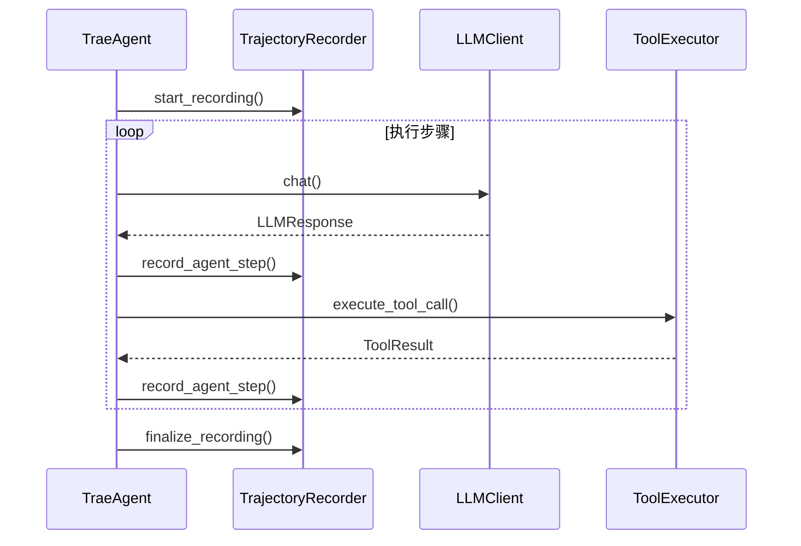
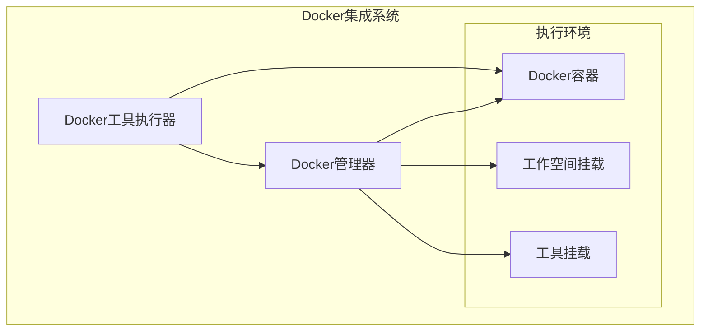

# Trae Agent 技术详解与 Node.js 实现指南

## 1. 项目概述与核心价值

Trae Agent 是由字节跳动开发的基于大语言模型（LLM）的智能软件工程代理系统。该系统的核心价值在于提供了一个**透明、模块化、研究友好**的AI代理架构，专门用于处理通用软件工程任务。

### 1.1 核心特性分析

#### 🌊 Lakeview 智能总结系统
Lakeview 是 Trae Agent 的核心创新之一，它提供了对代理执行步骤的简洁智能总结。这个系统的技术要点包括：

- **实时步骤摘要**：在代理执行过程中，实时生成每个步骤的简洁摘要
- **上下文感知**：基于任务上下文和执行历史生成相关性强的总结
- **可配置性**：支持通过配置启用或禁用，适应不同使用场景

#### 🤖 多 LLM 提供商支持
系统采用了**策略模式**设计，支持多种 LLM 提供商：

```python
class LLMProvider(Enum):
    OPENAI = "openai"
    ANTHROPIC = "anthropic" 
    AZURE = "azure"
    OLLAMA = "ollama"
    OPENROUTER = "openrouter"
    DOUBAO = "doubao"
    GOOGLE = "google"
```

每个提供商都有专门的客户端实现，通过统一的接口进行调用。

#### 🛠️ 丰富的工具生态系统
Trae Agent 提供了完整的工具执行框架：

- **文件编辑工具**：`str_replace_based_edit_tool`、`json_edit_tool`
- **系统交互工具**：`bash` 命令执行
- **思维链工具**：`sequentialthinking` 结构化思考
- **任务完成工具**：`task_done` 明确任务状态
- **MCP 工具支持**：Model Context Protocol 扩展工具

## 2. 系统架构深度解析

### 2.1 整体架构设计



### 2.2 核心组件技术详解

#### 2.2.1 BaseAgent 抽象基类

BaseAgent 是所有代理的基础类，定义了代理的核心生命周期和接口：

**关键技术特点：**

1. **生命周期管理**：
   - `new_task()`: 任务初始化
   - `execute_task()`: 任务执行
   - `cleanup_mcp_clients()`: 资源清理

2. **异步执行模型**：
   ```python
   async def execute_task(self) -> AgentExecution:
       execution = AgentExecution(task=self._task, steps=[])
       while step_number <= self._max_steps:
           step = AgentStep(step_number=step_number, state=AgentStepState.THINKING)
           messages = await self._run_llm_step(step, messages, execution)
           await self._finalize_step(step, messages, execution)
   ```

3. **状态机设计**：
   - `THINKING`: 思考阶段
   - `CALLING_TOOL`: 工具调用阶段
   - `REFLECTING`: 反思阶段
   - `COMPLETED`: 完成阶段
   - `ERROR`: 错误阶段

#### 2.2.2 TraeAgent 专业化实现

TraeAgent 继承自 BaseAgent，专门针对软件工程任务进行了优化：

**核心技术创新：**

1. **MCP（Model Context Protocol）集成**：
   ```python
   async def discover_mcp_tools(self):
       if self.mcp_servers_config:
           for mcp_server_name, mcp_server_config in self.mcp_servers_config.items():
               mcp_client = MCPClient()
               await mcp_client.connect_and_discover(
                   mcp_server_name, mcp_server_config, self.mcp_tools
               )
   ```

2. **Git 集成与补丁生成**：
   ```python
   def get_git_diff(self) -> str:
       if not self.base_commit:
           stdout = subprocess.check_output(["git", "--no-pager", "diff"]).decode()
       else:
           stdout = subprocess.check_output(
               ["git", "--no-pager", "diff", self.base_commit, "HEAD"]
           ).decode()
   ```

3. **智能任务完成检测**：
   ```python
   def llm_indicates_task_completed(self, llm_response: LLMResponse) -> bool:
       return any(tool_call.name == "task_done" for tool_call in llm_response.tool_calls)
   ```

### 2.3 工具系统架构



#### 2.3.1 工具执行机制

**并行执行支持：**
```python
async def parallel_tool_call(self, tool_calls: list[ToolCall]) -> list[ToolResult]:
    return await asyncio.gather(*[self.execute_tool_call(call) for call in tool_calls])
```

**顺序执行支持：**
```python
async def sequential_tool_call(self, tool_calls: list[ToolCall]) -> list[ToolResult]:
    return [await self.execute_tool_call(call) for call in tool_calls]
```

**Docker 隔离执行：**
DockerToolExecutor 提供了容器化的工具执行环境，确保执行安全性和环境一致性。

### 2.4 LLM 客户端系统

```mermaid
graph LR
    subgraph "LLM客户端架构"
        LLMClient[LLM客户端]
        BaseLLMClient[基础LLM客户端]
        
        subgraph "具体实现"
            OpenAIClient[OpenAI客户端]
            AnthropicClient[Anthropic客户端]
            GoogleClient[Google客户端]
            OllamaClient[Ollama客户端]
        end
    end
    
    LLMClient --> BaseLLMClient
    BaseLLMClient <|-- OpenAIClient
    BaseLLMClient <|-- AnthropicClient
    BaseLLMClient <|-- GoogleClient
    BaseLLMClient <|-- OllamaClient
```

#### 2.4.1 统一接口设计

**核心接口方法：**
```python
def chat(
    self,
    messages: list[LLMMessage],
    model_config: ModelConfig,
    tools: list[Tool] | None = None,
    reuse_history: bool = True,
) -> LLMResponse
```

**工具调用支持检测：**
```python
def supports_tool_calling(self, model_config: ModelConfig) -> bool:
    return hasattr(self.client, "supports_tool_calling") and \
           self.client.supports_tool_calling(model_config)
```

## 3. 配置系统详解

### 3.1 配置架构设计



### 3.2 配置优先级机制

系统采用了**分层配置优先级**机制：

```
命令行参数 > 环境变量 > 配置文件 > 默认值
```

**实现细节：**
```python
def resolve_config_value(
    *,
    cli_value: int | str | float | None,
    config_value: int | str | float | None,
    env_var: str | None = None,
) -> int | str | float | None:
    if cli_value is not None:
        return cli_value
    
    if env_var and os.getenv(env_var):
        return os.getenv(env_var)
    
    if config_value is not None:
        return config_value
    
    return None
```

### 3.3 YAML 配置示例详解

```yaml
# 代理配置
agents:
  trae_agent:
    enable_lakeview: true
    model: trae_agent_model
    max_steps: 200
    tools:
      - bash
      - str_replace_based_edit_tool
      - sequentialthinking
      - task_done

# 模型提供商配置
model_providers:
  anthropic:
    api_key: your_anthropic_api_key
    provider: anthropic
  openai:
    api_key: your_openai_api_key
    provider: openai
    base_url: https://api.openai.com/v1  # 可选

# 模型配置
models:
  trae_agent_model:
    model_provider: anthropic
    model: claude-sonnet-4-20250514
    max_tokens: 4096
    temperature: 0.5
    parallel_tool_calls: true

# MCP服务器配置（可选）
mcp_servers:
  playwright:
    command: npx
    args:
      - "@playwright/mcp@0.0.27"
    timeout: 30
```

## 4. 轨迹记录系统

### 4.1 轨迹记录架构



### 4.2 轨迹数据结构

**核心记录内容：**
- LLM 交互历史
- 代理执行步骤
- 工具使用情况
- 执行元数据
- 错误和异常信息

**数据格式示例：**
```json
{
  "task": "Create a hello world Python script",
  "provider": "anthropic",
  "model": "claude-sonnet-4-20250514",
  "max_steps": 200,
  "steps": [
    {
      "step_number": 1,
      "state": "thinking",
      "llm_messages": [...],
      "llm_response": {...},
      "tool_calls": [...],
      "tool_results": [...],
      "timestamp": "2025-01-XX..."
    }
  ],
  "execution_time": 15.432,
  "success": true,
  "final_result": "Task completed successfully"
}
```

## 5. Docker 集成系统

### 5.1 Docker 管理架构



### 5.2 容器化执行特性

**支持的 Docker 模式：**

1. **镜像模式**：`--docker-image python:3.11`
2. **容器模式**：`--docker-container-id container_id`
3. **Dockerfile 模式**：`--dockerfile-path /path/to/Dockerfile`
4. **镜像文件模式**：`--docker-image-file image.tar`

**工作空间映射：**
```python
self.docker_manager = DockerManager(
    image=docker_config.get("image"),
    workspace_dir=docker_config["workspace_dir"],
    tools_dir=tools_dir,
    interactive=is_interactive_mode,
)
```

## 6. Node.js 实现指南

现在我将提供完整的 Node.js 实现方案：

### 6.1 项目结构设计

```
trae-agent-nodejs/
├── src/
│   ├── agent/
│   │   ├── BaseAgent.ts
│   │   ├── TraeAgent.ts
│   │   └── AgentBasics.ts
│   ├── tools/
│   │   ├── base/
│   │   │   ├── Tool.ts
│   │   │   └── ToolExecutor.ts
│   │   ├── BashTool.ts
│   │   ├── EditTool.ts
│   │   └── SequentialThinkingTool.ts
│   ├── llm/
│   │   ├── LLMClient.ts
│   │   ├── providers/
│   │   │   ├── OpenAIClient.ts
│   │   │   ├── AnthropicClient.ts
│   │   │   └── GoogleClient.ts
│   │   └── types.ts
│   ├── config/
│   │   ├── Config.ts
│   │   └── types.ts
│   ├── utils/
│   │   ├── TrajectoryRecorder.ts
│   │   ├── DockerManager.ts
│   │   └── MCPClient.ts
│   └── cli/
│       └── index.ts
├── package.json
├── tsconfig.json
└── README.md
```

### 6.2 核心类型定义

```typescript
// src/llm/types.ts
export interface LLMMessage {
  role: 'system' | 'user' | 'assistant';
  content: string;
  toolResult?: ToolResult;
}

export interface LLMResponse {
  content: string;
  toolCalls?: ToolCall[];
  usage?: TokenUsage;
}

export interface TokenUsage {
  promptTokens: number;
  completionTokens: number;
  totalTokens: number;
}

// src/tools/base/Tool.ts
export interface ToolCall {
  name: string;
  callId: string;
  arguments: Record<string, any>;
  id?: string;
}

export interface ToolResult {
  callId: string;
  name: string;
  success: boolean;
  result?: string;
  error?: string;
  id?: string;
}

export interface ToolExecResult {
  output?: string;
  error?: string;
  errorCode: number;
}

export interface ToolParameter {
  name: string;
  type: string | string[];
  description: string;
  enum?: string[];
  items?: Record<string, any>;
  required: boolean;
}
```

### 6.3 基础工具类实现

```typescript
// src/tools/base/Tool.ts
export abstract class Tool {
  protected modelProvider?: string;

  constructor(modelProvider?: string) {
    this.modelProvider = modelProvider;
  }

  abstract getName(): string;
  abstract getDescription(): string;
  abstract getParameters(): ToolParameter[];
  abstract execute(arguments: Record<string, any>): Promise<ToolExecResult>;

  getModelProvider(): string | undefined {
    return this.modelProvider;
  }

  jsonDefinition(): Record<string, any> {
    return {
      name: this.getName(),
      description: this.getDescription(),
      parameters: this.getInputSchema(),
    };
  }

  getInputSchema(): Record<string, any> {
    const schema: Record<string, any> = {
      type: 'object',
    };

    const properties: Record<string, any> = {};
    const required: string[] = [];

    for (const param of this.getParameters()) {
      const paramSchema: Record<string, any> = {
        type: param.type,
        description: param.description,
      };

      // OpenAI strict mode support
      if (this.modelProvider === 'openai') {
        required.push(param.name);
        if (!param.required) {
          const currentType = paramSchema.type;
          if (typeof currentType === 'string') {
            paramSchema.type = [currentType, 'null'];
          } else if (Array.isArray(currentType) && !currentType.includes('null')) {
            paramSchema.type = [...currentType, 'null'];
          }
        }
      } else if (param.required) {
        required.push(param.name);
      }

      if (param.enum) {
        paramSchema.enum = param.enum;
      }

      if (param.items) {
        paramSchema.items = param.items;
      }

      if (this.modelProvider === 'openai' && param.type === 'object') {
        paramSchema.additionalProperties = false;
      }

      properties[param.name] = paramSchema;
    }

    schema.properties = properties;
    if (required.length > 0) {
      schema.required = required;
    }

    if (this.modelProvider === 'openai') {
      schema.additionalProperties = false;
    }

    return schema;
  }

  async close(): Promise<void> {
    // Default implementation - can be overridden
  }
}
```

### 6.4 工具执行器实现

```typescript
// src/tools/base/ToolExecutor.ts
export class ToolExecutor {
  private tools: Tool[];
  private toolMap?: Map<string, Tool>;

  constructor(tools: Tool[]) {
    this.tools = tools;
  }

  async closeTools(): Promise<void[]> {
    const tasks = this.tools.map(tool => tool.close());
    return Promise.all(tasks);
  }

  private normalizeToolName(name: string): string {
    return name.toLowerCase().replace(/_/g, '');
  }

  private getToolMap(): Map<string, Tool> {
    if (!this.toolMap) {
      this.toolMap = new Map();
      for (const tool of this.tools) {
        const normalizedName = this.normalizeToolName(tool.getName());
        this.toolMap.set(normalizedName, tool);
      }
    }
    return this.toolMap;
  }

  async executeToolCall(toolCall: ToolCall): Promise<ToolResult> {
    const normalizedName = this.normalizeToolName(toolCall.name);
    const toolMap = this.getToolMap();
    
    if (!toolMap.has(normalizedName)) {
      return {
        name: toolCall.name,
        success: false,
        error: `Tool '${toolCall.name}' not found. Available tools: ${this.tools.map(t => t.getName()).join(', ')}`,
        callId: toolCall.callId,
        id: toolCall.id,
      };
    }

    const tool = toolMap.get(normalizedName)!;

    try {
      const execResult = await tool.execute(toolCall.arguments);
      return {
        name: toolCall.name,
        success: execResult.errorCode === 0,
        result: execResult.output,
        error: execResult.error,
        callId: toolCall.callId,
        id: toolCall.id,
      };
    } catch (error) {
      return {
        name: toolCall.name,
        success: false,
        error: `Error executing tool '${toolCall.name}': ${error instanceof Error ? error.message : String(error)}`,
        callId: toolCall.callId,
        id: toolCall.id,
      };
    }
  }

  async parallelToolCall(toolCalls: ToolCall[]): Promise<ToolResult[]> {
    const tasks = toolCalls.map(call => this.executeToolCall(call));
    return Promise.all(tasks);
  }

  async sequentialToolCall(toolCalls: ToolCall[]): Promise<ToolResult[]> {
    const results: ToolResult[] = [];
    for (const call of toolCalls) {
      const result = await this.executeToolCall(call);
      results.push(result);
    }
    return results;
  }
}
```

### 6.5 LLM 客户端实现

```typescript
// src/llm/LLMClient.ts
export enum LLMProvider {
  OPENAI = 'openai',
  ANTHROPIC = 'anthropic',
  AZURE = 'azure',
  OLLAMA = 'ollama',
  OPENROUTER = 'openrouter',
  DOUBAO = 'doubao',
  GOOGLE = 'google',
}

export class LLMClient {
  private provider: LLMProvider;
  private modelConfig: ModelConfig;
  private client: BaseLLMClient;

  constructor(modelConfig: ModelConfig) {
    this.provider = modelConfig.modelProvider.provider as LLMProvider;
    this.modelConfig = modelConfig;

    switch (this.provider) {
      case LLMProvider.OPENAI:
        this.client = new OpenAIClient(modelConfig);
        break;
      case LLMProvider.ANTHROPIC:
        this.client = new AnthropicClient(modelConfig);
        break;
      case LLMProvider.GOOGLE:
        this.client = new GoogleClient(modelConfig);
        break;
      // ... 其他提供商
      default:
        throw new Error(`Unsupported provider: ${this.provider}`);
    }
  }

  setTrajectoryRecorder(recorder?: TrajectoryRecorder): void {
    this.client.setTrajectoryRecorder(recorder);
  }

  setChatHistory(messages: LLMMessage[]): void {
    this.client.setChatHistory(messages);
  }

  chat(
    messages: LLMMessage[],
    modelConfig: ModelConfig,
    tools?: Tool[],
    reuseHistory: boolean = true
  ): Promise<LLMResponse> {
    return this.client.chat(messages, modelConfig, tools, reuseHistory);
  }

  supportsToolCalling(modelConfig: ModelConfig): boolean {
    return this.client.supportsToolCalling && this.client.supportsToolCalling(modelConfig);
  }
}
```

### 6.6 基础代理实现

```typescript
// src/agent/BaseAgent.ts
export abstract class BaseAgent {
  protected llmClient: LLMClient;
  protected modelConfig: ModelConfig;
  protected maxSteps: number;
  protected initialMessages: LLMMessage[] = [];
  protected task: string = '';
  protected tools: Tool[];
  protected toolCaller: ToolExecutor;
  protected trajectoryRecorder?: TrajectoryRecorder;

  constructor(agentConfig: AgentConfig) {
    this.llmClient = new LLMClient(agentConfig.model);
    this.modelConfig = agentConfig.model;
    this.maxSteps = agentConfig.maxSteps;
    
    // 初始化工具
    this.tools = agentConfig.tools.map(toolName => {
      const ToolClass = toolsRegistry[toolName];
      return new ToolClass(this.modelConfig.modelProvider.provider);
    });
    
    this.toolCaller = new ToolExecutor(this.tools);
  }

  setTrajectoryRecorder(recorder?: TrajectoryRecorder): void {
    this.trajectoryRecorder = recorder;
    this.llmClient.setTrajectoryRecorder(recorder);
  }

  abstract newTask(
    task: string,
    extraArgs?: Record<string, string>,
    toolNames?: string[]
  ): void;

  async executeTask(): Promise<AgentExecution> {
    const startTime = Date.now();
    const execution: AgentExecution = {
      task: this.task,
      steps: [],
      agentState: AgentState.RUNNING,
      success: false,
      executionTime: 0,
    };

    try {
      if (this.trajectoryRecorder) {
        this.trajectoryRecorder.startRecording({
          task: this.task,
          provider: this.llmClient.provider,
          model: this.modelConfig.model,
          maxSteps: this.maxSteps,
        });
      }

      let messages = [...this.initialMessages];
      let stepNumber = 1;

      while (stepNumber <= this.maxSteps) {
        const step: AgentStep = {
          stepNumber,
          state: AgentStepState.THINKING,
        };

        try {
          messages = await this.runLLMStep(step, messages, execution);
          await this.finalizeStep(step, messages, execution);
          
          if (execution.agentState === AgentState.COMPLETED) {
            break;
          }
          
          stepNumber++;
        } catch (error) {
          execution.agentState = AgentState.ERROR;
          step.state = AgentStepState.ERROR;
          step.error = error instanceof Error ? error.message : String(error);
          await this.finalizeStep(step, messages, execution);
          break;
        }
      }

      if (stepNumber > this.maxSteps && !execution.success) {
        execution.finalResult = 'Task execution exceeded maximum steps without completion.';
        execution.agentState = AgentState.ERROR;
      }

    } catch (error) {
      execution.finalResult = `Agent execution failed: ${error instanceof Error ? error.message : String(error)}`;
    } finally {
      await this.closeTools();
    }

    execution.executionTime = Date.now() - startTime;

    if (this.trajectoryRecorder) {
      this.trajectoryRecorder.finalizeRecording({
        success: execution.success,
        finalResult: execution.finalResult,
      });
    }

    return execution;
  }

  private async runLLMStep(
    step: AgentStep,
    messages: LLMMessage[],
    execution: AgentExecution
  ): Promise<LLMMessage[]> {
    // 获取 LLM 响应
    step.state = AgentStepState.THINKING;
    const llmResponse = await this.llmClient.chat(messages, this.modelConfig, this.tools);
    step.llmResponse = llmResponse;

    // 更新 token 使用情况
    this.updateLLMUsage(llmResponse, execution);

    if (this.llmIndicatesTaskCompleted(llmResponse)) {
      if (this.isTaskCompleted(llmResponse)) {
        execution.agentState = AgentState.COMPLETED;
        execution.finalResult = llmResponse.content;
        execution.success = true;
        return messages;
      } else {
        execution.agentState = AgentState.RUNNING;
        return [{
          role: 'user',
          content: this.taskIncompleteMessage(),
        }];
      }
    } else {
      return await this.toolCallHandler(llmResponse.toolCalls, step);
    }
  }

  private async toolCallHandler(
    toolCalls: ToolCall[] | undefined,
    step: AgentStep
  ): Promise<LLMMessage[]> {
    const messages: LLMMessage[] = [];
    
    if (!toolCalls || toolCalls.length === 0) {
      messages.push({
        role: 'user',
        content: 'It seems that you have not completed the task.',
      });
      return messages;
    }

    step.state = AgentStepState.CALLING_TOOL;
    step.toolCalls = toolCalls;

    let toolResults: ToolResult[];
    if (this.modelConfig.parallelToolCalls) {
      toolResults = await this.toolCaller.parallelToolCall(toolCalls);
    } else {
      toolResults = await this.toolCaller.sequentialToolCall(toolCalls);
    }
    
    step.toolResults = toolResults;

    for (const toolResult of toolResults) {
      messages.push({
        role: 'user',
        toolResult,
      });
    }

    const reflection = this.reflectOnResult(toolResults);
    if (reflection) {
      step.state = AgentStepState.REFLECTING;
      step.reflection = reflection;
      messages.push({
        role: 'assistant',
        content: reflection,
      });
    }

    return messages;
  }

  protected reflectOnResult(toolResults: ToolResult[]): string | undefined {
    if (toolResults.length === 0) {
      return undefined;
    }

    const failedResults = toolResults.filter(result => !result.success);
    if (failedResults.length === 0) {
      return undefined;
    }

    return failedResults
      .map(result => `The tool execution failed with error: ${result.error}. Consider trying a different approach or fixing the parameters.`)
      .join('\n');
  }

  protected llmIndicatesTaskCompleted(llmResponse: LLMResponse): boolean {
    const completionIndicators = [
      'task completed',
      'task finished',
      'done',
      'completed successfully',
      'finished successfully',
    ];

    const responseContent = llmResponse.content.toLowerCase();
    return completionIndicators.some(indicator => responseContent.includes(indicator));
  }

  protected isTaskCompleted(llmResponse: LLMResponse): boolean {
    return true; // 默认实现，子类可以重写
  }

  protected taskIncompleteMessage(): string {
    return 'The task is incomplete. Please try again.';
  }

  private async finalizeStep(
    step: AgentStep,
    messages: LLMMessage[],
    execution: AgentExecution
  ): Promise<void> {
    step.state = AgentStepState.COMPLETED;
    this.recordHandler(step, messages);
    execution.steps.push(step);
  }

  private recordHandler(step: AgentStep, messages: LLMMessage[]): void {
    if (this.trajectoryRecorder) {
      this.trajectoryRecorder.recordAgentStep({
        stepNumber: step.stepNumber,
        state: step.state,
        llmMessages: messages,
        llmResponse: step.llmResponse,
        toolCalls: step.toolCalls,
        toolResults: step.toolResults,
        reflection: step.reflection,
        error: step.error,
      });
    }
  }

  private updateLLMUsage(llmResponse: LLMResponse, execution: AgentExecution): void {
    if (!llmResponse.usage) {
      return;
    }

    if (!execution.totalTokens) {
      execution.totalTokens = llmResponse.usage;
    } else {
      execution.totalTokens.promptTokens += llmResponse.usage.promptTokens;
      execution.totalTokens.completionTokens += llmResponse.usage.completionTokens;
      execution.totalTokens.totalTokens += llmResponse.usage.totalTokens;
    }
  }

  private async closeTools(): Promise<void> {
    if (this.toolCaller) {
      await this.toolCaller.closeTools();
    }
  }
}
```

### 6.7 TraeAgent 专业化实现

```typescript
// src/agent/TraeAgent.ts
export class TraeAgent extends BaseAgent {
  private projectPath: string = '';
  private baseCommit?: string;
  private mustPatch: string = 'false';
  private patchPath?: string;
  private mcpServersConfig?: Record<string, MCPServerConfig>;
  private allowMcpServers: string[] = [];
  private mcpTools: Tool[] = [];
  private mcpClients: MCPClient[] = [];

  constructor(traeAgentConfig: TraeAgentConfig) {
    super(traeAgentConfig);
    this.mcpServersConfig = traeAgentConfig.mcpServersConfig;
    this.allowMcpServers = traeAgentConfig.allowMcpServers || [];
  }

  async initializeMcp(): Promise<void> {
    await this.discoverMcpTools();
    
    if (this.mcpTools.length > 0) {
      this.tools.push(...this.mcpTools);
      // 重新创建工具执行器
      this.toolCaller = new ToolExecutor(this.tools);
    }
  }

  private async discoverMcpTools(): Promise<void> {
    if (!this.mcpServersConfig) {
      return;
    }

    for (const [serverName, serverConfig] of Object.entries(this.mcpServersConfig)) {
      if (this.allowMcpServers.length > 0 && !this.allowMcpServers.includes(serverName)) {
        continue;
      }

      const mcpClient = new MCPClient();
      try {
        await mcpClient.connectAndDiscover(
          serverName,
          serverConfig,
          this.mcpTools,
          this.llmClient.provider
        );
        this.mcpClients.push(mcpClient);
      } catch (error) {
        // 清理失败的客户端
        try {
          await mcpClient.cleanup(serverName);
        } catch {
          // 忽略清理错误
        }
        continue;
      }
    }
  }

  newTask(
    task: string,
    extraArgs?: Record<string, string>,
    toolNames?: string[]
  ): void {
    this.task = task;

    if (!extraArgs) {
      throw new Error('Project path and issue information are required.');
    }
    
    if (!extraArgs.projectPath) {
      throw new Error('Project path is required');
    }

    this.projectPath = extraArgs.projectPath;
    
    let userMessage = `[Project root path]:\n${this.projectPath}\n\n`;
    
    if (extraArgs.issue) {
      userMessage += `[Problem statement]: We're currently solving the following issue within our repository. Here's the issue text:\n${extraArgs.issue}\n`;
    }

    // 设置可选属性
    if (extraArgs.baseCommit) this.baseCommit = extraArgs.baseCommit;
    if (extraArgs.mustPatch) this.mustPatch = extraArgs.mustPatch;
    if (extraArgs.patchPath) this.patchPath = extraArgs.patchPath;

    this.initialMessages = [
      { role: 'system', content: this.getSystemPrompt() },
      { role: 'user', content: userMessage },
    ];

    // 开始轨迹记录
    if (this.trajectoryRecorder) {
      this.trajectoryRecorder.startRecording({
        task,
        provider: this.llmClient.provider,
        model: this.modelConfig.model,
        maxSteps: this.maxSteps,
      });
    }
  }

  async executeTask(): Promise<AgentExecution> {
    const execution = await super.executeTask();

    // 生成补丁文件
    if (this.patchPath) {
      const gitDiff = this.getGitDiff();
      await fs.writeFile(this.patchPath, gitDiff, 'utf8');
    }

    return execution;
  }

  private getSystemPrompt(): string {
    // 返回 Trae Agent 的系统提示词
    return `You are Trae Agent, an AI assistant specialized in software engineering tasks...`;
  }

  protected llmIndicatesTaskCompleted(llmResponse: LLMResponse): boolean {
    if (!llmResponse.toolCalls) {
      return false;
    }
    return llmResponse.toolCalls.some(toolCall => toolCall.name === 'task_done');
  }

  protected isTaskCompleted(llmResponse: LLMResponse): boolean {
    if (this.mustPatch === 'true') {
      const modelPatch = this.getGitDiff();
      const patch = this.removePatchesToTests(modelPatch);
      if (!patch.trim()) {
        return false;
      }
    }
    return true;
  }

  protected taskIncompleteMessage(): string {
    return 'ERROR! Your Patch is empty. Please provide a patch that fixes the problem.';
  }

  private getGitDiff(): string {
    try {
      const { execSync } = require('child_process');
      const originalCwd = process.cwd();
      
      if (!fs.existsSync(this.projectPath)) {
        return '';
      }
      
      process.chdir(this.projectPath);
      
      try {
        let stdout: string;
        if (!this.baseCommit) {
          stdout = execSync('git --no-pager diff', { encoding: 'utf8' });
        } else {
          stdout = execSync(`git --no-pager diff ${this.baseCommit} HEAD`, { encoding: 'utf8' });
        }
        return stdout;
      } finally {
        process.chdir(originalCwd);
      }
    } catch {
      return '';
    }
  }

  private removePatchesToTests(modelPatch: string): string {
    const lines = modelPatch.split('\n');
    const filteredLines: string[] = [];
    const testPatterns = ['/test/', '/tests/', '/testing/', 'test_', 'tox.ini'];
    let isTests = false;

    for (const line of lines) {
      if (line.startsWith('diff --git a/')) {
        const targetPath = line.split(' ').pop() || '';
        isTests = targetPath.startsWith('b/') && 
                  testPatterns.some(pattern => targetPath.includes(pattern));
      }

      if (!isTests) {
        filteredLines.push(line);
      }
    }

    return filteredLines.join('\n');
  }

  async cleanup(): Promise<void> {
    for (const client of this.mcpClients) {
      try {
        await client.cleanup('cleanup');
      } catch {
        // 忽略清理错误
      }
    }
    this.mcpClients = [];
  }
}
```

### 6.8 配置系统实现

```typescript
// src/config/Config.ts
export class Config {
  lakeview?: LakeviewConfig;
  modelProviders?: Record<string, ModelProvider>;
  models?: Record<string, ModelConfig>;
  traeAgent?: TraeAgentConfig;

  static async create(options: {
    configFile?: string;
    configString?: string;
  }): Promise<Config> {
    const { configFile, configString } = options;
    
    if (configFile && configString) {
      throw new ConfigError('Only one of configFile or configString should be provided');
    }

    let yamlConfig: any;
    
    try {
      if (configFile) {
        if (configFile.endsWith('.json')) {
          return this.createFromLegacyConfig({ configFile });
        }
        const content = await fs.readFile(configFile, 'utf8');
        yamlConfig = yaml.parse(content);
      } else if (configString) {
        yamlConfig = yaml.parse(configString);
      } else {
        throw new ConfigError('No config file or config string provided');
      }
    } catch (error) {
      throw new ConfigError(`Error parsing YAML config: ${error}`);
    }

    const config = new Config();

    // 解析模型提供商
    const modelProviders = yamlConfig.model_providers;
    if (!modelProviders || Object.keys(modelProviders).length === 0) {
      throw new ConfigError('No model providers provided');
    }

    config.modelProviders = {};
    for (const [name, providerConfig] of Object.entries(modelProviders)) {
      config.modelProviders[name] = new ModelProvider(providerConfig as any);
    }

    // 解析模型配置
    const models = yamlConfig.models;
    if (!models || Object.keys(models).length === 0) {
      throw new ConfigError('No models provided');
    }

    config.models = {};
    for (const [modelName, modelConfig] of Object.entries(models as any)) {
      const providerName = modelConfig.model_provider;
      if (!config.modelProviders[providerName]) {
        throw new ConfigError(`Model provider ${providerName} not found`);
      }
      
      config.models[modelName] = new ModelConfig({
        ...modelConfig,
        modelProvider: config.modelProviders[providerName],
      });
    }

    // 解析 MCP 服务器配置
    const mcpServersConfig: Record<string, MCPServerConfig> = {};
    const mcpServers = yamlConfig.mcp_servers || {};
    for (const [name, serverConfig] of Object.entries(mcpServers)) {
      mcpServersConfig[name] = new MCPServerConfig(serverConfig as any);
    }

    const allowMcpServers = yamlConfig.allow_mcp_servers || [];

    // 解析代理配置
    const agents = yamlConfig.agents;
    if (!agents || Object.keys(agents).length === 0) {
      throw new ConfigError('No agent configs provided');
    }

    for (const [agentName, agentConfig] of Object.entries(agents as any)) {
      const modelName = agentConfig.model;
      if (!modelName) {
        throw new ConfigError(`No model provided for ${agentName}`);
      }
      
      const model = config.models[modelName];
      if (!model) {
        throw new ConfigError(`Model ${modelName} not found`);
      }

      switch (agentName) {
        case 'trae_agent':
          config.traeAgent = new TraeAgentConfig({
            ...agentConfig,
            model,
            mcpServersConfig,
            allowMcpServers,
          });
          break;
        default:
          throw new ConfigError(`Unknown agent: ${agentName}`);
      }
    }

    return config;
  }

  resolveConfigValues(options: {
    provider?: string;
    model?: string;
    modelBaseUrl?: string;
    apiKey?: string;
    maxSteps?: number;
  }): Config {
    if (this.traeAgent) {
      this.traeAgent.resolveConfigValues({
        maxSteps: options.maxSteps,
      });
      
      this.traeAgent.model.resolveConfigValues({
        modelProviders: this.modelProviders,
        provider: options.provider,
        model: options.model,
        modelBaseUrl: options.modelBaseUrl,
        apiKey: options.apiKey,
      });
    }
    
    return this;
  }
}

function resolveConfigValue(options: {
  cliValue?: any;
  configValue?: any;
  envVar?: string;
}): any {
  const { cliValue, configValue, envVar } = options;
  
  if (cliValue !== undefined) {
    return cliValue;
  }
  
  if (envVar && process.env[envVar]) {
    return process.env[envVar];
  }
  
  if (configValue !== undefined) {
    return configValue;
  }
  
  return undefined;
}
```

### 6.9 CLI 接口实现

```typescript
// src/cli/index.ts
import { Command } from 'commander';
import { Config } from '../config/Config';
import { TraeAgent } from '../agent/TraeAgent';
import { TrajectoryRecorder } from '../utils/TrajectoryRecorder';

const program = new Command();

program
  .name('trae-cli')
  .description('Trae Agent - LLM-based agent for software engineering tasks')
  .version('1.0.0');

program
  .command('run')
  .description('Execute a task')
  .argument('<task>', 'Task description')
  .option('--config <file>', 'Configuration file path', 'trae_config.yaml')
  .option('--provider <provider>', 'LLM provider')
  .option('--model <model>', 'Model name')
  .option('--max-steps <steps>', 'Maximum steps', parseInt)
  .option('--working-dir <dir>', 'Working directory', process.cwd())
  .option('--trajectory-file <file>', 'Trajectory output file')
  .option('--must-patch', 'Force patch generation')
  .action(async (task: string, options) => {
    try {
      // 加载配置
      const config = await Config.create({ configFile: options.config });
      
      // 解析配置值
      config.resolveConfigValues({
        provider: options.provider,
        model: options.model,
        maxSteps: options.maxSteps,
      });

      if (!config.traeAgent) {
        throw new Error('No trae_agent configuration found');
      }

      // 创建代理
      const agent = new TraeAgent(config.traeAgent);
      
      // 初始化 MCP
      await agent.initializeMcp();

      // 设置轨迹记录器
      if (options.trajectoryFile) {
        const recorder = new TrajectoryRecorder(options.trajectoryFile);
        agent.setTrajectoryRecorder(recorder);
      }

      // 创建任务
      const extraArgs: Record<string, string> = {
        projectPath: options.workingDir,
        issue: task,
      };
      
      if (options.mustPatch) {
        extraArgs.mustPatch = 'true';
      }

      agent.newTask(task, extraArgs);

      // 执行任务
      console.log(`Executing task: ${task}`);
      const execution = await agent.executeTask();

      // 输出结果
      if (execution.success) {
        console.log('✅ Task completed successfully!');
        console.log(`Final result: ${execution.finalResult}`);
      } else {
        console.log('❌ Task failed');
        console.log(`Error: ${execution.finalResult}`);
      }

      console.log(`Execution time: ${execution.executionTime}ms`);
      console.log(`Steps completed: ${execution.steps.length}`);
      
      if (execution.totalTokens) {
        console.log(`Tokens used: ${execution.totalTokens.totalTokens}`);
      }

      // 清理资源
      await agent.cleanup();

    } catch (error) {
      console.error('Error:', error instanceof Error ? error.message : String(error));
      process.exit(1);
    }
  });

program
  .command('interactive')
  .description('Start interactive mode')
  .option('--config <file>', 'Configuration file path', 'trae_config.yaml')
  .action(async (options) => {
    // 交互模式实现
    console.log('Interactive mode not yet implemented');
  });

program
  .command('show-config')
  .description('Show current configuration')
  .option('--config <file>', 'Configuration file path', 'trae_config.yaml')
  .action(async (options) => {
    try {
      const config = await Config.create({ configFile: options.config });
      console.log(JSON.stringify(config, null, 2));
    } catch (error) {
      console.error('Error:', error instanceof Error ? error.message : String(error));
      process.exit(1);
    }
  });

program.parse();
```

### 6.10 Package.json 配置

```json
{
  "name": "trae-agent-nodejs",
  "version": "1.0.0",
  "description": "Trae Agent的Node.js实现 - 基于LLM的软件工程任务代理",
  "main": "dist/index.js",
  "bin": {
    "trae-cli": "dist/cli/index.js"
  },
  "scripts": {
    "build": "tsc",
    "dev": "ts-node src/cli/index.ts",
    "start": "node dist/cli/index.js",
    "test": "jest",
    "lint": "eslint src/**/*.ts",
    "format": "prettier --write src/**/*.ts"
  },
  "dependencies": {
    "openai": "^4.0.0",
    "@anthropic-ai/sdk": "^0.24.0",
    "@google/generative-ai": "^0.15.0",
    "commander": "^11.0.0",
    "yaml": "^2.3.0",
    "dotenv": "^16.0.0",
    "chalk": "^5.0.0",
    "ora": "^7.0.0",
    "inquirer": "^9.0.0"
  },
  "devDependencies": {
    "@types/node": "^20.0.0",
    "@types/jest": "^29.0.0",
    "typescript": "^5.0.0",
    "ts-node": "^10.0.0",
    "jest": "^29.0.0",
    "eslint": "^8.0.0",
    "@typescript-eslint/eslint-plugin": "^6.0.0",
    "@typescript-eslint/parser": "^6.0.0",
    "prettier": "^3.0.0"
  },
  "keywords": [
    "ai",
    "llm",
    "agent",
    "software-engineering",
    "automation",
    "typescript",
    "nodejs"
  ],
  "author": "Your Name",
  "license": "MIT"
}
```

## 7. 部署与使用指南

### 7.1 安装与配置

```bash
# 克隆项目
git clone <your-repo-url>
cd trae-agent-nodejs

# 安装依赖
npm install

# 构建项目
npm run build

# 创建配置文件
cp trae_config.yaml.example trae_config.yaml
```

### 7.2 配置示例

```yaml
# trae_config.yaml
agents:
  trae_agent:
    enable_lakeview: true
    model: trae_agent_model
    max_steps: 200
    tools:
      - bash
      - str_replace_based_edit_tool
      - sequentialthinking
      - task_done

model_providers:
  openai:
    api_key: your_openai_api_key
    provider: openai
  anthropic:
    api_key: your_anthropic_api_key
    provider: anthropic

models:
  trae_agent_model:
    model_provider: anthropic
    model: claude-3-5-sonnet-20241022
    max_tokens: 4096
    temperature: 0.5
    parallel_tool_calls: true
```

### 7.3 使用示例

```bash
# 基本任务执行
trae-cli run "Create a hello world Python script"

# 指定工作目录
trae-cli run "Add unit tests for the utils module" --working-dir ./my-project

# 使用特定模型
trae-cli run "Fix the bug in main.py" --provider openai --model gpt-4

# 保存执行轨迹
trae-cli run "Optimize the database queries" --trajectory-file debug.json

# 强制生成补丁
trae-cli run "Update API endpoints" --must-patch

# 查看配置
trae-cli show-config

# 交互模式
trae-cli interactive
```

## 8. 技术特性对比与优势

### 8.1 Python vs Node.js 实现对比

| 特性 | Python 版本 | Node.js 版本 | 优势分析 |
|------|-------------|-------------|----------|
| **异步处理** | asyncio | 原生 async/await | Node.js 异步性能更优 |
| **类型安全** | Python 类型提示 | TypeScript 强类型 | TypeScript 编译时检查更严格 |
| **生态系统** | 丰富的 AI/ML 库 | 丰富的 Web 生态 | 各有优势 |
| **性能** | 解释执行 | V8 引擎优化 | Node.js 执行效率更高 |
| **部署** | 需要 Python 环境 | 单一可执行文件 | Node.js 部署更便捷 |
| **内存使用** | 较高 | 相对较低 | Node.js 内存效率更好 |

### 8.2 架构优势

1. **模块化设计**：每个组件都有清晰的职责边界
2. **可扩展性**：支持自定义工具和 LLM 提供商
3. **容错性**：完善的错误处理和资源清理机制
4. **可观测性**：详细的轨迹记录和日志系统
5. **配置灵活性**：支持多层级配置优先级

## 9. 高级特性与最佳实践

### 9.1 自定义工具开发

```typescript
// 示例：创建自定义数据库工具
export class DatabaseTool extends Tool {
  getName(): string {
    return 'database_query';
  }

  getDescription(): string {
    return 'Execute database queries and return results';
  }

  getParameters(): ToolParameter[] {
    return [
      {
        name: 'query',
        type: 'string',
        description: 'SQL query to execute',
        required: true,
      },
      {
        name: 'database',
        type: 'string',
        description: 'Database name',
        required: false,
      },
    ];
  }

  async execute(arguments: Record<string, any>): Promise<ToolExecResult> {
    try {
      const { query, database } = arguments;
      // 数据库查询逻辑
      const result = await this.executeQuery(query, database);
      
      return {
        output: JSON.stringify(result),
        errorCode: 0,
      };
    } catch (error) {
      return {
        error: error instanceof Error ? error.message : String(error),
        errorCode: 1,
      };
    }
  }

  private async executeQuery(query: string, database?: string): Promise<any> {
    // 实际的数据库查询实现
    // ...
  }
}
```

### 9.2 性能优化策略

1. **工具并行执行**：启用 `parallel_tool_calls` 配置
2. **连接池管理**：为 LLM 客户端实现连接复用
3. **缓存机制**：对重复查询结果进行缓存
4. **资源限制**：设置合理的 `max_steps` 和 `max_tokens`
5. **异步优化**：充分利用 Node.js 的异步特性

### 9.3 安全考虑

1. **输入验证**：严格验证所有用户输入
2. **权限控制**：限制工具的文件系统访问权限
3. **沙箱执行**：使用 Docker 容器隔离执行环境
4. **API 密钥管理**：安全存储和轮换 API 密钥
5. **审计日志**：记录所有敏感操作

## 10. 总结

Trae Agent 代表了 AI 代理系统设计的先进理念，通过其**透明、模块化、研究友好**的架构设计，为软件工程自动化提供了强大的基础平台。本文档详细分析了其核心技术实现，并提供了完整的 Node.js 移植方案。

### 10.1 核心价值

1. **技术创新**：MCP 协议集成、智能轨迹记录、多 LLM 支持
2. **架构优势**：模块化设计、异步执行、容器化支持
3. **实用性**：丰富的工具生态、灵活的配置系统
4. **可扩展性**：支持自定义工具和提供商扩展

### 10.2 Node.js 实现优势

1. **性能提升**：V8 引擎优化，异步 I/O 性能优异
2. **类型安全**：TypeScript 提供编译时类型检查
3. **生态丰富**：NPM 生态系统支持
4. **部署便捷**：单一可执行文件，容器化友好

通过本指南，开发者可以深入理解 Trae Agent 的技术精髓，并成功将其移植到 Node.js 平台，为 JavaScript/TypeScript 生态系统带来强大的 AI 代理能力。
