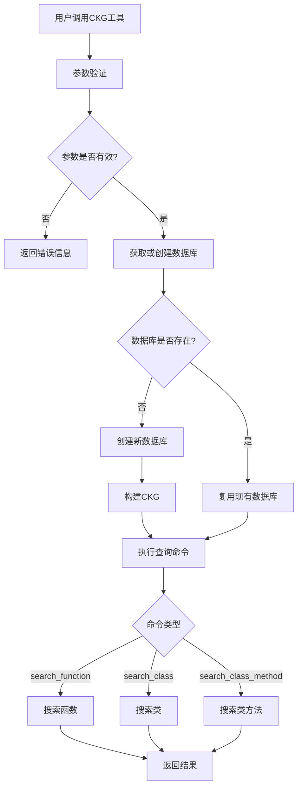
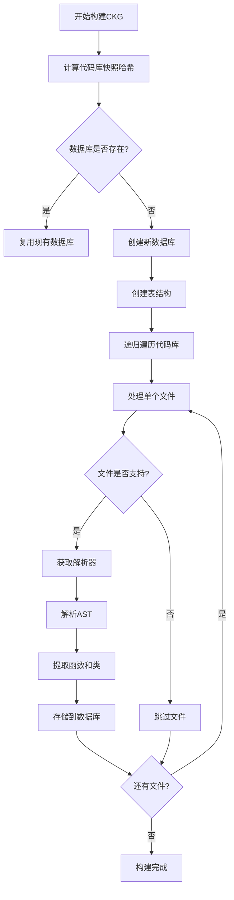
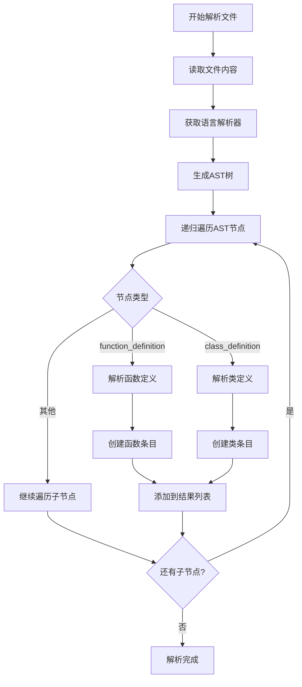
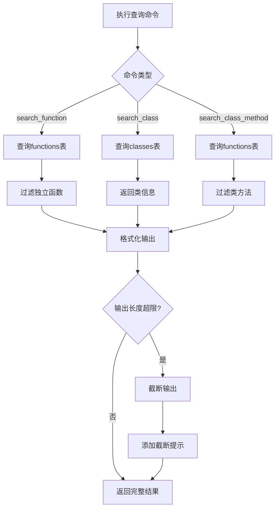
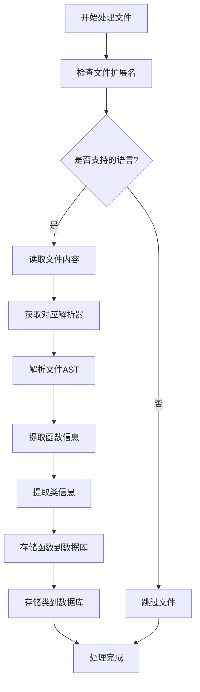
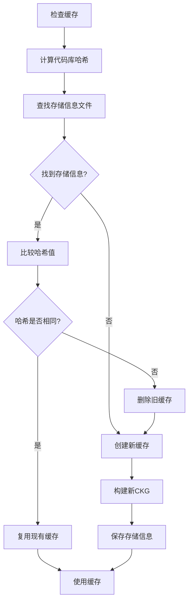
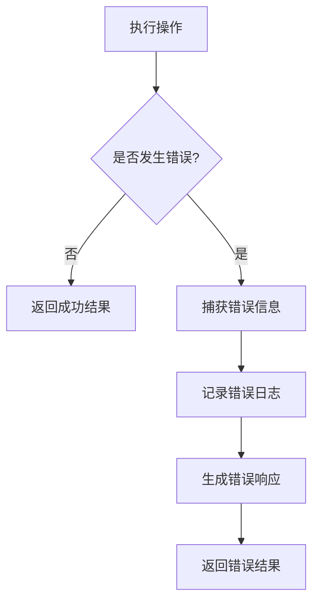
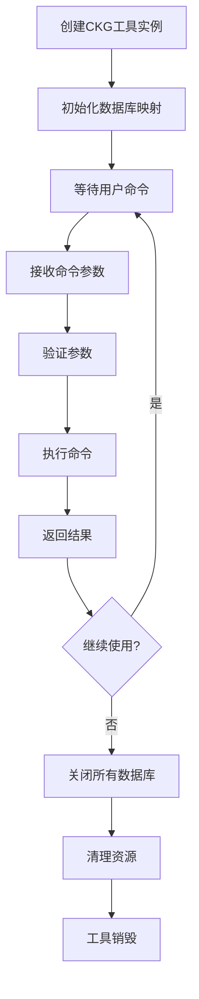

# CKG工具代码逻辑流程图

## 整体架构流程图

```mermaid
graph TB
    A[用户调用CKG工具] --> B[参数验证]
    B --> C{参数是否有效?}
    C -->|否| D[返回错误信息]
    C -->|是| E[获取或创建数据库]
    E --> F{数据库是否存在?}
    F -->|是| G[复用现有数据库]
    F -->|否| H[创建新数据库]
    H --> I[构建CKG]
    I --> J[执行查询命令]
    G --> J
    J --> K{命令类型}
    K -->|search_function| L[搜索函数]
    K -->|search_class| M[搜索类]
    K -->|search_class_method| N[搜索类方法]
    L --> O[返回结果]
    M --> O
    N --> O
```

## CKG构建流程图

```mermaid
graph TB
    A[开始构建CKG] --> B[计算代码库快照哈希]
    B --> C{数据库是否存在?}
    C -->|是| D[复用现有数据库]
    C -->|否| E[创建新数据库]
    E --> F[创建表结构]
    F --> G[递归遍历代码库]
    G --> H[处理单个文件]
    H --> I{文件是否支持?}
    I -->|否| J[跳过文件]
    I -->|是| K[获取解析器]
    K --> L[解析AST]
    L --> M[提取函数和类]
    M --> N[存储到数据库]
    N --> O{还有文件?}
    O -->|是| H
    O -->|否| P[构建完成]
    J --> O
```

## AST解析流程图

```mermaid
graph TB
    A[开始解析文件] --> B[读取文件内容]
    B --> C[获取语言解析器]
    C --> D[生成AST树]
    D --> E[递归遍历AST节点]
    E --> F{节点类型}
    F -->|function_definition| G[解析函数定义]
    F -->|class_definition| H[解析类定义]
    F -->|其他| I[继续遍历子节点]
    G --> J[创建函数条目]
    H --> K[创建类条目]
    J --> L[添加到结果列表]
    K --> L
    I --> M{还有子节点?}
    M -->|是| E
    M -->|否| N[解析完成]
    L --> M
```

## 数据库查询流程图

```mermaid
graph TB
    A[执行查询命令] --> B{命令类型}
    B -->|search_function| C[查询functions表]
    B -->|search_class| D[查询classes表]
    B -->|search_class_method| E[查询functions表]
    C --> F[过滤独立函数]
    D --> G[返回类信息]
    E --> H[过滤类方法]
    F --> I[格式化输出]
    G --> I
    H --> I
    I --> J{输出长度超限?}
    J -->|是| K[截断输出]
    J -->|否| L[返回完整结果]
    K --> M[添加截断提示]
    M --> L
```

## 文件处理流程图

```mermaid
graph TB
    A[开始处理文件] --> B[检查文件扩展名]
    B --> C{是否支持的语言?}
    C -->|否| D[跳过文件]
    C -->|是| E[读取文件内容]
    E --> F[获取对应解析器]
    F --> G[解析文件AST]
    G --> H[提取函数信息]
    H --> I[提取类信息]
    I --> J[存储函数到数据库]
    J --> K[存储类到数据库]
    K --> L[处理完成]
    D --> L
```

## 缓存管理流程图

```mermaid
graph TB
    A[检查缓存] --> B[计算代码库哈希]
    B --> C[查找存储信息文件]
    C --> D{找到存储信息?}
    D -->|否| E[创建新缓存]
    D -->|是| F[比较哈希值]
    F --> G{哈希是否相同?}
    G -->|是| H[复用现有缓存]
    G -->|否| I[删除旧缓存]
    I --> E
    E --> J[构建新CKG]
    J --> K[保存存储信息]
    H --> L[使用缓存]
    K --> L
```

## 错误处理流程图

```mermaid
graph TB
    A[执行操作] --> B{是否发生错误?}
    B -->|否| C[返回成功结果]
    B -->|是| D[捕获错误信息]
    D --> E[记录错误日志]
    E --> F[生成错误响应]
    F --> G[返回错误结果]
```

## 工具生命周期流程图

```mermaid
graph TB
    A[创建CKG工具实例] --> B[初始化数据库映射]
    B --> C[等待用户命令]
    C --> D[接收命令参数]
    D --> E[验证参数]
    E --> F[执行命令]
    F --> G[返回结果]
    G --> H{继续使用?}
    H -->|是| C
    H -->|否| I[关闭所有数据库]
    I --> J[清理资源]
    J --> K[工具销毁]
```
