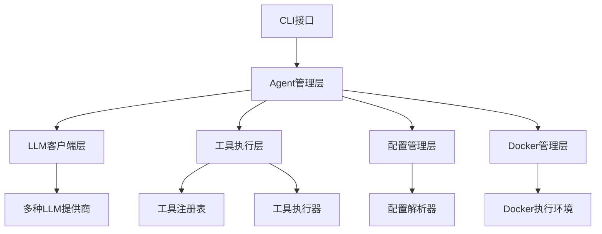
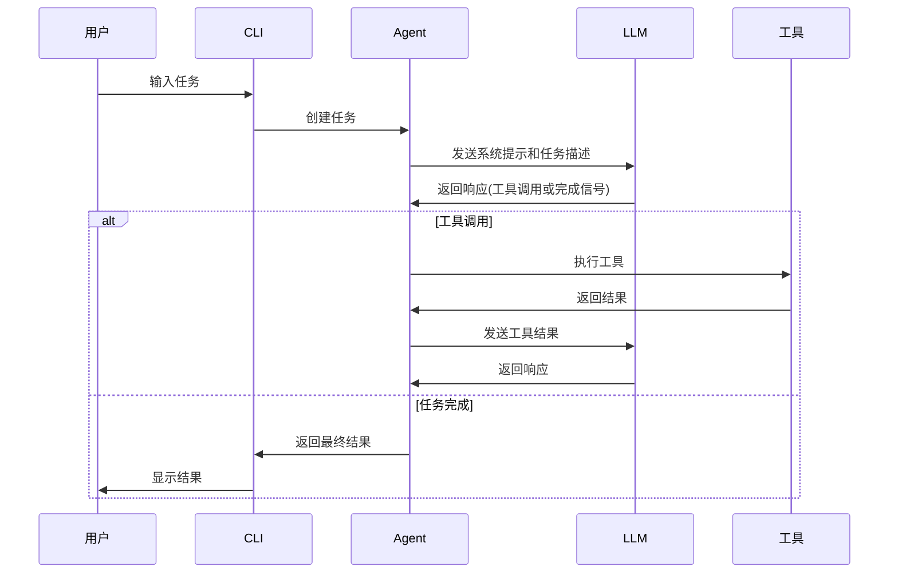

# Trae Agent 项目概述和架构设计 - 技术详解

## 1. 项目概述

Trae Agent 是一个基于大型语言模型（LLM）的通用软件工程任务代理。它提供了一个强大的命令行界面（CLI），能够理解自然语言指令并执行复杂的软件工程工作流。该项目采用模块化架构设计，支持多种LLM提供商和丰富的工具生态系统。

### 1.1 核心特性

- **Lakeview**: 提供简洁的代理步骤摘要
- **多LLM支持**: 支持OpenAI、Anthropic、Doubao、Azure、OpenRouter、Ollama和Google Gemini API
- **丰富工具生态**: 文件编辑、bash执行、顺序思考等工具
- **交互模式**: 支持对话式界面进行迭代开发
- **轨迹记录**: 详细记录所有代理操作用于调试和分析
- **灵活配置**: 基于YAML的配置文件，支持环境变量
- **Docker模式**: 支持在容器环境中执行任务

## 2. 需求分析

### 2.1 功能需求

1. **任务执行**: 能够理解自然语言描述的任务并自动执行
2. **工具集成**: 集成多种开发工具，如文件编辑、命令执行等
3. **多LLM支持**: 支持不同的LLM提供商，提供灵活性
4. **环境隔离**: 通过Docker提供安全的执行环境
5. **过程记录**: 记录执行过程用于调试和分析
6. **交互式开发**: 支持与用户的交互式对话

### 2.2 非功能需求

1. **可扩展性**: 系统应支持新工具和LLM提供商的轻松集成
2. **安全性**: 确保执行环境的安全隔离
3. **可靠性**: 提供错误处理和恢复机制
4. **可配置性**: 支持灵活的配置管理
5. **可观察性**: 提供详细的执行轨迹记录

## 3. 架构设计

### 3.1 整体架构

Trae Agent 采用分层架构设计，主要包括以下组件：



### 3.2 核心模块

#### 3.2.1 Agent模块

- `BaseAgent`: 抽象基类，定义了代理的基本行为和执行流程
- `TraeAgent`: 具体实现类，专门用于软件工程任务
- `Agent`: 工厂类，负责创建和管理不同类型的代理

#### 3.2.2 工具模块

- `Tool`: 工具基类，定义工具的基本接口
- `ToolExecutor`: 工具执行器，负责执行工具调用
- `DockerToolExecutor`: Docker环境下的工具执行器
- 工具注册表: 管理所有可用工具的注册和发现

#### 3.2.3 LLM客户端模块

- `LLMClient`: 主客户端，支持多种LLM提供商
- 各提供商客户端: OpenAI、Anthropic、Azure、Ollama、OpenRouter、Doubao、Google等
- `LLMMessage`和`LLMResponse`: 定义LLM交互的数据结构

#### 3.2.4 配置模块

- `Config`: 主配置类，管理所有配置信息
- `AgentConfig`: 代理配置
- `ModelConfig`: 模型配置
- `ModelProvider`: 模型提供商配置

#### 3.2.5 Docker管理模块

- `DockerManager`: 管理Docker容器的生命周期
- 支持多种Docker模式: 镜像、容器ID、Dockerfile、镜像文件

## 4. 执行流程

### 4.1 代理执行流程



### 4.2 任务生命周期

1. **任务创建**: 用户通过CLI输入任务描述
2. **任务解析**: Agent解析任务并初始化执行环境
3. **LLM交互**: Agent与LLM进行多轮对话，获取执行指令
4. **工具执行**: 根据LLM指令执行相应工具
5. **结果反馈**: 将工具执行结果反馈给LLM
6. **任务完成**: LLM确认任务完成，返回最终结果

## 5. 技术实现要点

### 5.1 Agent执行机制

#### 知识点1: 异步执行框架
在Node.js中，我们可以使用async/await来实现异步执行框架，这与Python的asyncio类似。

```javascript
// 知识点1: 异步执行框架
// Node.js中使用async/await实现异步执行

class BaseAgent {
  constructor(config) {
    this.config = config;
    this.maxSteps = config.maxSteps;
    this.tools = [];
    this.task = "";
  }

  // 创建新任务
  newTask(task, extraArgs = null, toolNames = null) {
    this.task = task;
    // 初始化工具
    if (!toolNames && this.tools.length === 0) {
      toolNames = ['bash', 'str_replace_based_edit_tool', 'sequentialthinking', 'task_done'];
      this.tools = toolNames.map(name => new (toolsRegistry[name])());
    }
  }

  // 执行任务的核心方法
  async executeTask() {
    const execution = {
      task: this.task,
      steps: [],
      agentState: 'RUNNING',
      success: false
    };

    let messages = this.initialMessages || [];
    let stepNumber = 1;

    try {
      while (stepNumber <= this.maxSteps) {
        const step = {
          stepNumber: stepNumber,
          state: 'THINKING'
        };

        try {
          // 执行LLM步骤
          messages = await this.runLLMStep(step, messages, execution);
          
          // 完成步骤
          await this.finalizeStep(step, messages, execution);
          
          if (execution.agentState === 'COMPLETED') {
            break;
          }
          
          stepNumber++;
        } catch (error) {
          execution.agentState = 'ERROR';
          step.state = 'ERROR';
          step.error = error.message;
          await this.finalizeStep(step, messages, execution);
          break;
        }
      }
    } catch (error) {
      execution.finalResult = `Agent execution failed: ${error.message}`;
    } finally {
      // 清理资源
      await this.closeTools();
    }

    return execution;
  }

  // 执行单步LLM交互
  async runLLMStep(step, messages, execution) {
    // 显示思考状态
    step.state = 'THINKING';
    this.updateCliConsole(step, execution);

    // 获取LLM响应
    const llmResponse = await this.llmClient.chat(messages, this.modelConfig, this.tools);
    step.llmResponse = llmResponse;

    // 显示步骤
    this.updateCliConsole(step, execution);

    // 检查任务是否完成
    if (this.llmIndicatesTaskCompleted(llmResponse)) {
      if (this.isTaskCompleted(llmResponse)) {
        execution.agentState = 'COMPLETED';
        execution.finalResult = llmResponse.content;
        execution.success = true;
        return messages;
      } else {
        // 任务未完成，返回错误消息
        return [{ role: 'user', content: this.taskIncompleteMessage() }];
      }
    } else {
      // 处理工具调用
      const toolCalls = llmResponse.toolCalls;
      return await this.toolCallHandler(toolCalls, step);
    }
  }

  // 处理工具调用
  async toolCallHandler(toolCalls, step) {
    let messages = [];
    
    if (!toolCalls || toolCalls.length <= 0) {
      messages = [
        { role: 'user', content: 'It seems that you have not completed the task.' }
      ];
      return messages;
    }

    step.state = 'CALLING_TOOL';
    step.toolCalls = toolCalls;
    this.updateCliConsole(step);

    // 并行或顺序执行工具调用
    let toolResults;
    if (this.modelConfig.parallelToolCalls) {
      toolResults = await this.toolCaller.parallelToolCall(toolCalls);
    } else {
      toolResults = await this.toolCaller.sequentialToolCall(toolCalls);
    }
    
    step.toolResults = toolResults;
    this.updateCliConsole(step);
    
    // 添加工具结果到对话
    for (const toolResult of toolResults) {
      const message = { role: 'user', toolResult: toolResult };
      messages.push(message);
    }

    // 反思工具执行结果
    const reflection = this.reflectOnResult(toolResults);
    if (reflection) {
      step.state = 'REFLECTING';
      step.reflection = reflection;
      this.updateCliConsole(step);
      messages.push({ role: 'assistant', content: reflection });
    }

    return messages;
  }
}
```

#### 知识点2: 工具执行器实现
工具执行器负责管理工具的执行，支持并行和顺序执行模式。

```javascript
// 知识点2: 工具执行器实现
// 工具执行器负责管理工具的执行，支持并行和顺序执行模式

class ToolExecutor {
  constructor(tools) {
    this.tools = tools;
    this.toolMap = {};
    // 建立工具名称到工具实例的映射
    for (const tool of tools) {
      this.toolMap[tool.name.toLowerCase().replace(/_/g, '')] = tool;
    }
  }

  // 并行执行工具调用
  async parallelToolCall(toolCalls) {
    // 使用Promise.all实现并行执行
    return await Promise.all(toolCalls.map(call => this.executeToolCall(call)));
  }

  // 顺序执行工具调用
  async sequentialToolCall(toolCalls) {
    const results = [];
    for (const call of toolCalls) {
      const result = await this.executeToolCall(call);
      results.push(result);
    }
    return results;
  }

  // 执行单个工具调用
  async executeToolCall(toolCall) {
    const normalizedName = toolCall.name.toLowerCase().replace(/_/g, '');
    
    if (!this.toolMap[normalizedName]) {
      return {
        callId: toolCall.callId,
        name: toolCall.name,
        success: false,
        error: `Tool '${toolCall.name}' not found. Available tools: ${Object.keys(this.toolMap).join(', ')}`
      };
    }

    const tool = this.toolMap[normalizedName];
    
    try {
      const toolExecResult = await tool.execute(toolCall.arguments);
      return {
        callId: toolCall.callId,
        name: toolCall.name,
        success: toolExecResult.errorCode === 0,
        result: toolExecResult.output,
        error: toolExecResult.error
      };
    } catch (error) {
      return {
        callId: toolCall.callId,
        name: toolCall.name,
        success: false,
        error: `Error executing tool '${toolCall.name}': ${error.message}`
      };
    }
  }

  // 关闭所有工具资源
  async closeTools() {
    const closePromises = this.tools
      .filter(tool => typeof tool.close === 'function')
      .map(tool => tool.close());
    
    return await Promise.all(closePromises);
  }
}
```

#### 知识点3: Docker工具执行器
在Docker模式下，需要特殊的工具执行器来处理容器环境中的工具调用。

```javascript
// 知识点3: Docker工具执行器
// 在Docker模式下，需要特殊的工具执行器来处理容器环境中的工具调用

class DockerToolExecutor {
  constructor(originalExecutor, dockerManager, dockerTools, hostWorkspaceDir, containerWorkspaceDir) {
    this.originalExecutor = originalExecutor;
    this.dockerManager = dockerManager;
    this.dockerToolsSet = new Set(dockerTools);
    this.hostWorkspaceDir = hostWorkspaceDir ? path.resolve(hostWorkspaceDir) : null;
    this.containerWorkspaceDir = containerWorkspaceDir;
  }

  // 路径转换：将主机路径转换为容器路径
  translatePath(hostPath) {
    if (!this.hostWorkspaceDir) {
      return hostPath;
    }
    
    const absHostPath = path.resolve(hostPath);
    if (absHostPath.startsWith(this.hostWorkspaceDir)) {
      const relativePath = path.relative(this.hostWorkspaceDir, absHostPath);
      const containerPath = path.join(this.containerWorkspaceDir, relativePath);
      return path.normalize(containerPath);
    }
    
    return hostPath;
  }

  // 并行执行工具调用
  async parallelToolCall(toolCalls) {
    // 为简化实现，平行调用也顺序执行
    return await this.sequentialToolCall(toolCalls);
  }

  // 顺序执行工具调用
  async sequentialToolCall(toolCalls) {
    const results = [];
    for (const toolCall of toolCalls) {
      if (this.dockerToolsSet.has(toolCall.name)) {
        // 在Docker环境中执行
        const result = this.executeInDocker(toolCall);
        results.push(result);
      } else {
        // 在主机上执行
        const result = await this.originalExecutor.sequentialToolCall([toolCall]);
        results.push(result[0]);
      }
    }
    return results;
  }

  // 在Docker容器中执行工具
  executeInDocker(toolCall) {
    try {
      // 参数预处理和路径转换
      const processedArgs = {};
      for (const [key, value] of Object.entries(toolCall.arguments)) {
        // 假设所有名为'path'的参数都是需要转换的路径
        if (key === 'path' && typeof value === 'string') {
          processedArgs[key] = this.translatePath(value);
        } else {
          processedArgs[key] = value;
        }
      }

      let commandToRun = '';

      // 处理bash工具
      if (toolCall.name === 'bash') {
        const commandValue = processedArgs.command;
        if (typeof commandValue !== 'string' || !commandValue) {
          throw new Error("Tool 'bash' requires a non-empty 'command' string argument.");
        }
        commandToRun = commandValue;
      }
      // 处理编辑工具
      else if (toolCall.name === 'str_replace_based_edit_tool') {
        const subCommand = processedArgs.command;
        if (!subCommand) {
          throw new Error("Edit tool called without a 'command' (sub-command).");
        }

        if (typeof subCommand !== 'string') {
          throw new TypeError(`The 'command' argument for ${toolCall.name} must be a string.`);
        }
        
        const executablePath = `${this.dockerManager.CONTAINER_TOOLS_PATH}/edit_tool`;
        const cmdParts = [executablePath, subCommand];

        for (const [key, value] of Object.entries(processedArgs)) {
          if (key === 'command' || value === null) {
            continue;
          }
          if (Array.isArray(value)) {
            const strValue = value.join(' ');
            cmdParts.push(`--${key} ${strValue}`);
          } else {
            cmdParts.push(`--${key} '${value}'`);
          }
        }

        commandToRun = cmdParts.join(' ');
      }
      // 处理JSON编辑工具
      else if (toolCall.name === 'json_edit_tool') {
        const executablePath = `${this.dockerManager.CONTAINER_TOOLS_PATH}/json_edit_tool`;
        const cmdParts = [executablePath];
        
        for (const [key, value] of Object.entries(processedArgs)) {
          if (value === null) {
            continue;
          }
          // 序列化'value'参数为JSON字符串
          if (key === 'value') {
            const jsonStringValue = JSON.stringify(value);
            cmdParts.push(`--${key} '${jsonStringValue}'`);
          } else if (Array.isArray(value)) {
            cmdParts.push(`--${key} ${value.join(' ')}`);
          } else {
            cmdParts.push(`--${key} '${value}'`);
          }
        }
        
        commandToRun = cmdParts.join(' ');
      } else {
        throw new Error(`The logic for Docker execution of tool '${toolCall.name}' is not implemented.`);
      }

      // 执行最终构建的命令
      const [exitCode, output] = this.dockerManager.execute(commandToRun);
      return {
        callId: toolCall.callId,
        name: toolCall.name,
        result: output,
        success: exitCode === 0
      };
    } catch (error) {
      return {
        callId: toolCall.callId,
        name: toolCall.name,
        result: `Failed to build or execute command for tool '${toolCall.name}' in Docker: ${error.message}`,
        success: false,
        error: error.message
      };
    }
  }
}
```

### 5.2 LLM客户端实现

#### 知识点4: 多提供商LLM客户端
支持多种LLM提供商的统一接口实现。

```javascript
// 知识点4: 多提供商LLM客户端
// 支持多种LLM提供商的统一接口实现

class LLMClient {
  constructor(modelConfig) {
    this.provider = modelConfig.modelProvider.provider;
    this.modelConfig = modelConfig;

    // 根据提供商创建对应的客户端
    switch (this.provider) {
      case 'openai':
        this.client = new OpenAIClient(modelConfig);
        break;
      case 'anthropic':
        this.client = new AnthropicClient(modelConfig);
        break;
      case 'azure':
        this.client = new AzureClient(modelConfig);
        break;
      case 'ollama':
        this.client = new OllamaClient(modelConfig);
        break;
      case 'openrouter':
        this.client = new OpenRouterClient(modelConfig);
        break;
      case 'doubao':
        this.client = new DoubaoClient(modelConfig);
        break;
      case 'google':
        this.client = new GoogleClient(modelConfig);
        break;
      default:
        throw new Error(`Unsupported LLM provider: ${this.provider}`);
    }
  }

  // 发送聊天消息到LLM
  chat(messages, modelConfig, tools = null, reuseHistory = true) {
    return this.client.chat(messages, modelConfig, tools, reuseHistory);
  }

  // 设置轨迹记录器
  setTrajectoryRecorder(recorder) {
    this.client.setTrajectoryRecorder(recorder);
  }

  // 设置聊天历史
  setChatHistory(messages) {
    this.client.setChatHistory(messages);
  }
}

// Anthropic客户端实现示例
class AnthropicClient {
  constructor(modelConfig) {
    this.modelConfig = modelConfig;
    this.apiKey = modelConfig.modelProvider.apiKey;
    this.baseUrl = modelConfig.modelProvider.baseUrl || 'https://api.anthropic.com';
    
    // 初始化Anthropic客户端
    this.client = new Anthropic({
      apiKey: this.apiKey,
      baseURL: this.baseUrl
    });
    
    this.messageHistory = [];
    this.systemMessage = undefined;
  }

  // 设置聊天历史
  setChatHistory(messages) {
    this.messageHistory = this.parseMessages(messages);
  }

  // 解析消息为Anthropic格式
  parseMessages(messages) {
    const anthropicMessages = [];
    for (const msg of messages) {
      if (msg.role === 'system') {
        this.systemMessage = msg.content || undefined;
      } else if (msg.toolResult) {
        anthropicMessages.push({
          role: 'user',
          content: [this.parseToolCallResult(msg.toolResult)]
        });
      } else if (msg.toolCall) {
        anthropicMessages.push({
          role: 'assistant',
          content: [this.parseToolCall(msg.toolCall)]
        });
      } else {
        if (!msg.content) {
          throw new Error('Message content is required');
        }
        
        anthropicMessages.push({
          role: msg.role,
          content: msg.content
        });
      }
    }
    return anthropicMessages;
  }

  // 解析工具调用
  parseToolCall(toolCall) {
    return {
      type: 'tool_use',
      id: toolCall.callId,
      name: toolCall.name,
      input: toolCall.arguments
    };
  }

  // 解析工具调用结果
  parseToolCallResult(toolResult) {
    let result = '';
    if (toolResult.result) {
      result += toolResult.result + '\n';
    }
    if (toolResult.error) {
      result += 'Tool call failed with error:\n';
      result += toolResult.error;
    }
    result = result.trim();

    // 如果工具失败但没有提供详细信息，则提供默认错误消息
    if (!toolResult.success && !result) {
      result = 'Tool execution failed without providing error details.';
    }

    return {
      type: 'tool_result',
      tool_use_id: toolResult.callId,
      content: result,
      is_error: !toolResult.success
    };
  }

  // 发送聊天消息到Anthropic
  async chat(messages, modelConfig, tools = null, reuseHistory = true) {
    // 转换消息为Anthropic格式
    const anthropicMessages = this.parseMessages(messages);
    
    this.messageHistory = reuseHistory ? [...this.messageHistory, ...anthropicMessages] : anthropicMessages;

    // 准备工具定义
    let toolSchemas = undefined;
    if (tools && tools.length > 0) {
      toolSchemas = tools.map(tool => {
        if (tool.name === 'str_replace_based_edit_tool') {
          return {
            name: 'str_replace_based_edit_tool',
            type: 'text_editor_20250429'
          };
        } else if (tool.name === 'bash') {
          return {
            name: 'bash',
            type: 'bash_20250124'
          };
        } else {
          return {
            name: tool.name,
            description: tool.description,
            input_schema: tool.getInputSchema()
          };
        }
      });
    }

    // 发送请求到Anthropic API
    const response = await this.client.messages.create({
      model: modelConfig.model,
      messages: this.messageHistory,
      max_tokens: modelConfig.maxTokens || 4096,
      system: this.systemMessage,
      tools: toolSchemas,
      temperature: modelConfig.temperature,
      top_p: modelConfig.topP,
      top_k: modelConfig.topK
    });

    // 处理响应中的工具调用
    let content = '';
    const toolCalls = [];

    for (const contentBlock of response.content) {
      if (contentBlock.type === 'text') {
        content += contentBlock.text;
        this.messageHistory.push({
          role: 'assistant',
          content: contentBlock.text
        });
      } else if (contentBlock.type === 'tool_use') {
        toolCalls.push({
          callId: contentBlock.id,
          name: contentBlock.name,
          arguments: contentBlock.input
        });
        this.messageHistory.push({
          role: 'assistant',
          content: [contentBlock]
        });
      }
    }

    const usage = response.usage ? {
      inputTokens: response.usage.input_tokens || 0,
      outputTokens: response.usage.output_tokens || 0,
      cacheCreationInputTokens: response.usage.cache_creation_input_tokens || 0,
      cacheReadInputTokens: response.usage.cache_read_input_tokens || 0
    } : null;

    const llmResponse = {
      content: content,
      usage: usage,
      model: response.model,
      finishReason: response.stop_reason,
      toolCalls: toolCalls.length > 0 ? toolCalls : null
    };

    return llmResponse;
  }
}
```

### 5.3 配置管理系统

#### 知识点5: 配置解析和管理
支持多种配置源（文件、环境变量、命令行参数）的配置管理系统。

```javascript
// 知识点5: 配置解析和管理
// 支持多种配置源（文件、环境变量、命令行参数）的配置管理系统

class Config {
  constructor() {
    this.lakeview = null;
    this.modelProviders = {};
    this.models = {};
    this.traeAgent = null;
  }

  // 从YAML文件创建配置
  static async createFromFile(configFile) {
    try {
      const yamlContent = await fs.promises.readFile(configFile, 'utf8');
      const yamlConfig = yaml.load(yamlContent);
      return this.createFromYaml(yamlConfig);
    } catch (error) {
      throw new Error(`Error parsing YAML config: ${error.message}`);
    }
  }

  // 从YAML对象创建配置
  static createFromYaml(yamlConfig) {
    const config = new Config();

    // 解析模型提供商
    const modelProviders = yamlConfig.modelProviders;
    if (modelProviders && Object.keys(modelProviders).length > 0) {
      for (const [providerName, providerConfig] of Object.entries(modelProviders)) {
        config.modelProviders[providerName] = new ModelProvider(providerConfig);
      }
    } else {
      throw new Error('No model providers provided');
    }

    // 解析模型配置
    const models = yamlConfig.models;
    if (models && Object.keys(models).length > 0) {
      for (const [modelName, modelConfig] of Object.entries(models)) {
        if (!config.modelProviders[modelConfig.modelProvider]) {
          throw new Error(`Model provider ${modelConfig.modelProvider} not found`);
        }
        
        config.models[modelName] = new ModelConfig({
          ...modelConfig,
          modelProvider: config.modelProviders[modelConfig.modelProvider]
        });
      }
    } else {
      throw new Error('No models provided');
    }

    // 解析Lakeview配置
    const lakeview = yamlConfig.lakeview;
    if (lakeview) {
      const lakeviewModelName = lakeview.model;
      if (!lakeviewModelName) {
        throw new Error('No model provided for lakeview');
      }
      
      const lakeviewModel = config.models[lakeviewModelName];
      config.lakeview = new LakeviewConfig({ model: lakeviewModel });
    }

    // 解析MCP服务器配置
    const mcpServersConfig = {};
    if (yamlConfig.mcpServers) {
      for (const [serverName, serverConfig] of Object.entries(yamlConfig.mcpServers)) {
        mcpServersConfig[serverName] = new MCPServerConfig(serverConfig);
      }
    }
    
    const allowMcpServers = yamlConfig.allowMcpServers || [];

    // 解析代理配置
    const agents = yamlConfig.agents;
    if (agents && Object.keys(agents).length > 0) {
      for (const [agentName, agentConfig] of Object.entries(agents)) {
        const agentModelName = agentConfig.model;
        if (!agentModelName) {
          throw new Error(`No model provided for ${agentName}`);
        }
        
        const agentModel = config.models[agentModelName];
        if (!agentModel) {
          throw new Error(`Model ${agentModelName} not found`);
        }
        
        switch (agentName) {
          case 'trae_agent':
            config.traeAgent = new TraeAgentConfig({
              ...agentConfig,
              model: agentModel,
              mcpServersConfig: mcpServersConfig,
              allowMcpServers: allowMcpServers
            });
            
            if (config.traeAgent.enableLakeview && !config.lakeview) {
              throw new Error('Lakeview is enabled but no lakeview config provided');
            }
            break;
          default:
            throw new Error(`Unknown agent: ${agentName}`);
        }
      }
    } else {
      throw new Error('No agent configs provided');
    }

    return config;
  }

  // 解析配置值（优先级：CLI > ENV > Config > Default）
  resolveConfigValues({
    provider = null,
    model = null,
    modelBaseUrl = null,
    apiKey = null,
    maxSteps = null
  } = {}) {
    if (this.traeAgent) {
      this.traeAgent.resolveConfigValues({ maxSteps });
      this.traeAgent.model.resolveConfigValues({
        modelProviders: this.modelProviders,
        provider,
        model,
        modelBaseUrl,
        apiKey
      });
    }
    return this;
  }
}

// 模型提供商配置类
class ModelProvider {
  constructor(config) {
    this.apiKey = config.apiKey;
    this.provider = config.provider;
    this.baseUrl = config.baseUrl || null;
    this.apiVersion = config.apiVersion || null;
  }
}

// 模型配置类
class ModelConfig {
  constructor(config) {
    this.model = config.model;
    this.modelProvider = config.modelProvider;
    this.temperature = config.temperature;
    this.topP = config.topP;
    this.topK = config.topK;
    this.parallelToolCalls = config.parallelToolCalls;
    this.maxRetries = config.maxRetries;
    this.maxTokens = config.maxTokens || null;
    this.supportsToolCalling = config.supportsToolCalling !== undefined ? config.supportsToolCalling : true;
    this.candidateCount = config.candidateCount || null;
    this.stopSequences = config.stopSequences || null;
    this.maxCompletionTokens = config.maxCompletionTokens || null;
  }

  // 获取最大令牌数参数值
  getMaxTokensParam() {
    if (this.maxCompletionTokens !== null) {
      return this.maxCompletionTokens;
    } else if (this.maxTokens !== null) {
      return this.maxTokens;
    } else {
      return 4096; // 默认值
    }
  }

  // 解析配置值
  resolveConfigValues({
    modelProviders = null,
    provider = null,
    model = null,
    modelBaseUrl = null,
    apiKey = null
  } = {}) {
    this.model = resolveConfigValue({ cliValue: model, configValue: this.model });

    // 如果用户想要更改模型提供商
    if (provider) {
      if (modelProviders && provider in modelProviders) {
        this.modelProvider = modelProviders[provider];
      } else if (!apiKey) {
        throw new Error('To register a new model provider, an apiKey should be provided');
      } else {
        this.modelProvider = new ModelProvider({
          apiKey: apiKey,
          provider: provider,
          baseUrl: modelBaseUrl
        });
      }
    }

    // 映射提供商到环境变量名称
    const envVarApiKey = `${this.modelProvider.provider.toUpperCase()}_API_KEY`;
    const envVarApiBaseUrl = `${this.modelProvider.provider.toUpperCase()}_BASE_URL`;

    const resolvedApiKey = resolveConfigValue({
      cliValue: apiKey,
      configValue: this.modelProvider.apiKey,
      envVar: envVarApiKey
    });

    const resolvedApiBaseUrl = resolveConfigValue({
      cliValue: modelBaseUrl,
      configValue: this.modelProvider.baseUrl,
      envVar: envVarApiBaseUrl
    });

    if (resolvedApiKey) {
      this.modelProvider.apiKey = String(resolvedApiKey);
    }

    if (resolvedApiBaseUrl) {
      this.modelProvider.baseUrl = String(resolvedApiBaseUrl);
    }
  }
}

// 解析配置值（优先级：CLI > ENV > Config > Default）
function resolveConfigValue({ cliValue, configValue, envVar = null }) {
  if (cliValue !== null && cliValue !== undefined) {
    return cliValue;
  }

  if (envVar && process.env[envVar]) {
    return process.env[envVar];
  }

  if (configValue !== null && configValue !== undefined) {
    return configValue;
  }

  return null;
}
```

### 5.4 Docker管理实现

#### 知识点6: Docker容器管理
管理Docker容器生命周期和命令执行的实现。

```javascript
// 知识点6: Docker容器管理
// 管理Docker容器生命周期和命令执行的实现

class DockerManager {
  static CONTAINER_TOOLS_PATH = '/agent_tools';

  constructor({
    image = null,
    containerId = null,
    dockerfilePath = null,
    dockerImageFile = null,
    workspaceDir = null,
    toolsDir = null,
    interactive = false
  } = {}) {
    if (!image && !containerId && !dockerfilePath && !dockerImageFile) {
      throw new Error('Either a Docker image or a container ID or a dockerfile path or a docker image file (tar) must be provided.');
    }

    this.image = image;
    this.containerId = containerId;
    this.dockerfilePath = dockerfilePath;
    this.dockerImageFile = dockerImageFile;
    this.workspaceDir = workspaceDir;
    this.toolsDir = toolsDir;
    this.interactive = interactive;
    this.containerWorkspace = '/workspace';
    this.container = null;
    this.shell = null;
    this.isManaged = true;
  }

  // 启动/连接到容器
  async start() {
    try {
      // 从Dockerfile构建镜像
      if (this.dockerfilePath) {
        if (!path.isAbsolute(this.dockerfilePath)) {
          throw new Error('Dockerfile path must be an absolute path.');
        }
        
        const buildContext = path.dirname(this.dockerfilePath);
        const dockerfileName = path.basename(this.dockerfilePath);
        const uniqueTag = `trae-agent-custom:${uuid.v4()}`;
        
        console.log(`Building Docker image from '${this.dockerfilePath}' with tag '${uniqueTag}'...`);
        
        // 这里应该调用Docker API来构建镜像
        // 为简化示例，我们假设构建成功
        this.image = uniqueTag;
        console.log(`✅ Successfully built image: ${this.image}`);
      }
      // 从文件加载镜像
      else if (this.dockerImageFile) {
        console.log(`Loading Docker image from file '${this.dockerImageFile}'...`);
        // 这里应该调用Docker API来加载镜像
        // 为简化示例，我们假设加载成功
        this.image = 'loaded-image:latest';
        console.log(`✅ Successfully loaded image: ${this.image}`);
      }

      // 连接到现有容器
      if (this.containerId) {
        console.log(`Attaching to existing container: ${this.containerId}...`);
        // 这里应该调用Docker API来获取容器
        // 为简化示例，我们创建一个模拟容器对象
        this.container = { id: this.containerId, shortId: this.containerId.substring(0, 12) };
        this.isManaged = false;
        console.log(`Successfully attached to container ${this.container.shortId}.`);
      }
      // 启动新容器
      else if (this.image) {
        console.log(`Starting a new container from image: ${this.image}...`);
        
        if (this.workspaceDir) {
          // 确保工作目录存在
          await fs.promises.mkdir(this.workspaceDir, { recursive: true });
          
          // 这里应该调用Docker API来运行容器
          // 为简化示例，我们创建一个模拟容器对象
          this.container = { 
            id: `container-${Date.now()}`,
            shortId: `container-${Date.now()}`.substring(0, 12)
          };
          this.containerId = this.container.id;
          this.isManaged = true;
          
          console.log(`Container ${this.container.shortId} created. Workspace '${this.workspaceDir}' is mounted to '${this.containerWorkspace}'.`);
        } else {
          // 这里应该调用Docker API来运行容器
          // 为简化示例，我们创建一个模拟容器对象
          this.container = { 
            id: `container-${Date.now()}`,
            shortId: `container-${Date.now()}`.substring(0, 12)
          };
          this.containerId = this.container.id;
          this.isManaged = true;
          
          console.log(`Container ${this.container.shortId} created.`);
        }
      }

      // 复制工具到容器
      await this.copyToolsToContainer();
      
      // 启动持久化shell
      await this.startPersistentShell();
    } catch (error) {
      console.error(`[red]Failed to start DockerManager: ${error.message}[/red]`);
      throw error;
    }
  }

  // 复制工具到容器
  async copyToolsToContainer() {
    if (!this.toolsDir || !(await this.isDirectory(this.toolsDir))) {
      console.log(`[yellow]Packaged tools directory '${this.toolsDir}' not provided or not found, skipping copy.[/yellow]`);
      return;
    }

    console.log(`Copying tools from '${this.toolsDir}' to container path '${DockerManager.CONTAINER_TOOLS_PATH}'...`);
    
    try {
      // 这里应该调用docker cp命令
      // 为简化示例，我们假设复制成功
      console.log('Tools copied successfully.');
    } catch (error) {
      console.error(`[red]Failed to copy tools to container: ${error.message}[/red]`);
      throw new Error(`Failed to copy tools: ${error.message}`);
    }
  }

  // 检查路径是否为目录
  async isDirectory(path) {
    try {
      const stats = await fs.promises.stat(path);
      return stats.isDirectory();
    } catch {
      return false;
    }
  }

  // 启动持久化shell
  async startPersistentShell() {
    if (!this.container) {
      return;
    }
    
    console.log('Starting persistent shell for interactive mode...');
    
    try {
      // 这里应该使用类似pexpect的库来启动持久化shell
      // 为简化示例，我们创建一个模拟shell对象
      this.shell = {
        isAlive: () => true,
        sendLine: (command) => console.log(`Sending command: ${command}`),
        expect: async (pattern, timeout) => {
          // 模拟等待响应
          await new Promise(resolve => setTimeout(resolve, 100));
        }
      };
      
      console.log('Persistent shell is ready.');
    } catch (error) {
      console.error('[red]Timeout waiting for shell prompt. The container might be slow to start or misconfigured.[/red]');
      throw error;
    }
  }

  // 执行命令
  execute(command, timeout = 300) {
    if (!this.container) {
      throw new Error('Container is not running. Call start() first.');
    }

    return this.executeInteractive(command, timeout);
  }

  // 在交互式shell中执行命令
  executeInteractive(command, timeout) {
    if (!this.shell || !this.shell.isAlive()) {
      console.log('[yellow]Shell not found or died. Attempting to restart...[/yellow]');
      this.startPersistentShell();
    }

    if (!this.shell) {
      throw new Error('Failed to start or restart the persistent shell.');
    }

    const marker = '---CMD_DONE---';
    const fullCommand = command.trim();
    const markerCommand = `echo ${marker}$?`;
    
    this.shell.sendLine(fullCommand);
    this.shell.sendLine(markerCommand);
    
    // 为简化示例，我们直接返回成功结果
    // 实际实现中应该等待shell响应并解析结果
    return [0, `Executed: ${fullCommand}`];
  }

  // 停止容器和shell
  stop() {
    if (this.shell && this.shell.isAlive()) {
      console.log('Closing persistent shell...');
      // 这里应该关闭shell
      this.shell = null;
    }

    if (this.container && this.isManaged) {
      console.log(`Stopping and removing managed container ${this.container.shortId}...`);
      // 这里应该调用Docker API来停止和删除容器
      this.container = null;
      console.log('Container cleaned up successfully.');
    }
  }
}
```

## 6. 技术架构总结

### 6.1 核心设计模式

1. **工厂模式**: 用于创建不同类型的代理和LLM客户端
2. **策略模式**: 用于支持不同的LLM提供商
3. **装饰器模式**: 用于重试机制和轨迹记录
4. **观察者模式**: 用于CLI控制台更新

### 6.2 关键技术点

1. **异步编程**: 使用async/await处理异步操作
2. **错误处理**: 完善的异常处理和资源清理机制
3. **配置管理**: 支持多源配置（文件、环境变量、命令行）
4. **容器化**: Docker支持提供环境隔离
5. **工具生态系统**: 插件化工具架构支持扩展

### 6.3 性能优化

1. **连接池**: 对于需要保持连接的服务，使用连接池管理
2. **缓存机制**: 对于频繁访问的数据，使用缓存减少重复计算
3. **并行处理**: 利用Promise.all实现工具并行执行
4. **资源管理**: 及时释放不再使用的资源

通过以上详细的技术实现说明，我们可以看到Trae Agent在架构设计上的精巧之处，以及如何通过Node.js实现类似的功能。每个模块都有明确的职责，模块间通过清晰的接口进行交互，确保了系统的可扩展性和可维护性。