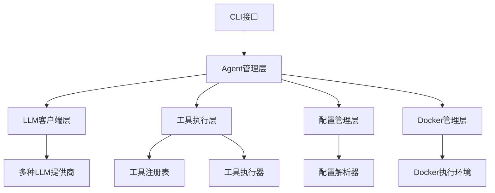
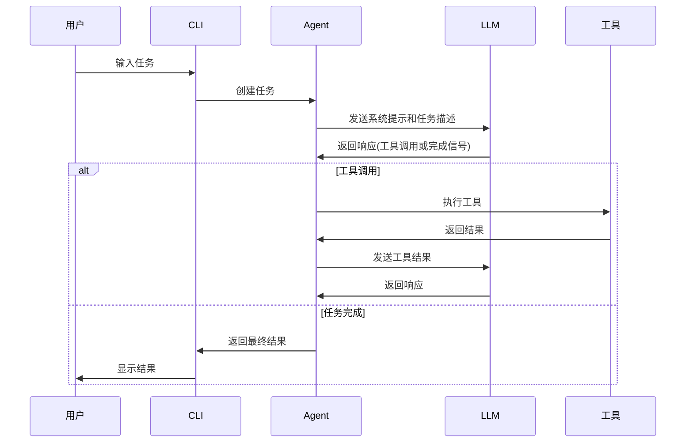

# Trae Agent 项目概述和架构设计

## 1. 项目概述

Trae Agent 是一个基于大型语言模型（LLM）的通用软件工程任务代理。它提供了一个强大的命令行界面（CLI），能够理解自然语言指令并执行复杂的软件工程工作流。该项目采用模块化架构设计，支持多种LLM提供商和丰富的工具生态系统。

### 1.1 核心特性

- **Lakeview**: 提供简洁的代理步骤摘要
- **多LLM支持**: 支持OpenAI、Anthropic、Doubao、Azure、OpenRouter、Ollama和Google Gemini API
- **丰富工具生态**: 文件编辑、bash执行、顺序思考等工具
- **交互模式**: 支持对话式界面进行迭代开发
- **轨迹记录**: 详细记录所有代理操作用于调试和分析
- **灵活配置**: 基于YAML的配置文件，支持环境变量
- **Docker模式**: 支持在容器环境中执行任务

### 1.2 项目背景与目标

在软件开发过程中，开发者经常需要执行重复性的任务，如代码修复、测试编写、文档生成等。这些任务虽然有一定规律，但需要深入理解代码库和上下文。Trae Agent 的设计目标是通过LLM的能力来自动化这些软件工程任务，提高开发效率。

### 1.3 用户场景

1. **代码修复**: 自动修复GitHub issue中报告的bug
2. **测试生成**: 根据代码逻辑自动生成测试用例
3. **文档更新**: 根据代码变更自动更新文档
4. **重构建议**: 提供代码重构建议并自动实施
5. **性能优化**: 分析代码性能瓶颈并提供优化方案

## 2. 需求分析

### 2.1 功能需求

1. **任务执行**: 能够理解自然语言描述的任务并自动执行
2. **工具集成**: 集成多种开发工具，如文件编辑、命令执行等
3. **多LLM支持**: 支持不同的LLM提供商，提供灵活性
4. **环境隔离**: 通过Docker提供安全的执行环境
5. **过程记录**: 记录执行过程用于调试和分析
6. **交互式开发**: 支持与用户的交互式对话

### 2.2 非功能需求

1. **可扩展性**: 系统应支持新工具和LLM提供商的轻松集成
2. **安全性**: 确保执行环境的安全隔离
3. **可靠性**: 提供错误处理和恢复机制
4. **可配置性**: 支持灵活的配置管理
5. **可观察性**: 提供详细的执行轨迹记录

## 3. 架构设计

### 3.1 整体架构

Trae Agent 采用分层架构设计，主要包括以下组件：

### 3.2 核心模块

#### 3.2.1 Agent模块

- `BaseAgent`: 抽象基类，定义了代理的基本行为和执行流程
- `TraeAgent`: 具体实现类，专门用于软件工程任务
- `Agent`: 工厂类，负责创建和管理不同类型的代理

#### 3.2.2 工具模块

- `Tool`: 工具基类，定义工具的基本接口
- `ToolExecutor`: 工具执行器，负责执行工具调用
- `DockerToolExecutor`: Docker环境下的工具执行器
- 工具注册表: 管理所有可用工具的注册和发现

#### 3.2.3 LLM客户端模块

- `LLMClient`: 主客户端，支持多种LLM提供商
- 各提供商客户端: OpenAI、Anthropic、Azure、Ollama、OpenRouter、Doubao、Google等
- `LLMMessage`和`LLMResponse`: 定义LLM交互的数据结构

#### 3.2.4 配置模块

- `Config`: 主配置类，管理所有配置信息
- `AgentConfig`: 代理配置
- `ModelConfig`: 模型配置
- `ModelProvider`: 模型提供商配置

#### 3.2.5 Docker管理模块

- `DockerManager`: 管理Docker容器的生命周期
- 支持多种Docker模式: 镜像、容器ID、Dockerfile、镜像文件

## 4. 执行流程

### 4.1 代理执行流程

### 4.2 任务生命周期

1. **任务创建**: 用户通过CLI输入任务描述
2. **任务解析**: Agent解析任务并初始化执行环境
3. **LLM交互**: Agent与LLM进行多轮对话，获取执行指令
4. **工具执行**: 根据LLM指令执行相应工具
5. **结果反馈**: 将工具执行结果反馈给LLM
6. **任务完成**: LLM确认任务完成，返回最终结果

## 5. 技术选型

### 5.1 编程语言

- **Python 3.12+**: 主要开发语言，具有丰富的生态系统和良好的异步支持

### 5.2 核心依赖

- **Click**: 命令行界面库
- **PyYAML**: YAML配置文件解析
- **Docker SDK**: Docker容器管理
- **Rich**: 终端界面美化
- **Asyncio**: 异步编程支持

### 5.3 LLM客户端库

- **OpenAI**: openai-python
- **Anthropic**: anthropic-sdk
- **Google**: google-generativeai
- **Ollama**: ollama-python

## 6. 部署架构

### 6.1 本地部署

1. **环境准备**: 安装Python 3.12+和UV包管理器
2. **代码获取**: 克隆项目仓库
3. **依赖安装**: 使用UV安装项目依赖
4. **配置设置**: 配置API密钥和模型参数
5. **服务启动**: 启动CLI服务

### 6.2 Docker部署

1. **镜像构建**: 构建包含所有依赖的Docker镜像
2. **容器运行**: 运行容器并挂载配置文件
3. **服务访问**: 通过CLI与服务交互

## 7. 性能考虑

### 7.1 异步处理

采用异步编程模型提高并发处理能力，特别是在以下场景：
- LLM调用等待
- 工具执行
- 文件I/O操作

### 7.2 资源管理

- **连接池**: 对于需要保持连接的服务，使用连接池管理
- **缓存机制**: 对于频繁访问的数据，使用缓存减少重复计算
- **内存优化**: 及时释放不再使用的资源

## 8. 安全设计

### 8.1 访问控制

- **API密钥管理**: 通过配置文件和环境变量管理API密钥
- **权限控制**: 限制工具的执行权限，防止危险操作

### 8.2 数据安全

- **敏感信息保护**: 避免在日志中记录敏感信息
- **数据加密**: 对传输中的数据进行加密

### 8.3 环境隔离

- **Docker容器**: 使用容器提供安全的执行环境
- **文件系统限制**: 限制对文件系统的访问权限

## 9. 可扩展性设计

### 9.1 插件化架构

- **工具插件**: 支持动态注册和扩展工具
- **LLM插件**: 支持添加新的LLM提供商
- **配置插件**: 支持自定义配置格式

### 9.2 模块化设计

- **高内聚低耦合**: 各模块职责明确，依赖关系清晰
- **接口标准化**: 定义标准接口，便于模块替换

## 10. 监控和日志

### 10.1 轨迹记录

- **详细日志**: 记录所有LLM交互和工具执行过程
- **执行轨迹**: 保存完整的任务执行轨迹用于分析

### 10.2 性能监控

- **执行时间**: 记录各阶段的执行时间
- **资源使用**: 监控CPU、内存等资源使用情况

## 11. 测试策略

### 11.1 单元测试

- **工具测试**: 对每个工具进行独立测试
- **客户端测试**: 测试各LLM客户端的功能
- **配置测试**: 验证配置解析的正确性

### 11.2 集成测试

- **端到端测试**: 测试完整的任务执行流程
- **Docker测试**: 验证Docker模式的正确性

### 11.3 性能测试

- **压力测试**: 测试系统在高负载下的表现
- **稳定性测试**: 验证系统长时间运行的稳定性

## 12. 总结

Trae Agent 采用现代化的软件架构设计，具有良好的可扩展性、安全性和性能。通过模块化设计和插件化架构，系统可以轻松扩展新的功能和特性。同时，通过详细的日志记录和轨迹跟踪，系统具有良好的可观察性和可调试性。