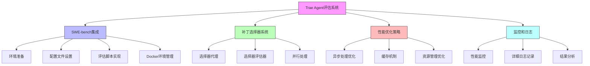

# Trae Agent 评估系统和性能优化 - 技术详解

在本技术详解中，我们将深入探讨Trae Agent的评估系统和性能优化机制的实现细节。我们将使用Node.js来实现这些功能，并为每一行代码添加详细注释，同时在每个代码段前明确相应的知识点。

## 1. 评估系统概述

Trae Agent 的评估系统是其质量保证的重要组成部分，主要用于在标准基准上评估代理的性能。该系统支持多种评估基准，包括 SWE-bench、SWE-bench-Live 和 Multi-SWE-bench。

## 2. SWE-bench 集成

### 2.1 SWE-bench 简介

SWE-bench 是一个评估语言模型在真实世界软件工程任务上的基准。它包含来自流行 Python 仓库的 GitHub issues，这些 issues 已经被人类开发者解决。

### 2.2 评估流程

#### 2.2.1 环境准备

```bash
# 克隆和设置基准 harness
chmod +x setup.sh
./setup.sh swe_bench

# 安装额外依赖
uv sync --extra evaluation
cd evaluation
```

#### 2.2.2 配置文件设置

```yaml
# trae_config.yaml
agents:
  trae_agent:
    enable_lakeview: false
    model: trae_agent_model
    max_steps: 200
    tools:
      - bash
      - str_replace_based_edit_tool
      - sequentialthinking
      - task_done

model_providers:
  anthropic:
    api_key: your_anthropic_api_key
    provider: anthropic
  openai:
    api_key: your_openai_api_key
    provider: openai

models:
  trae_agent_model:
    model_provider: anthropic
    model: claude-sonnet-4-20250514
    max_tokens: 4096
    temperature: 0.5
    top_p: 0.9
    top_k: 40
    max_retries: 1
    parallel_tool_calls: 1
```

### 2.3 评估脚本实现

#### 2.3.1 核心评估类

```javascript
// 知识点1: 评估运行器实现
// 实现核心评估运行器类

const fs = require('fs').promises;
const path = require('path');
const { exec } = require('child_process');
const { promisify } = require('util');
const execAsync = promisify(exec);

class EvaluationRunner {
  /**
   * 构造函数
   * @param {Config} config - 配置
   * @param {string} benchmark - 基准名称
   * @param {string} dataset - 数据集
   * @param {string} runId - 运行ID
   * @param {string} benchmarkHarnessPath - 基准harness路径
   * @param {string | null} dockerEnvConfig - Docker环境配置
   * @param {string} mode - 模式
   * @param {number} maxWorkers - 最大工作线程数
   */
  constructor(config, benchmark, dataset, runId, benchmarkHarnessPath, 
              dockerEnvConfig = null, mode = "e2e", maxWorkers = 4) {
    this.config = config;
    this.benchmark = benchmark;
    this.dataset = dataset;
    this.runId = runId;
    this.benchmarkHarnessPath = benchmarkHarnessPath;
    this.dockerEnvConfig = dockerEnvConfig;
    this.mode = mode;
    this.maxWorkers = maxWorkers;
    this.workingDir = path.join("results", `${benchmark}_${dataset}_${runId}`);
    
    // 确保工作目录存在
    this._ensureDirectory(this.workingDir);
  }
  
  /**
   * 确保目录存在
   * @param {string} dirPath - 目录路径
   */
  async _ensureDirectory(dirPath) {
    try {
      await fs.access(dirPath);
    } catch (error) {
      await fs.mkdir(dirPath, { recursive: true });
    }
  }
}
```

#### 2.3.2 实例执行

```javascript
// 知识点2: 实例执行实现
// 实现实例执行逻辑

/**
 * 运行单个实例
 * @param {Object} instance - 实例数据
 * @returns {Object} 执行结果
 */
async runInstance(instance) {
  const instanceId = instance.instance_id;
  console.log(`Processing instance: ${instanceId}`);
  
  try {
    // 准备Docker镜像
    const imageTag = await this._prepareDockerImage(instance);
    
    // 准备Trae Agent
    const traeArtifacts = await this._prepareTraeAgent();
    
    // 创建容器
    const containerId = await this._createContainer(imageTag, instance);
    
    // 写入问题描述
    await this._writeProblemStatement(containerId, instance);
    
    // 运行Trae Agent
    const patchContent = await this._runTraeAgent(containerId, instance, traeArtifacts);
    
    // 收集结果
    const result = {
      instance_id: instanceId,
      patch: patchContent,
      status: "success"
    };
    
    return result;
  } catch (error) {
    return {
      instance_id: instanceId,
      error: error.message,
      status: "failed"
    };
  } finally {
    // 清理容器
    await this._cleanupContainer(containerId);
  }
}
```

#### 2.3.3 Docker环境管理

```javascript
// 知识点3: Docker环境管理实现
// 实现Docker环境管理逻辑

const Docker = require('dockerode');
const docker = new Docker();

/**
 * 准备Docker镜像
 * @param {Object} instance - 实例数据
 * @returns {string} 镜像标签
 */
async _prepareDockerImage(instance) {
  const instanceId = instance.instance_id;
  const imageName = `sweb.eval.x86_64.${instanceId.replace('__', '_1776_')}`;
  
  try {
    // 检查镜像是否存在
    await docker.getImage(imageName).inspect();
    console.log(`Image ${imageName} already exists`);
    return imageName;
  } catch (error) {
    console.log(`Image ${imageName} not found, pulling...`);
    // 拉取镜像
    const stream = await docker.pull(imageName);
    await new Promise((resolve, reject) => {
      docker.modem.followProgress(stream, (err, res) => {
        if (err) reject(err);
        else resolve(res);
      });
    });
    return imageName;
  }
}

/**
 * 创建容器
 * @param {string} imageTag - 镜像标签
 * @param {Object} instance - 实例数据
 * @returns {string} 容器ID
 */
async _createContainer(imageTag, instance) {
  const instanceId = instance.instance_id;
  const containerName = `trae_eval_${instanceId}_${Math.floor(Date.now() / 1000)}`;
  
  // 创建容器
  const container = await docker.createContainer({
    Image: imageTag,
    name: containerName,
    Tty: true,
    OpenStdin: true,
    Volumes: {
      [this.workingDir]: {}
    },
    WorkingDir: "/workspace",
    HostConfig: {
      Binds: [
        `${this.workingDir}:/workspace`
      ]
    }
  });
  
  // 启动容器
  await container.start();
  
  return container.id;
}
```

## 3. 补丁选择器系统

### 3.1 补丁选择器概述

补丁选择器是Trae Agent的一个高级功能，用于从多个候选补丁中选择最佳补丁。它采用基于代理的集成推理方法。

### 3.2 选择器代理实现

#### 3.2.1 核心类结构

```javascript
// 知识点4: 补丁选择器代理实现
// 实现补丁选择器代理核心类

class SelectorAgent {
  /**
   * 构造函数
   * @param {Object} options - 选项
   * @param {ModelConfig} options.llmConfig - LLM配置
   * @param {Sandbox} options.sandbox - 沙箱
   * @param {string} options.projectPath - 项目路径
   * @param {string} options.issueDescription - 问题描述
   * @param {string} options.trajectoryFileName - 轨迹文件名
   * @param {CandidatePatch[]} options.candidateList - 候选补丁列表
   * @param {number} options.maxTurn - 最大轮次
   */
  constructor({ llmConfig, sandbox, projectPath, issueDescription, 
                trajectoryFileName, candidateList, maxTurn = 50 }) {
    this.llmConfig = llmConfig;
    this.maxTurn = maxTurn;
    this.sandbox = sandbox;
    this.sandboxSession = this.sandbox.getSession();
    this.sandboxSession.execute("git reset --hard HEAD");
    this.initialMessages = [];
    this.candidateList = candidateList;
    this.projectPath = projectPath;
    this.issueDescription = issueDescription;
    
    // 初始化工具
    this.tools = [
      new BashTool({ modelProvider: llmConfig.model_provider.provider }),
      new StrReplaceBasedEditTool({ modelProvider: llmConfig.model_provider.provider })
    ];
    
    this.llmClient = new LLMClient(llmConfig);
    this.trajectoryRecorder = new TrajectoryRecorder(trajectoryFileName);
  }
}
```

#### 3.2.2 运行逻辑

```javascript
// 知识点5: 选择器运行逻辑实现
// 实现选择器运行逻辑

const { parseToolResponse } = require('../utils/tool_parser');

/**
 * 运行选择器
 * @returns {Array} [finalId, finalPatch] 最终ID和补丁
 */
async run() {
  console.log(`max_turn: ${this.maxTurn}`);
  let turn = 0;
  let [finalId, finalPatch] = [this.candidateList[0].id, this.candidateList[0].patch];
  let messages = this.initialMessages;
  
  while (turn < this.maxTurn) {
    turn += 1;
    // 获取LLM响应
    const llmResponse = await this.llmClient.chat(messages, this.llmConfig, this.tools);
    
    // 记录轨迹
    this.trajectoryRecorder.recordLLMInteraction(
      messages,
      llmResponse,
      this.llmConfig.model_provider.provider,
      this.llmConfig.model,
      this.tools
    );
    
    const answerContent = llmResponse.content;
    console.log(`\n### Selector's Answer(${turn})\n`, answerContent);
    
    // 检查是否选择了补丁
    const match = answerContent.match(
      /(?:###\s*)?Status:\s*(success|succeed|successfully|successful)\s*\n\s*(?:###\s*)?Result:/
    );
    
    if (match) {
      // 解析选择结果
      const resultMatch = answerContent.match(
        /(?:###\s*)?Result:\s*(.+?)\s*(?:###\s*)?Analysis:/
      );
      if (resultMatch) {
        const result = resultMatch[1].trim().split("Patch-").pop();
        if ([...Array(this.candidateList.length).keys()].map(i => String(i + 1)).includes(result)) {
          const index = parseInt(result) - 1;
          finalId = this.candidateList[index].id;
          finalPatch = this.candidateList[index].patch;
        }
      }
      break;
    } else {
      // 处理工具调用
      messages = messages.concat(parseToolResponse(
        llmResponse, llmResponse.finishReason || "", this.sandboxSession
      ));
    }
  }
  
  // 完成记录
  this.trajectoryRecorder.finalizeRecording(true, finalPatch);
  this.sandboxSession.execute("git reset --hard HEAD");
  this.sandboxSession.close();
  
  return [finalId, finalPatch];
}
```

### 3.3 补丁选择评估

#### 3.3.1 评估执行器

```javascript
// 知识点6: 选择器评估器实现
// 实现选择器评估器

class SelectorEvaluation {
  /**
   * 构造函数
   * @param {Object} options - 选项
   * @param {ModelConfig} options.llmConfig - LLM配置
   * @param {number} options.numCandidate - 候选数量
   * @param {number} options.maxRetry - 最大重试次数
   * @param {number} options.maxTurn - 最大轮次
   * @param {string} options.logPath - 日志路径
   * @param {string} options.outputPath - 输出路径
   * @param {string} options.patchesPath - 补丁路径
   * @param {Array} options.instanceList - 实例列表
   * @param {Object} options.candidateDic - 候数字典
   * @param {string} options.toolsPath - 工具路径
   * @param {string} options.statisticsPath - 统计路径
   * @param {number} options.groupSize - 组大小
   * @param {boolean} options.majorityVoting - 是否多数投票
   */
  constructor({ llmConfig, numCandidate, maxRetry, maxTurn, logPath, outputPath,
                patchesPath, instanceList, candidateDic, toolsPath, statisticsPath,
                groupSize, majorityVoting = true }) {
    this.llmConfig = llmConfig;
    this.numCandidate = numCandidate;
    this.maxRetry = maxRetry;
    this.logPath = logPath;
    this.outputPath = outputPath;
    this.patchesPath = patchesPath;
    this.instanceList = instanceList;
    this.candidateDic = candidateDic;
    this.maxTurn = maxTurn;
    this.toolsPath = toolsPath;
    this.statisticsPath = statisticsPath;
    this.groupSize = groupSize;
    this.majorityVoting = majorityVoting;
  }
}
```

#### 3.3.2 并行处理

```javascript
// 知识点7: 并行处理实现
// 实现并行处理逻辑

const { Worker, isMainThread, parentPort, workerData } = require('worker_threads');
const { promisify } = require('util');
const { exec } = require('child_process');
const execAsync = promisify(exec);

/**
 * 运行实例（工作线程函数）
 * @param {Object} options - 选项
 * @returns {string} 实例ID
 */
function runInstance(options) {
  // 这里实现具体的实例运行逻辑
  // 由于这是工作线程函数，需要独立实现
  return options.instance.instance_id;
}

/**
 * 并行运行所有实例
 * @param {number | null} maxWorkers - 最大工作线程数
 */
async runAll(maxWorkers = null) {
  // 在主线程中实现并行处理
  if (!isMainThread) return;
  
  const { Worker } = require('worker_threads');
  const workers = [];
  const results = [];
  
  // 创建工作线程池
  for (let i = 0; i < (maxWorkers || this.maxWorkers); i++) {
    const worker = new Worker(__filename, {
      workerData: {
        // 传递必要的数据给工作线程
        llmConfig: this.llmConfig,
        maxRetry: this.maxRetry,
        numCandidate: this.numCandidate,
        toolsPath: this.toolsPath,
        statisticsPath: this.statisticsPath,
        groupSize: this.groupSize,
        maxTurn: this.maxTurn,
        logPath: this.logPath,
        patchesPath: this.patchesPath,
        majorityVoting: this.majorityVoting
      }
    });
    
    workers.push(worker);
  }
  
  // 分配任务给工作线程
  const instanceQueue = [...this.instanceList];
  
  // 处理完成的任务
  for (const worker of workers) {
    worker.on('message', (result) => {
      results.push(result);
      console.log(`Completed instance: ${result}`);
    });
    
    worker.on('error', (error) => {
      console.error('Worker error:', error);
    });
    
    worker.on('exit', (code) => {
      if (code !== 0) {
        console.error(`Worker stopped with exit code ${code}`);
      }
    });
  }
  
  return results;
}
```

## 4. 性能优化策略

### 4.1 异步处理优化

#### 4.1.1 并行工具调用

```javascript
// 知识点8: 并行工具调用实现
// 实现并行工具调用优化

class ToolExecutor {
  /**
   * 并行执行工具调用
   * @param {ToolCall[]} toolCalls - 工具调用列表
   * @returns {ToolResult[]} 工具结果列表
   */
  async parallelToolCall(toolCalls) {
    // 使用Promise.all并行执行所有工具调用
    return await Promise.all(
      toolCalls.map(call => this.executeToolCall(call))
    );
  }
  
  /**
   * 执行单个工具调用
   * @param {ToolCall} toolCall - 工具调用
   * @returns {ToolResult} 工具结果
   */
  async executeToolCall(toolCall) {
    // 根据工具名称找到对应的工具实现
    const tool = this.tools.find(t => t.name === toolCall.name);
    if (!tool) {
      throw new Error(`Unknown tool: ${toolCall.name}`);
    }
    
    try {
      // 执行工具
      const result = await tool.execute(toolCall.arguments);
      return new ToolResult({
        callId: toolCall.callId,
        success: true,
        result: result
      });
    } catch (error) {
      return new ToolResult({
        callId: toolCall.callId,
        success: false,
        error: error.message
      });
    }
  }
}
```

#### 4.1.2 异步资源管理

```javascript
// 知识点9: 异步资源管理实现
// 实现异步资源管理优化

/**
 * 释放工具资源
 * @returns {Promise} 释放结果
 */
async closeTools() {
  const closePromises = [];
  
  // 并行关闭所有工具
  for (const tool of this.tools) {
    if (typeof tool.close === 'function') {
      closePromises.push(tool.close());
    }
  }
  
  // 等待所有工具关闭完成
  return await Promise.all(closePromises);
}
```

### 4.2 缓存机制

#### 4.2.1 Docker镜像缓存

```javascript
// 知识点10: Docker镜像缓存实现
// 实现Docker镜像缓存优化

/**
 * 准备Docker镜像，利用缓存
 * @param {Object} instance - 实例数据
 * @returns {string} 镜像名称
 */
async _prepareDockerImage(instance) {
  const instanceId = instance.instance_id;
  const imageName = `sweb.eval.x86_64.${instanceId.replace('__', '_1776_')}`;
  
  try {
    // 检查本地是否存在镜像
    await docker.getImage(imageName).inspect();
    console.log(`Using cached image: ${imageName}`);
    return imageName;
  } catch (error) {
    console.log(`Image ${imageName} not found, pulling...`);
    // 从远程拉取
    const stream = await docker.pull(imageName);
    await new Promise((resolve, reject) => {
      docker.modem.followProgress(stream, (err, res) => {
        if (err) reject(err);
        else resolve(res);
      });
    });
    return imageName;
  }
}
```

#### 4.2.2 Trae Agent工件缓存

```javascript
// 知识点11: Trae Agent工件缓存实现
// 实现Trae Agent工件缓存优化

const tar = require('tar');
const path = require('path');

/**
 * 准备Trae Agent工件，利用缓存
 * @returns {Object} 工件路径映射
 */
async _prepareTraeAgent() {
  const artifactsDir = "trae-workspace";
  
  // 确保目录存在
  await fs.mkdir(artifactsDir, { recursive: true }).catch(() => {});
  
  // 检查是否已存在工件
  const traeAgentExists = await fs.access(path.join(artifactsDir, "trae-agent.tar")).then(() => true).catch(() => false);
  const uvExists = await fs.access(path.join(artifactsDir, "uv.tar")).then(() => true).catch(() => false);
  const uvSharedExists = await fs.access(path.join(artifactsDir, "uv_shared.tar")).then(() => true).catch(() => false);
  
  if (traeAgentExists && uvExists && uvSharedExists) {
    console.log("Using cached Trae Agent artifacts");
    return {
      trae_agent: path.join(artifactsDir, "trae-agent.tar"),
      uv: path.join(artifactsDir, "uv.tar"),
      uv_shared: path.join(artifactsDir, "uv_shared.tar")
    };
  }
  
  // 构建工件
  return await this._buildTraeAgentArtifacts(artifactsDir);
}

/**
 * 构建Trae Agent工件
 * @param {string} artifactsDir - 工件目录
 * @returns {Object} 工件路径映射
 */
async _buildTraeAgentArtifacts(artifactsDir) {
  console.log("Building Trae Agent artifacts...");
  
  // 构建trae-agent.tar
  await tar.create({
    gzip: true,
    file: path.join(artifactsDir, "trae-agent.tar"),
    cwd: "."
  }, ["src", "package.json", "trae_config.yaml"]);
  
  // 构建uv.tar
  await execAsync("uv build --sdist", { cwd: "." });
  await tar.create({
    gzip: true,
    file: path.join(artifactsDir, "uv.tar"),
    cwd: "."
  }, ["dist"]);
  
  // 构建uv_shared.tar
  await tar.create({
    gzip: true,
    file: path.join(artifactsDir, "uv_shared.tar"),
    cwd: "."
  }, [".venv"]);
  
  return {
    trae_agent: path.join(artifactsDir, "trae-agent.tar"),
    uv: path.join(artifactsDir, "uv.tar"),
    uv_shared: path.join(artifactsDir, "uv_shared.tar")
  };
}
```

### 4.3 资源管理优化

#### 4.3.1 连接池

```javascript
// 知识点12: 连接池实现
// 实现Docker连接池优化

class DockerManager {
  constructor() {
    // 使用连接池管理Docker客户端
    this.client = new Docker();
    this.containers = new Map();
  }
  
  /**
   * 从缓存获取容器
   * @param {string} containerId - 容器ID
   * @returns {Container} 容器对象
   */
  getContainer(containerId) {
    // 从缓存获取容器
    if (this.containers.has(containerId)) {
      return this.containers.get(containerId);
    }
    
    // 创建新容器对象并缓存
    const container = this.client.getContainer(containerId);
    this.containers.set(containerId, container);
    return container;
  }
  
  /**
   * 清理容器缓存
   * @param {string} containerId - 容器ID
   */
  removeContainer(containerId) {
    this.containers.delete(containerId);
  }
}
```

#### 4.3.2 内存优化

```javascript
// 知识点13: 内存优化实现
// 实现内存优化策略

const gc = require('gc-stats')();

/**
 * 清理资源
 */
_cleanupResources() {
  // 清理容器
  for (const [containerId, container] of this.containers) {
    try {
      container.stop();
      container.remove();
    } catch (error) {
      console.error(`Failed to cleanup container ${containerId}:`, error);
    } finally {
      this.containers.delete(containerId);
    }
  }
  
  // 强制垃圾回收
  if (global.gc) {
    global.gc();
  }
}
```

## 5. 监控和日志

### 5.1 性能监控

#### 5.1.1 执行时间跟踪

```javascript
// 知识点14: 执行时间跟踪实现
// 实现执行时间跟踪监控

/**
 * 执行任务并跟踪性能
 * @returns {AgentExecution} 执行结果
 */
async executeTask() {
  const startTime = Date.now();
  
  try {
    // 执行任务逻辑
    const execution = await super.executeTask();
    
    return execution;
  } finally {
    const executionTime = (Date.now() - startTime) / 1000;
    
    // 记录性能指标
    if (this.trajectoryRecorder) {
      this.trajectoryRecorder.recordPerformanceMetric(
        "execution_time", executionTime
      );
    }
  }
}
```

#### 5.1.2 资源使用监控

```javascript
// 知识点15: 资源使用监控实现
// 实现资源使用监控

const os = require('os');

/**
 * 监控资源使用
 */
_monitorResources() {
  // CPU使用率
  const cpuPercent = os.loadavg()[0] / os.cpus().length * 100;
  
  // 内存使用
  const memoryInfo = process.memoryUsage();
  const memoryPercent = memoryInfo.heapUsed / memoryInfo.heapTotal * 100;
  
  // 磁盘使用
  const diskInfo = require('node-disk-info');
  
  // 记录到轨迹
  if (this.trajectoryRecorder) {
    this.trajectoryRecorder.recordResourceUsage({
      cpu_percent: cpuPercent,
      memory_percent: memoryPercent,
      // disk_percent: diskInfo.getDiskInfoSync()[0].used / diskInfo.getDiskInfoSync()[0].size * 100
    });
  }
}
```

### 5.2 详细日志记录

#### 5.2.1 步骤日志

```javascript
// 知识点16: 步骤日志实现
// 实现详细的步骤日志记录

const winston = require('winston');

// 配置日志记录器
const logger = winston.createLogger({
  level: 'info',
  format: winston.format.combine(
    winston.format.timestamp(),
    winston.format.json()
  ),
  transports: [
    new winston.transports.File({ filename: 'trae-agent.log' })
  ]
});

/**
 * 更新CLI控制台
 * @param {AgentStep | null} step - 代理步骤
 * @param {AgentExecution | null} agentExecution - 代理执行
 */
_updateCliConsole(step = null, agentExecution = null) {
  if (this.cliConsole) {
    this.cliConsole.updateStatus(step, agentExecution);
    
    // 记录详细日志
    if (step) {
      logger.info(`Step ${step.stepNumber}: ${step.state.value}`);
      if (step.llmResponse) {
        logger.debug(`LLM Response: ${step.llmResponse.content.substring(0, 100)}...`);
      }
      if (step.toolCalls) {
        logger.debug(`Tool Calls: ${step.toolCalls.map(tc => tc.name).join(', ')}`);
      }
    }
  }
}
```

#### 5.2.2 错误日志

```javascript
// 知识点17: 错误日志实现
// 实现详细的错误日志记录

/**
 * 运行LLM步骤
 * @param {AgentStep} step - 代理步骤
 * @param {LLMMessage[]} messages - 消息列表
 * @param {AgentExecution} execution - 代理执行
 * @returns {LLMMessage[]} 响应消息列表
 */
async _runLLMStep(step, messages, execution) {
  try {
    // 执行LLM步骤
    const llmResponse = await this.llmClient.chat(messages, this.modelConfig, this.tools);
    step.llmResponse = llmResponse;
    
    return llmResponse;
  } catch (error) {
    logger.error(`LLM step failed: ${error.message}`);
    logger.error(error.stack);
    throw error;
  }
}
```

## 6. 评估结果分析

### 6.1 结果收集

```javascript
// 知识点18: 结果收集实现
// 实现评估结果收集

/**
 * 收集预测结果
 * @param {Array} results - 执行结果列表
 * @returns {string} 预测文件路径
 */
async collectPredictions(results) {
  const predictions = [];
  for (const result of results) {
    if (result.status === "success") {
      predictions.push({
        instance_id: result.instance_id,
        model_patch: result.patch
      });
    }
  }
  
  // 保存到文件
  const predictionsFile = path.join(this.workingDir, "predictions.json");
  await fs.writeFile(predictionsFile, JSON.stringify(predictions, null, 2));
  
  return predictionsFile;
}
```

### 6.2 结果评估

```javascript
// 知识点19: 结果评估实现
// 实现评估结果分析

/**
 * 评估预测结果
 * @param {string} predictionsFile - 预测文件路径
 * @returns {string} 结果文件路径
 */
async evaluatePredictions(predictionsFile) {
  // 使用SWE-bench harness进行评估
  const cmd = [
    "python", "-m", "swebench.harness.run_evaluation",
    "--predictions_path", predictionsFile,
    "--swe_bench_tasks", this.dataset,
    "--log_dir", path.join(this.workingDir, "logs"),
    "--testbed", path.join(this.workingDir, "testbed"),
    "--skip_existing", "--timeout", "900",
    "--verbose"
  ];
  
  try {
    await execAsync(cmd.join(" "));
    
    // 生成结果报告
    const resultsFile = path.join(this.workingDir, "results.json");
    return resultsFile;
  } catch (error) {
    console.error("Evaluation failed:", error);
    throw error;
  }
}
```

## 7. 系统架构图



## 8. 最佳实践

### 8.1 评估设置

1. **环境隔离**: 使用Docker确保评估环境的一致性
2. **资源配置**: 为评估分配足够的计算资源
3. **版本控制**: 确保使用固定版本的代码和依赖

### 8.2 性能优化

1. **并行处理**: 利用多核CPU并行处理多个实例
2. **缓存机制**: 缓存重复使用的资源和工件
3. **资源清理**: 及时清理不再需要的资源

### 8.3 监控和调试

1. **详细日志**: 记录详细的执行日志用于调试
2. **性能指标**: 监控关键性能指标
3. **错误处理**: 实现完善的错误处理和恢复机制

## 9. 总结

Trae Agent 的评估系统和性能优化机制是确保其高质量和高效运行的关键：

1. **评估系统**:
   - 集成SWE-bench等标准基准
   - 支持补丁选择器进行高级评估
   - 提供完整的评估流程和结果分析

2. **性能优化**:
   - 异步处理和并行执行
   - 缓存机制减少重复工作
   - 资源管理优化提高效率
   - 监控和日志提供调试支持

通过这些机制，Trae Agent 能够在各种基准上进行有效评估，同时保持良好的性能表现。