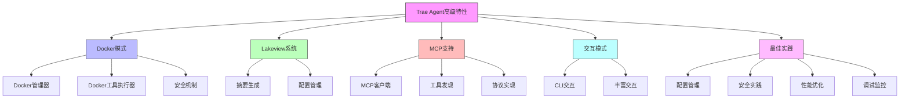

# Trae Agent 高级特性和最佳实践 - 技术详解

在本技术详解中，我们将深入探讨Trae Agent的高级特性和最佳实践的实现细节。我们将使用Node.js来实现这些功能，并为每一行代码添加详细注释，同时在每个代码段前明确相应的知识点。

## 1. Docker模式深度解析

### 1.1 Docker模式概述

Docker模式是Trae Agent的一项重要特性，它允许在隔离的容器环境中执行任务，提供安全的执行环境并确保环境一致性。

### 1.2 Docker管理器实现

#### 1.2.1 核心类结构

```javascript
// 知识点1: Docker管理器实现
// 实现Docker容器生命周期和命令执行管理

const Docker = require('dockerode');
const fs = require('fs').promises;
const path = require('path');
const { exec } = require('child_process');
const { promisify } = require('util');
const execAsync = promisify(exec);

class DockerManager {
  // 容器中工具路径
  static CONTAINER_TOOLS_PATH = "/agent_tools";
  
  /**
   * 构造函数
   * @param {Object} options - 选项
   * @param {string | null} options.image - Docker镜像
   * @param {string | null} options.containerId - 容器ID
   * @param {string | null} options.dockerfilePath - Dockerfile路径
   * @param {string | null} options.dockerImageFile - Docker镜像文件
   * @param {string | null} options.workspaceDir - 工作目录
   * @param {string | null} options.toolsDir - 工具目录
   * @param {boolean} options.interactive - 是否交互模式
   */
  constructor({ image = null, containerId = null, dockerfilePath = null, 
                dockerImageFile = null, workspaceDir = null, toolsDir = null, 
                interactive = false }) {
    // 验证参数
    if (!image && !containerId && !dockerfilePath && !dockerImageFile) {
      throw new Error(
        "Either a Docker image or a container ID or a dockerfile path or a docker image file (tar) must be provided."
      );
    }
    
    // 初始化Docker客户端
    this.client = new Docker();
    this.image = image;
    this.containerId = containerId;
    this.dockerfilePath = dockerfilePath;
    this.dockerImageFile = dockerImageFile;
    this.workspaceDir = workspaceDir;
    this.toolsDir = toolsDir;
    this.interactive = interactive;
    this.containerWorkspace = "/workspace";
    this.container = null;
    this.shell = null;
    this.isManaged = true;
  }
}
```

#### 1.2.2 容器启动流程

```javascript
// 知识点2: 容器启动流程实现
// 实现容器启动和连接逻辑

/**
 * 启动/连接到容器
 */
async start() {
  try {
    // 构建镜像（如果需要）
    if (this.dockerfilePath) {
      await this._buildImageFromDockerfile();
    } else if (this.dockerImageFile) {
      await this._loadImageFromFile();
    }
    
    // 启动或连接容器
    if (this.containerId) {
      await this._attachToExistingContainer();
    } else if (this.image) {
      await this._startNewContainer();
    }
    
    // 复制工具到容器
    await this._copyToolsToContainer();
    // 启动持久化shell
    await this._startPersistentShell();
  } catch (error) {
    console.error(`Failed to start DockerManager: ${error.message}`);
    throw error;
  }
}

/**
 * 从Dockerfile构建镜像
 */
async _buildImageFromDockerfile() {
  try {
    const stream = await this.client.buildImage({
      context: path.dirname(this.dockerfilePath),
      src: [path.basename(this.dockerfilePath)]
    }, {
      t: this.image || `trae-agent-${Date.now()}`
    });
    
    await new Promise((resolve, reject) => {
      this.client.modem.followProgress(stream, (err, res) => {
        if (err) reject(err);
        else resolve(res);
      });
    });
  } catch (error) {
    throw new Error(`Failed to build image from Dockerfile: ${error.message}`);
  }
}

/**
 * 从文件加载镜像
 */
async _loadImageFromFile() {
  try {
    const imageStream = fs.createReadStream(this.dockerImageFile);
    await this.client.loadImage(imageStream);
  } catch (error) {
    throw new Error(`Failed to load image from file: ${error.message}`);
  }
}
```

#### 1.2.3 工具复制机制

```javascript
// 知识点3: 工具复制机制实现
// 实现将本地工具目录复制到容器中的固定路径

/**
 * 将本地工具目录复制到容器中的固定路径
 */
async _copyToolsToContainer() {
  if (!this.toolsDir || !(await this._isDirectory(this.toolsDir))) {
    console.warn(
      `Packaged tools directory '${this.toolsDir}' not provided or not found, skipping copy.`
    );
    return;
  }
  
  console.log(
    `Copying tools from '${this.toolsDir}' to container path '${DockerManager.CONTAINER_TOOLS_PATH}'...`
  );
  
  try {
    const cmd = `docker cp '${path.resolve(this.toolsDir)}' '${this.container.id}:${DockerManager.CONTAINER_TOOLS_PATH}'`;
    await execAsync(cmd);
    console.log("Tools copied successfully.");
  } catch (error) {
    throw new Error(`Failed to copy tools to container: ${error.message}`);
  }
}

/**
 * 检查路径是否为目录
 * @param {string} dirPath - 目录路径
 * @returns {boolean} 是否为目录
 */
async _isDirectory(dirPath) {
  try {
    const stats = await fs.stat(dirPath);
    return stats.isDirectory();
  } catch (error) {
    return false;
  }
}
```

### 1.3 Docker工具执行器

#### 1.3.1 路径转换机制

```javascript
// 知识点4: Docker工具执行器实现
// 实现Docker容器中的工具执行逻辑

class DockerToolExecutor {
  /**
   * 将主机路径转换为容器路径
   * @param {string} hostPath - 主机路径
   * @returns {string} 容器路径
   */
  _translatePath(hostPath) {
    const absHostPath = path.resolve(hostPath);
    if (this._isSubPath(absHostPath, this.hostWorkspaceDir)) {
      const relativePath = path.relative(this.hostWorkspaceDir, absHostPath);
      const containerPath = path.join(this.containerWorkspaceDir, relativePath);
      return path.normalize(containerPath);
    }
    return hostPath;
  }
  
  /**
   * 检查子路径
   * @param {string} childPath - 子路径
   * @param {string} parentPath - 父路径
   * @returns {boolean} 是否为子路径
   */
  _isSubPath(childPath, parentPath) {
    const relative = path.relative(parentPath, childPath);
    return relative && !relative.startsWith('..') && !path.isAbsolute(relative);
  }
}
```

#### 1.3.2 工具执行逻辑

```javascript
// 知识点5: 工具执行逻辑实现
// 实现在Docker容器中执行工具的逻辑

/**
 * 在Docker容器中执行工具
 * @param {ToolCall} toolCall - 工具调用
 * @returns {ToolResult} 工具结果
 */
async _executeInDocker(toolCall) {
  try {
    // 处理参数中的路径转换
    const processedArgs = this._processArguments(toolCall.arguments);
    
    let commandToRun;
    
    // 构建容器内执行命令
    if (toolCall.name === "bash") {
      commandToRun = processedArgs.command;
    } else if (toolCall.name === "str_replace_based_edit_tool") {
      const executablePath = `${this.dockerManager.CONTAINER_TOOLS_PATH}/edit_tool`;
      const cmdParts = [executablePath, toolCall.subCommand];
      // 添加参数...
      commandToRun = cmdParts.join(" ");
    }
    
    // 在容器中执行命令
    const output = await this.dockerManager.execute(commandToRun);
    
    // 返回结果
    return new ToolResult({
      callId: toolCall.callId,
      name: toolCall.name,
      success: true,
      result: output
    });
  } catch (error) {
    return new ToolResult({
      callId: toolCall.callId,
      name: toolCall.name,
      success: false,
      error: error.message
    });
  }
}

/**
 * 处理参数
 * @param {Object} arguments - 参数
 * @returns {Object} 处理后的参数
 */
_processArguments(arguments) {
  const processed = {};
  for (const [key, value] of Object.entries(arguments)) {
    if (typeof value === 'string' && this._isPath(value)) {
      processed[key] = this._translatePath(value);
    } else {
      processed[key] = value;
    }
  }
  return processed;
}

/**
 * 检查是否为路径
 * @param {string} str - 字符串
 * @returns {boolean} 是否为路径
 */
_isPath(str) {
  return str.includes('/') || str.includes('\\') || str.startsWith('./') || str.startsWith('../');
}
```

## 2. Lakeview系统

### 2.1 Lakeview概述

Lakeview是Trae Agent提供的简洁代理步骤摘要功能，它能够生成任务执行过程的摘要信息。

### 2.2 Lakeview配置

```yaml
# trae_config.yaml
lakeview:
  model: lakeview_model

models:
  lakeview_model:
    model_provider: anthropic
    model: claude-3.5-sonnet
    max_tokens: 4096
    temperature: 0.5
    top_p: 1
    top_k: 0
    max_retries: 10
    parallel_tool_calls: true
```

### 2.3 Lakeview实现

```javascript
// 知识点6: Lakeview系统实现
// 实现Lakeview摘要生成器

class Lakeview {
  /**
   * 构造函数
   * @param {LakeviewConfig} config - 配置
   */
  constructor(config) {
    this.config = config;
    this.llmClient = new LLMClient(config.model);
  }
  
  /**
   * 生成执行摘要
   * @param {AgentExecution} agentExecution - 代理执行
   * @returns {string} 摘要
   */
  async generateSummary(agentExecution) {
    // 构建摘要提示
    const prompt = this._buildSummaryPrompt(agentExecution);
    
    // 调用LLM生成摘要
    const messages = [new LLMMessage({ role: "user", content: prompt })];
    const response = await this.llmClient.chat(messages, this.config.model);
    
    return response.content;
  }
  
  /**
   * 构建摘要提示
   * @param {AgentExecution} agentExecution - 代理执行
   * @returns {string} 提示
   */
  _buildSummaryPrompt(agentExecution) {
    let prompt = "请为以下任务执行生成简洁摘要:\n\n";
    prompt += `任务: ${agentExecution.task}\n`;
    prompt += `执行步骤数: ${agentExecution.steps.length}\n`;
    prompt += `执行时间: ${agentExecution.executionTime.toFixed(2)}秒\n`;
    prompt += `成功: ${agentExecution.success}\n`;
    
    if (agentExecution.finalResult) {
      prompt += `最终结果: ${agentExecution.finalResult.substring(0, 200)}...\n`;
    }
    
    prompt += "\n请用中文生成不超过100字的简洁摘要。";
    
    return prompt;
  }
}
```

## 3. MCP (Model Context Protocol) 支持

### 3.1 MCP概述

MCP是模型上下文协议，允许Trae Agent与外部服务进行交互，扩展其功能。

### 3.2 MCP配置

```yaml
# trae_config.yaml
allow_mcp_servers:
  - playwright

mcp_servers:
  playwright:
    command: npx
    args:
      - "@playwright/mcp@0.0.27"
```

### 3.3 MCP客户端实现

```javascript
// 知识点7: MCP客户端实现
// 实现MCP客户端功能

class MCPClient {
  /**
   * 连接并发现MCP工具
   * @param {string} serverName - 服务器名称
   * @param {MCPServerConfig} serverConfig - 服务器配置
   * @param {Tool[]} tools - 工具列表
   * @param {string} provider - 提供商
   */
  async connectAndDiscover(serverName, serverConfig, tools, provider) {
    try {
      // 建立连接
      await this._connect(serverConfig);
      
      // 发现工具
      const discoveredTools = await this._discoverTools();
      
      // 注册工具
      for (const toolInfo of discoveredTools) {
        const mcpTool = new MCPTool({
          name: toolInfo.name,
          description: toolInfo.description,
          parameters: toolInfo.parameters,
          mcpClient: this,
          toolId: toolInfo.id
        });
        tools.push(mcpTool);
      }
    } catch (error) {
      console.error(`Failed to connect and discover MCP tools: ${error.message}`);
      throw error;
    }
  }
  
  /**
   * 执行MCP工具
   * @param {string} toolId - 工具ID
   * @param {Object} arguments - 参数
   * @returns {ToolExecResult} 执行结果
   */
  async executeTool(toolId, arguments) {
    try {
      // 发送执行请求
      const result = await this._sendExecuteRequest(toolId, arguments);
      
      // 处理结果
      return new ToolExecResult({
        output: result.output,
        error: result.error,
        success: result.success !== undefined ? result.success : true
      });
    } catch (error) {
      return new ToolExecResult({
        error: error.message,
        success: false
      });
    }
  }
  
  /**
   * 建立连接
   * @param {MCPServerConfig} serverConfig - 服务器配置
   */
  async _connect(serverConfig) {
    // 实现连接逻辑
    // 这里可能需要启动子进程或建立网络连接
    console.log(`Connecting to MCP server with command: ${serverConfig.command} ${serverConfig.args.join(' ')}`);
  }
  
  /**
   * 发现工具
   * @returns {Array} 发现的工具列表
   */
  async _discoverTools() {
    // 实现工具发现逻辑
    // 这可能涉及发送特定的发现请求到MCP服务器
    return [];
  }
  
  /**
   * 发送执行请求
   * @param {string} toolId - 工具ID
   * @param {Object} arguments - 参数
   * @returns {Object} 执行结果
   */
  async _sendExecuteRequest(toolId, arguments) {
    // 实现发送执行请求的逻辑
    // 这可能涉及通过某种协议（如JSON-RPC）与MCP服务器通信
    return {};
  }
}
```

## 4. 交互模式详解

### 4.1 交互模式概述

交互模式允许用户与Trae Agent进行对话式交互，支持迭代开发和实时反馈。

### 4.2 交互模式实现

#### 4.2.1 CLI交互命令

```javascript
// 知识点8: CLI交互命令实现
// 实现CLI交互命令

const { Command } = require('commander');
const readline = require('readline');

const program = new Command();

program
  .command('interactive')
  .option('-p, --provider <provider>', 'LLM provider to use')
  .option('-m, --model <model>', 'Specific model to use')
  .description('启动交互式会话')
  .action(async (options) => {
    // 创建代理
    const agent = new Agent(agentType, config, trajectoryFile, cliConsole);
    
    // 根据控制台类型启动不同的交互循环
    if (selectedConsoleType === ConsoleType.SIMPLE) {
      await _runSimpleInteractiveLoop(
        agent, cliConsole, traeAgentConfig, configFile, trajectoryFile
      );
    } else {
      // 对于丰富控制台，启动文本应用程序
      await _runRichInteractiveLoop(
        agent, cliConsole, traeAgentConfig, configFile, trajectoryFile
      );
    }
  });

/**
 * 运行简单交互循环
 * @param {Agent} agent - 代理
 * @param {CLIConsole} cliConsole - CLI控制台
 * @param {TraeAgentConfig} traeAgentConfig - Trae代理配置
 * @param {string} configFile - 配置文件
 * @param {string | null} trajectoryFile - 轨迹文件
 */
async function _runSimpleInteractiveLoop(agent, cliConsole, traeAgentConfig, configFile, trajectoryFile) {
  const rl = readline.createInterface({
    input: process.stdin,
    output: process.stdout
  });
  
  console.log("Welcome to Trae Agent Interactive Mode!");
  console.log("Type 'help' for help, 'exit' or 'quit' to quit.");
  
  while (true) {
    try {
      const task = await new Promise((resolve) => {
        rl.question("\nEnter task (or 'exit' to quit): ", resolve);
      });
      
      if (task === null || task.toLowerCase() === 'exit' || task.toLowerCase() === 'quit') {
        console.log("Goodbye!");
        break;
      }
      
      if (task.toLowerCase() === "help") {
        // 显示帮助信息
        console.log("Available commands:");
        console.log("  help - 显示帮助信息");
        console.log("  status - 显示代理状态");
        console.log("  clear - 清屏");
        console.log("  exit/quit - 退出");
        continue;
      }
      
      if (task.toLowerCase() === "status") {
        // 显示代理状态
        console.log("Agent Status:");
        console.log("  Model: " + traeAgentConfig.model.model);
        console.log("  Provider: " + traeAgentConfig.model.model_provider.provider);
        continue;
      }
      
      if (task.toLowerCase() === "clear") {
        // 清屏
        console.clear();
        continue;
      }
      
      // 获取工作目录
      const workingDir = await new Promise((resolve) => {
        rl.question("Enter working directory (or press Enter for current): ", (input) => {
          resolve(input || process.cwd());
        });
      });
      
      // 设置轨迹记录
      console.log(`Trajectory will be saved to: ${trajectoryFile}`);
      
      const taskArgs = {
        project_path: workingDir,
        issue: task,
        must_patch: "false"
      };
      
      // 执行任务
      console.log(`\nExecuting task: ${task}`);
      
      // 启动控制台和执行任务
      const consoleTask = cliConsole.start();
      const executionTask = agent.run(task, taskArgs);
      
      // 等待执行完成
      await Promise.all([consoleTask, executionTask]);
      
      console.log(`\nTrajectory saved to: ${trajectoryFile}`);
      
    } catch (error) {
      if (error.name === 'AbortError') {
        console.log("\nUse 'exit' or 'quit' to end the session");
      } else {
        console.error(`Error: ${error.message}`);
      }
    }
  }
  
  rl.close();
}
```

#### 4.2.2 丰富交互循环

```javascript
// 知识点9: 丰富交互循环实现
// 实现更丰富的交互体验

/**
 * 运行丰富交互循环
 * @param {Agent} agent - 代理
 * @param {CLIConsole} cliConsole - CLI控制台
 * @param {TraeAgentConfig} traeAgentConfig - Trae代理配置
 * @param {string} configFile - 配置文件
 * @param {string | null} trajectoryFile - 轨迹文件
 */
async function _runRichInteractiveLoop(agent, cliConsole, traeAgentConfig, configFile, trajectoryFile) {
  // 使用更丰富的UI库（如Inquirer.js或类似库）
  const inquirer = require('inquirer');
  
  console.log("Welcome to Trae Agent Interactive Mode!");
  console.log("Use Ctrl+C to exit.");
  
  while (true) {
    try {
      // 使用丰富的提示界面
      const answers = await inquirer.prompt([
        {
          type: 'input',
          name: 'task',
          message: 'Enter task:',
          validate: (input) => input.length > 0 || 'Task cannot be empty'
        },
        {
          type: 'input',
          name: 'workingDir',
          message: 'Working directory:',
          default: process.cwd()
        }
      ]);
      
      const { task, workingDir } = answers;
      
      // 设置轨迹记录
      console.log(`Trajectory will be saved to: ${trajectoryFile}`);
      
      const taskArgs = {
        project_path: workingDir,
        issue: task,
        must_patch: "false"
      };
      
      // 执行任务
      console.log(`\nExecuting task: ${task}`);
      
      // 启动控制台和执行任务
      const consoleTask = cliConsole.start();
      const executionTask = agent.run(task, taskArgs);
      
      // 等待执行完成
      await Promise.all([consoleTask, executionTask]);
      
      console.log(`\nTrajectory saved to: ${trajectoryFile}`);
      
      // 询问是否继续
      const continueAnswer = await inquirer.prompt([
        {
          type: 'confirm',
          name: 'continue',
          message: 'Continue?',
          default: true
        }
      ]);
      
      if (!continueAnswer.continue) {
        console.log("Goodbye!");
        break;
      }
      
    } catch (error) {
      if (error.name === 'AbortError') {
        console.log("\nGoodbye!");
        break;
      } else {
        console.error(`Error: ${error.message}`);
      }
    }
  }
}
```

## 5. 最佳实践

### 5.1 配置管理最佳实践

1. **敏感信息保护**:

```bash
# 使用环境变量存储API密钥
export ANTHROPIC_API_KEY="your-anthropic-api-key"
export OPENAI_API_KEY="your-openai-api-key"
```

2. **配置文件版本控制**:

```yaml
# 将配置模板加入版本控制，但排除实际配置文件
.gitignore:
trae_config.yaml
trae-workspace/
```

3. **多环境配置**:

```yaml
// 知识点10: 多环境配置实现
// 实现不同环境的配置管理

class ConfigManager {
  /**
   * 加载配置
   * @param {string} environment - 环境
   * @returns {Object} 配置
   */
  static loadConfig(environment = 'development') {
    const configPath = `trae_config_${environment}.yaml`;
    try {
      const config = this._loadYamlConfig(configPath);
      // 合并环境变量
      this._mergeEnvironmentVariables(config);
      return config;
    } catch (error) {
      console.warn(`Failed to load ${configPath}, using default config`);
      return this._getDefaultConfig();
    }
  }
  
  /**
   * 加载YAML配置
   * @param {string} configPath - 配置路径
   * @returns {Object} 配置
   */
  static _loadYamlConfig(configPath) {
    const yaml = require('js-yaml');
    const fs = require('fs');
    const configContent = fs.readFileSync(configPath, 'utf8');
    return yaml.load(configContent);
  }
  
  /**
   * 合并环境变量
   * @param {Object} config - 配置
   */
  static _mergeEnvironmentVariables(config) {
    // 合并API密钥等敏感信息
    if (process.env.ANTHROPIC_API_KEY) {
      if (!config.model_providers) config.model_providers = {};
      if (!config.model_providers.anthropic) config.model_providers.anthropic = {};
      config.model_providers.anthropic.api_key = process.env.ANTHROPIC_API_KEY;
    }
    
    if (process.env.OPENAI_API_KEY) {
      if (!config.model_providers) config.model_providers = {};
      if (!config.model_providers.openai) config.model_providers.openai = {};
      config.model_providers.openai.api_key = process.env.OPENAI_API_KEY;
    }
  }
  
  /**
   * 获取默认配置
   * @returns {Object} 默认配置
   */
  static _getDefaultConfig() {
    return {
      agents: {
        trae_agent: {
          max_steps: 50,
          tools: ["bash", "str_replace_based_edit_tool"]
        }
      },
      model_providers: {},
      models: {}
    };
  }
}
```

### 5.2 安全最佳实践

1. **文件路径验证**:

```javascript
// 知识点11: 文件路径验证实现
// 实现文件路径安全性验证

class PathValidator {
  /**
   * 验证路径安全性
   * @param {string} command - 命令
   * @param {string} path - 路径
   */
  static validatePath(command, path) {
    // 检查路径是否为绝对路径
    if (!path.startsWith('/')) {
      throw new Error("Path must be absolute");
    }
    
    // 防止路径遍历攻击
    if (path.includes('..')) {
      throw new Error("Path traversal not allowed");
    }
    
    // 检查路径是否在允许的范围内
    const allowedPaths = ["/workspace", "/agent_tools"];
    const isAllowed = allowedPaths.some(allowedPath => 
      path === allowedPath || path.startsWith(allowedPath + '/')
    );
    
    if (!isAllowed) {
      throw new Error("Path not allowed");
    }
  }
}
```

2. **Docker安全**:

```javascript
// 知识点12: Docker安全实现
// 实现安全的Docker容器启动

/**
 * 安全地启动新容器
 */
async _startNewContainer() {
  try {
    this.container = await this.client.createContainer({
      Image: this.image,
      Cmd: ["sleep", "infinity"],
      Detach: true,
      Volumes: {
        [path.resolve(this.workspaceDir)]: {}
      },
      WorkingDir: this.containerWorkspace,
      HostConfig: {
        Binds: [
          `${path.resolve(this.workspaceDir)}:${this.containerWorkspace}`
        ],
        // 限制容器权限
        Privileged: false,
        NetworkMode: "none", // 禁用网络访问
        Memory: 4 * 1024 * 1024 * 1024, // 限制内存使用为4GB
        CpuQuota: 50000 // 限制CPU使用
      }
    });
    
    await this.container.start();
  } catch (error) {
    throw new Error(`Failed to start container: ${error.message}`);
  }
}
```

### 5.3 性能优化最佳实践

1. **异步处理**:

```javascript
// 知识点13: 异步处理实现
// 实现并行工具调用以提高性能

class ToolExecutor {
  /**
   * 并行执行工具调用以提高性能
   * @param {ToolCall[]} toolCalls - 工具调用列表
   * @returns {ToolResult[]} 工具结果列表
   */
  async parallelToolCall(toolCalls) {
    return await Promise.all(
      toolCalls.map(call => this.executeToolCall(call))
    );
  }
  
  /**
   * 执行单个工具调用
   * @param {ToolCall} toolCall - 工具调用
   * @returns {ToolResult} 工具结果
   */
  async executeToolCall(toolCall) {
    // 根据工具名称找到对应的工具实现
    const tool = this.tools.find(t => t.name === toolCall.name);
    if (!tool) {
      throw new Error(`Unknown tool: ${toolCall.name}`);
    }
    
    try {
      // 执行工具
      const result = await tool.execute(toolCall.arguments);
      return new ToolResult({
        callId: toolCall.callId,
        success: true,
        result: result
      });
    } catch (error) {
      return new ToolResult({
        callId: toolCall.callId,
        success: false,
        error: error.message
      });
    }
  }
}
```

2. **缓存机制**:

```javascript
// 知识点14: 缓存机制实现
// 实现Docker镜像信息缓存

const NodeCache = require('node-cache');
const dockerImageCache = new NodeCache({ stdTTL: 600 }); // 10分钟缓存

/**
 * 缓存Docker镜像信息
 * @param {string} imageName - 镜像名称
 * @returns {Object | null} 镜像信息
 */
async _getDockerImage(imageName) {
  // 检查缓存
  let image = dockerImageCache.get(imageName);
  if (image) {
    return image;
  }
  
  try {
    image = await this.dockerClient.getImage(imageName);
    // 存入缓存
    dockerImageCache.set(imageName, image);
    return image;
  } catch (error) {
    // 镜像未找到
    dockerImageCache.set(imageName, null);
    return null;
  }
}
```

3. **资源清理**:

```javascript
// 知识点15: 资源清理实现
// 实现资源清理机制

/**
 * 确保资源被清理
 */
async stop() {
  try {
    if (this.container) {
      await this.container.stop();
      await this.container.remove();
      this.container = null;
    }
    
    if (this.shell) {
      this.shell.kill();
      this.shell = null;
    }
  } catch (error) {
    console.error(`Failed to cleanup resources: ${error.message}`);
  }
}

// 在对象销毁时确保资源被清理
process.on('exit', () => {
  // 清理所有DockerManager实例
});
```

### 5.4 调试和监控最佳实践

1. **详细日志记录**:

```javascript
// 知识点16: 详细日志记录实现
// 实现详细的日志记录

const winston = require('winston');

// 配置日志记录器
const logger = winston.createLogger({
  level: process.env.LOG_LEVEL || 'info',
  format: winston.format.combine(
    winston.format.timestamp(),
    winston.format.json()
  ),
  transports: [
    new winston.transports.File({ filename: 'trae-agent.log' })
  ]
});

/**
 * 运行LLM步骤
 * @param {AgentStep} step - 代理步骤
 * @param {LLMMessage[]} messages - 消息列表
 * @param {AgentExecution} execution - 代理执行
 * @returns {LLMResponse} LLM响应
 */
async _runLLMStep(step, messages, execution) {
  logger.info(`Running LLM step ${step.stepNumber}`);
  logger.debug(`Messages: ${JSON.stringify(messages)}`);
  
  try {
    const response = await this.llmClient.chat(messages, this.modelConfig, this.tools);
    logger.info(`LLM response received, finish reason: ${response.finishReason}`);
    return response;
  } catch (error) {
    logger.error(`LLM step failed: ${error.message}`);
    logger.error(error.stack);
    throw error;
  }
}
```

2. **性能监控**:

```javascript
// 知识点17: 性能监控实现
// 实现性能指标监控

const os = require('os');

/**
 * 监控性能指标
 */
async _monitorPerformance(asyncFunction) {
  const startTime = Date.now();
  const startMemory = process.memoryUsage().rss;
  
  try {
    const result = await asyncFunction();
    return result;
  } finally {
    const endTime = Date.now();
    const endMemory = process.memoryUsage().rss;
    
    const executionTime = (endTime - startTime) / 1000; // 秒
    const memoryUsed = (endMemory - startMemory) / 1024 / 1024; // MB
    
    logger.info(`Execution time: ${executionTime.toFixed(2)}s`);
    logger.info(`Memory used: ${memoryUsed.toFixed(2)}MB`);
    
    // 记录到轨迹
    if (this.trajectoryRecorder) {
      this.trajectoryRecorder.recordPerformanceMetric({
        executionTime: executionTime,
        memoryUsed: memoryUsed,
        cpuUsage: os.loadavg()[0]
      });
    }
  }
}
```

## 6. 故障排除

### 6.1 常见问题

1. **Docker相关问题**:

```bash
# 检查Docker是否运行
docker version

# 启动Docker服务（Linux）
sudo systemctl start docker

# 重启Docker服务
sudo systemctl restart docker
```

2. **API密钥问题**:

```bash
# 验证环境变量
echo $ANTHROPIC_API_KEY
echo $OPENAI_API_KEY

# 检查配置文件
trae-cli show-config
```

3. **权限问题**:

```bash
# 修复文件权限
chmod +x /path/to/your/project

# 修复Docker权限
sudo usermod -aG docker $USER
```

### 6.2 调试技巧

1. **启用详细日志**:

```bash
# 设置日志级别
export LOG_LEVEL=DEBUG

# 运行命令
trae-cli run "your task" --verbose
```

2. **检查轨迹文件**:

```bash
# 查看轨迹文件
cat trajectories/trajectory_*.json | jq '.'
```

3. **使用交互模式调试**:

```bash
# 启动交互模式
trae-cli interactive

# 在交互模式中逐步执行任务
```

## 7. 扩展开发

### 7.1 开发新工具

1. **创建工具类**:

```javascript
// 知识点18: 新工具开发实现
// 实现自定义工具开发

class CustomTool extends Tool {
  /**
   * 获取工具名称
   * @returns {string} 工具名称
   */
  getName() {
    return "custom_tool";
  }
  
  /**
   * 获取工具描述
   * @returns {string} 工具描述
   */
  getDescription() {
    return "A custom tool for demonstration purposes.";
  }
  
  /**
   * 获取工具参数
   * @returns {ToolParameter[]} 工具参数
   */
  getParameters() {
    return [
      new ToolParameter({
        name: "param1",
        type: "string",
        description: "A sample parameter.",
        required: true
      })
    ];
  }
  
  /**
   * 执行工具
   * @param {ToolCallArguments} arguments - 参数
   * @returns {ToolExecResult} 执行结果
   */
  async execute(arguments) {
    const param1 = arguments.param1;
    // 实现工具逻辑
    const result = `Custom tool executed with param1: ${param1}`;
    return new ToolExecResult({ output: result });
  }
}
```

2. **注册工具**:

```javascript
// 在tools/registry.js中添加
const toolsRegistry = {
  // ... 现有工具
  "custom_tool": CustomTool
};

module.exports = { toolsRegistry };
```

### 7.2 添加新的LLM提供商

1. **创建客户端类**:

```javascript
// 知识点19: 新LLM提供商实现
// 实现新的LLM提供商客户端

class NewProviderClient extends BaseLLMClient {
  /**
   * 构造函数
   * @param {ModelConfig} modelConfig - 模型配置
   */
  constructor(modelConfig) {
    super(modelConfig);
    this.provider = LLMProvider.NEW_PROVIDER;
    // 初始化客户端
    this.client = new NewProviderSDK({
      apiKey: modelConfig.model_provider.api_key
    });
  }
  
  /**
   * 聊天
   * @param {LLMMessage[]} messages - 消息列表
   * @param {ModelConfig} modelConfig - 模型配置
   * @param {Tool[] | null} tools - 工具列表
   * @param {boolean} reuseHistory - 是否重用历史
   * @returns {LLMResponse} LLM响应
   */
  async chat(messages, modelConfig, tools = null, reuseHistory = true) {
    // 实现聊天逻辑
    const response = await this.client.chat({
      model: modelConfig.model,
      messages: messages.map(msg => ({
        role: msg.role,
        content: msg.content
      })),
      temperature: modelConfig.temperature,
      maxTokens: modelConfig.max_tokens
    });
    
    return new LLMResponse({
      content: response.content,
      model: response.model,
      finishReason: response.finish_reason
    });
  }
}
```

2. **在LLMClient中添加支持**:

```javascript
class LLMClient {
  /**
   * 构造函数
   * @param {ModelConfig} modelConfig - 模型配置
   */
  constructor(modelConfig) {
    this.provider = LLMProvider[modelConfig.model_provider.provider.toUpperCase()];
    this.modelConfig = modelConfig;
    this.client = null;
    
    // 根据提供商创建对应的客户端
    switch (this.provider) {
      case LLMProvider.NEW_PROVIDER:
        this.client = new NewProviderClient(modelConfig);
        break;
      // ... 其他提供商
    }
  }
}
```

## 8. 系统架构图



## 9. 总结

Trae Agent 的高级特性和最佳实践涵盖了系统的各个方面：

1. **Docker模式**: 提供安全的隔离执行环境
2. **Lakeview系统**: 生成简洁的任务执行摘要
3. **MCP支持**: 扩展与外部服务的交互能力
4. **交互模式**: 支持对话式交互和迭代开发
5. **最佳实践**: 包括配置管理、安全、性能优化和调试技巧
6. **故障排除**: 提供常见问题的解决方案
7. **扩展开发**: 指导如何开发新工具和添加LLM提供商

通过深入理解和应用这些高级特性和最佳实践，用户可以更好地使用和扩展Trae Agent，充分发挥其在软件工程任务中的潜力。